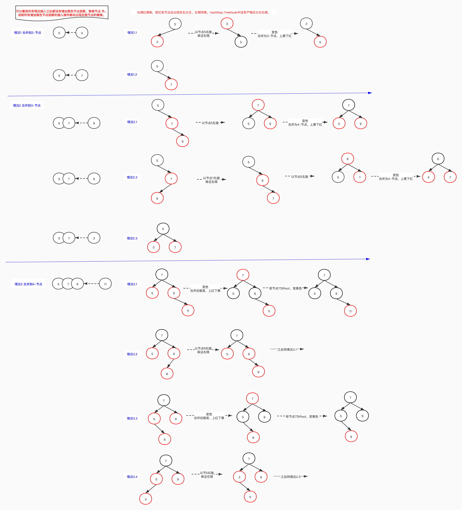
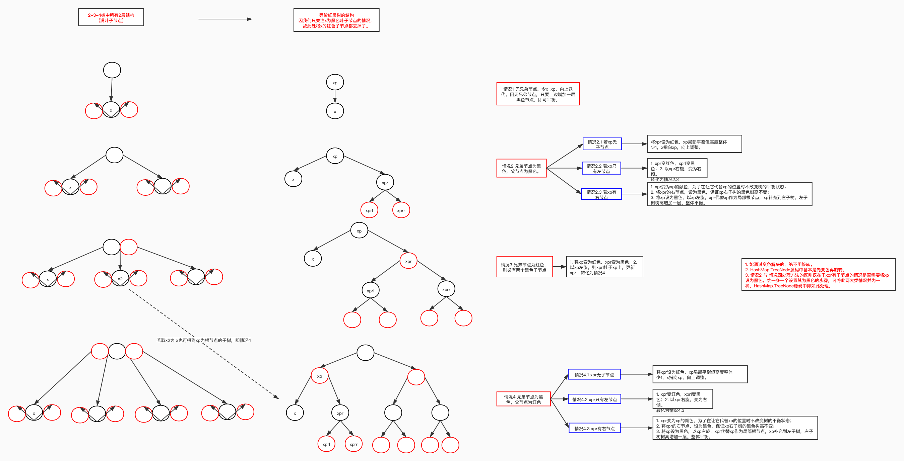

红黑树源于对2-3-4树的简易实现。参考《[Sedgewick的红黑树](https://www.cnblogs.com/eniac12/p/5558848.html)》

TreeNode 同时实现了两种数据结构：

- 双向链表：prev、next
- 红黑树：parent、left、right、red

​      方便了不同场景的应用，也方便了上层即HashMap中的封装，比如在没有HashMap的containsValue()方法中遍历冲突链表就没有特别去判断是否为树结构，因为TreeNode本身也还是链表结构。

​      这两种结构字段是相互独立的，可以看做两条线，但在发生节点位置变化时，需同时维护两条线的正确。如树结构的平衡性调整之后，root节点可能会变更，root变更即意味了链表结构的头节点变更，所以有了moveRootToFront()方法，将新的头节点（root节点）移动到链表头部。

TreeNode 中元素是如何排序的？

1. 通过元素key的hash值：HashMap.hash(key)。（记为1级排序方式）
2. 若hash相同，且元素key为可比较类型，则使用compareComparables方法比较其key。（记为2级排序方式）
3. 若hash相同，且元素key为不可比较类型，则使用tieBreakOrder来 比较两个元素的key。（记为3级排序方式）
   1. 先使用类名即getClass().getName()进行比较
   2. 若相同则使用由System.identityHashCode(key)生成的key对象的hashCode。

**find方法源码**

```java
				/**
				 * 使用给定的散列和键查找从根 p 开始的节点。 kc 参数在第一次使用比较key时缓存的其可比较类型。
				 **/
				final TreeNode<K,V> find(int h, Object k, Class<?> kc) {
            TreeNode<K,V> p = this;
            do {
                int ph, dir; K pk;
                TreeNode<K,V> pl = p.left, pr = p.right, q;
              // 1. 先使用key的hash进行比较排序，即1级排序方式。
                if ((ph = p.hash) > h)
                    p = pl;
                else if (ph < h)
                    p = pr;
                else if ((pk = p.key) == k || (k != null && k.equals(pk)))
                    return p;
              
              // 2. 执行到此处说明其左右子树的节点均与key的hash相等，但是与key不等，需要使用其它方式进一步排序
              
              // 左节点为空的情况，直接将右节点作为下次循环比较的节点
                else if (pl == null)
                    p = pr;
              // 右节点为空的情况，直接将左节点作为下次循环比较的节点
                else if (pr == null)
                    p = pl;
              // 左右节点均不为空，根据二级排序方式重新比较pk与k以决定方向，选取下一次循环的比较节点
                else if ((kc != null ||
                          (kc = comparableClassFor(k)) != null) &&
                         (dir = compareComparables(kc, k, pk)) != 0)
                    p = (dir < 0) ? pl : pr;
              
              // 执行到这里说明无法通过comparable比较，或者比较之后还是相等
              // 此处未采用3级比较，而是直接后序遍历其子节点，找到即刻返回，应该是考虑到这样效率更高。
              
			        // 从右节点递归遍历右子树，如果找到了匹配的则返回
                else if ((q = pr.find(h, k, kc)) != null)
                    return q;
              // 右子树未找到，从左节点进入下一个循环
                else
                    p = pl;
            } while (p != null);
          // 未找到匹配元素，返回null。
            return null;
        }
```

putTreeVal方法源码：

```java
final TreeNode<K,V> putTreeVal(HashMap<K,V> map, Node<K,V>[] tab,
                                       int h, K k, V v) {
            Class<?> kc = null;
				  // searched记录是否遍历查找过该元素，最多查找一次
            boolean searched = false;
            TreeNode<K,V> root = (parent != null) ? root() : this;
            for (TreeNode<K,V> p = root;;) {
              // dir 记录方向
                int dir, ph; K pk;
              // 1级排序方式
                if ((ph = p.hash) > h)
                    dir = -1;
                else if (ph < h)
                    dir = 1;
	              // 采用1级排序方式找到对应元素
                else if ((pk = p.key) == k || (k != null && k.equals(pk)))
                    return p;
              // 2级排序方式
                else if ((kc == null &&
                          (kc = comparableClassFor(k)) == null) ||
                         (dir = compareComparables(kc, k, pk)) == 0) {
                  // 2级排序方式
                    if (!searched) {
                      //最多执行一次
                        TreeNode<K,V> q, ch;
                        searched = true;
	                      // 基于find方法找到了对应元素
                        if (((ch = p.left) != null &&
                             (q = ch.find(h, k, kc)) != null) ||
                            ((ch = p.right) != null &&
                             (q = ch.find(h, k, kc)) != null))
                            return q;
                    }
                  // 3级排序方式
                    dir = tieBreakOrder(k, pk);
                }

                TreeNode<K,V> xp = p;
              // p循环到叶子节点，即树中无该元素且找到了插入节点x可能的父节点xp。
                if ((p = (dir <= 0) ? p.left : p.right) == null) {
                  // 构造待插入节点x
	                  Node<K,V> xpn = xp.next;
                    TreeNode<K,V> x = map.newTreeNode(h, k, v, xpn);
                  // 在树结构中插入x（平衡前位置），此时插入的位置一定是空的。
                    if (dir <= 0)
                        xp.left = x;
                    else
                        xp.right = x;
                  // 在链表结构中插入x
                    xp.next = x;
                    x.parent = x.prev = xp;
                    if (xpn != null)
                        ((TreeNode<K,V>)xpn).prev = x;
                  // 插入再平衡
                    moveRootToFront(tab, balanceInsertion(root, x));
                    return null;
                }
            }
        }
```

对标2-3-4树看红黑树的插入平衡性调整逻辑：



balanceInsertion方法源码：

- 并没有严格按照左倾或右倾红黑树来实现，效率优先，只有左右旋时左右倾才是必要的，所以将统一左右倾整合到了左右旋方法中）

```java
        static <K,V> TreeNode<K,V> balanceInsertion(TreeNode<K,V> root,
                                                    TreeNode<K,V> x) {
          // 新插入节点初始状态：红色
            x.red = true;
            for (TreeNode<K,V> xp, xpp, xppl, xppr;;) {
              // parent为null说明x为root，调整为黑色并返回，对应所有最终引起root节点变更的情况的最后一步。
                if ((xp = x.parent) == null) {
                    x.red = false;
                    return x;
                }
              // 父节点为黑色，不需要调整（对应情况1及2.3）。
              // Y: 父节点为root，且为红色，这是为什么？这种情况又是怎么出现的？
                else if (!xp.red || (xpp = xp.parent) == null)
                    return root;
              // 父节点为左倾，则按左倾进行平衡。
                if (xp == (xppl = xpp.left)) {
                  // 有叔叔节点且叔叔节点为红色，对应情况3.3和3.4（只是并没有将3.4调整为左倾，因为没有必要）
                    if ((xppr = xpp.right) != null && xppr.red) {
                  		// 爷爷节点xpp及其左右节点变色：上红下黑。
                        xppr.red = false;
                        xp.red = false;
                        xpp.red = true;
                      // 爷爷节点xpp等价于2-3-4树合并到4节点分裂上提的那个节点，其插入上一层节点可能引起新的不平衡。
                      // 爷爷节点xpp作为新的插入节点x，进入平衡性插入的下一次迭代。
                        x = xpp;
                    }
                  // 类似情况2
                    else {
                      // 如果x为右倾，通过以xp左旋调整为左倾。类似情况2.2的第一次旋转
                        if (x == xp.right) {
                            root = rotateLeft(root, x = xp);
                            xpp = (xp = x.parent) == null ? null : xp.parent;
                        }
                      // 因为上一步可能发生左旋而引起xp的变化，所以此处做了非空判断。
                      // 变色 + 第二次旋转，类似情况2.1 与 2.2第一次旋转后
                      // 即xp、xpp的变色 + 涉及xp的以xpp开启的旋转
                        if (xp != null) {
                            xp.red = false;
                            if (xpp != null) {
                                xpp.red = true;
                                root = rotateRight(root, xpp);
                            }
                        }
                    }
                }
              // 父节点为右倾，则按右倾进行平衡。
                else {
                  // 有叔叔节点，且叔叔节点为红色，对应情况3.1和3.2（只是并没有将3.2调整为左倾，因为没有必要）
                  // 2-3-4树中分裂上提之后新插入节点都会与另一个节点组成一个3-节点，等价到红黑树中两者上下关系并不重要。
                    if (xppl != null && xppl.red) {
                  		// 爷爷节点xpp及其左右节点变色：上红下黑。
                        xppl.red = false;
                        xp.red = false;
                        xpp.red = true;
                      // 爷爷节点xpp等价于2-3-4树合并到4节点时分裂上提的那个节点，其插入上一层节点可能引起新的不平衡。
                      // 爷爷节点xpp作为新的插入节点x，进入平衡性插入的下一次迭代。
                        x = xpp;
                    }
                    else {
                      //对应情况2.2，第一次右旋调整后变为情况2.1
                        if (x == xp.left) {
                            root = rotateRight(root, x = xp);
                            xpp = (xp = x.parent) == null ? null : xp.parent;
                        }
                      // 情况2.1
                      // xp、xpp的变色 + 涉及xp的以xpp开启的左旋
                        if (xp != null) {
                            xp.red = false;
                            if (xpp != null) {
                                xpp.red = true;
                              // 以xpp左旋
                                root = rotateLeft(root, xpp);
                            }
                        }
                    }
                }
            }
        }
```

rotateLeft方法源码：（右旋同理）

注意：TreeNode实现中的左右旋将，实际可能做了两次旋转，如下面注释中的旋转1和2.

```java
				static <K,V> TreeNode<K,V> rotateLeft(TreeNode<K,V> root,
                                              TreeNode<K,V> p) {
            TreeNode<K,V> r, pp, rl;
            if (p != null && (r = p.right) != null) {
              /** 旋转1，父节点为右倾，需先统一调整为右倾，才能做下边的旋转2。
               *   5        5
               *    \        \
               *     7  =>    6
               *    /          \
               *   6            7
               * */
                if ((rl = p.right = r.left) != null)
                    rl.parent = p;
              // 若p为根节点，则此次旋转root变更，并将新的root变为黑色。
                if ((pp = r.parent = p.parent) == null)
                    (root = r).red = false;
              /** 旋转2
               * 5            6
               *  \          / \
               *   6    =>  5   7
               *    \
               *     7
               * */
              // 若p不是根节点，变更pp与p、r的关系
                else if (pp.left == p)
                    pp.left = r;
                else
                    pp.right = r;
              // 变更r与p的关系
                r.left = p;
                p.parent = r;
            }
            return root;
        }
```

moveRootToFront方法源码：

```java
				/**
         * 确保给定的根是其冲突链表的头节点。Y: 注意理解链接结构字段与树结构字段是独立的。
         */
        static <K,V> void moveRootToFront(Node<K,V>[] tab, TreeNode<K,V> root) {
            int n;
            if (root != null && tab != null && (n = tab.length) > 0) {
            	// 找到当前该冲突链表头节点。
                int index = (n - 1) & root.hash;
                TreeNode<K,V> first = (TreeNode<K,V>)tab[index];
              // 如果当前该冲突头节点不是给定root节点，则将root移到该冲突链表头部。
                if (root != first) {
                    Node<K,V> rn;
                    tab[index] = root;
                    TreeNode<K,V> rp = root.prev;
                    if ((rn = root.next) != null)
                        ((TreeNode<K,V>)rn).prev = rp;
                    if (rp != null)
                        rp.next = rn;
                    if (first != null)
                        first.prev = root;
                    root.next = first;
                    root.prev = null;
                }
              // 递归不变检查。
                assert checkInvariants(root);
            }
        }
```

checkInvariants方法源码：

```java
				/**
         * 递归不变检查。 t非空。该检查可保证树结构与链表结构是统一的。
         */
        static <K,V> boolean checkInvariants(TreeNode<K,V> t) {
            TreeNode<K,V> tp = t.parent, tl = t.left, tr = t.right,
                tb = t.prev, tn = (TreeNode<K,V>)t.next;
	        // 检查前驱节点：若存在前驱节点，前驱节点的后继必须为t。
            if (tb != null && tb.next != t)
                return false;
          // 检查后继节点：若存在后继节点，后继节点的前驱必须为t。
            if (tn != null && tn.prev != t)
                return false;
          // 检查父节点：若存在父节点，父节点的左右子节点中必有一个是t。
            if (tp != null && t != tp.left && t != tp.right)
                return false;
          // 检查左节点：若存在左节点，其父节点必须为t且其hash必须小于等于t的hash。1级排序，左小
            if (tl != null && (tl.parent != t || tl.hash > t.hash))
                return false;
          // 检查右节点：若存在右节点，其父节点必须为t且其hash必须大于等于t的hash。1级排序，右大
            if (tr != null && (tr.parent != t || tr.hash < t.hash))
                return false;
          // 检查t的颜色：若为红色，则其左右节点不能都为红色。
          // Y: 若一个不存在，另一个子节点为红色呢？也不符合红黑树定义啊。
          // 对应查看balanceInsertion方法，存在红色root上插入节点的可能，不明原因？
            if (t.red && tl != null && tl.red && tr != null && tr.red)
                return false;
          // 递归检查左子树
            if (tl != null && !checkInvariants(tl))
                return false;
          // 递归检查右子树
            if (tr != null && !checkInvariants(tr))
                return false;
            return true;
        }
```

removeTreeNode方法源码：

```java
        /**
         * 删除给定节点，该节点必须在此调用之前存在。 这比典型的红黑删除代码更混乱，因为我们无法将内部节点的内容与叶后继交换，该				 * 后继由在遍历期间可独立访问的“下一个”指针固定。 因此，我们交换树链接。 如果当前树的节点似乎太少，则将 bin 转换回普通 				 * bin。 （测试会在 2 到 6 个节点之间触发，具体取决于树结构）。
         */
        final void removeTreeNode(HashMap<K,V> map, Node<K,V>[] tab,
                                  boolean movable) {
            int n;
          // 空映射，返回
            if (tab == null || (n = tab.length) == 0)
                return;
          
            int index = (n - 1) & hash;
            TreeNode<K,V> first = (TreeNode<K,V>)tab[index], root = first, rl;
          // next为待删除节点的后继节点，prev为待删除节点的前驱节点。succ -> succeed 继......之后
            TreeNode<K,V> succ = (TreeNode<K,V>)next, pred = prev;
          
          // 首先链表结构上删除该节点。前驱、后继直接相连
          
          // 1. 前驱为空，说明为root
            if (pred == null)
                tab[index] = first = succ;
            else
                pred.next = succ;
            if (succ != null)
                succ.prev = pred;
          // first为空，说明链表为空，唯一的一个节点已被删除。
            if (first == null)
                return;
          
          // 2. 树结构上删除该节点
          
          // root存在父节点说明此时root不是真实的根节点，需要更新为当前的根节点。（Y: 是怎么产生的？）
            if (root.parent != null)
                root = root.root();
          // 冲突元素太少，从红黑树降级为单链表HashMap.Node。
          // movable 可移动的，若为false则删除元素时不移动其它节点。
            if (root == null
                || (movable
                    && (root.right == null
                        || (rl = root.left) == null
                        || rl.left == null))) {
                tab[index] = first.untreeify(map);  // too small
                return;
            }
          
          // 直接删除节点p，转换成找到其替代节点replacement，将replacement与p节点互换位置，再删除p，使树结构变动最小。
          
            TreeNode<K,V> p = this, pl = left, pr = right, replacement;
          // 情况1：p有两个子节点，找到它右子树中的最小值，为replacement。
            if (pl != null && pr != null) {
                TreeNode<K,V> s = pr, sl;
              // 找到p的替代者，即其右子树中最小值s
                while ((sl = s.left) != null) // find successor
                    s = sl;
              // 交换s与其替代者的颜色
                boolean c = s.red; s.red = p.red; p.red = c; // swap colors
                TreeNode<K,V> sr = s.right;
                TreeNode<K,V> pp = p.parent;
              // 若找到的替代者为p的子节点即右节点，把p挂到s的右节点（Y：为什么是右节点？因为左节点要与p的左节点建立链接）。
                if (s == pr) { // p was s's direct parent
                    p.parent = s;
                    s.right = p;
                }
              // 否则，把p与sp建立链接，s与pr建立链接
                else {
                    TreeNode<K,V> sp = s.parent;
                    if ((p.parent = sp) != null) {
                        if (s == sp.left)
                            sp.left = p;
                        else
                            sp.right = p;
                    }
                    if ((s.right = pr) != null)
                        pr.parent = s;
                }
                p.left = null;
              // s的右节点作为p的右节点与p建立双向链接。
                if ((p.right = sr) != null)
                    sr.parent = p;
              // p的原左节点作为s的左节点，两者建立双向链接。
                if ((s.left = pl) != null)
                    pl.parent = s;
              // s与p的父节点pp建立双向链接。且若p原为root，则更新s为root。
                if ((s.parent = pp) == null)
                    root = s;
                else if (p == pp.left)
                    pp.left = s;
                else
                    pp.right = s;
              // sr存在时，等同于情况2，再次用sr替代p
                if (sr != null)
                    replacement = sr;
              // sr不存在，等同于情况3
                else
                    replacement = p;
            }
          // 情况2: p有一个子节点
            else if (pl != null)
                replacement = pl;
            else if (pr != null)
                replacement = pr;
          // 情况3: p为叶子节点
            else
                replacement = p;
          // replacement非p时，还需要一次位置互换，将replacement与pp建立双向链接，删除p与树的关系。
            if (replacement != p) {
                TreeNode<K,V> pp = replacement.parent = p.parent;
                if (pp == null)
                    root = replacement;
                else if (p == pp.left)
                    pp.left = replacement;
                else
                    pp.right = replacement;
                p.left = p.right = p.parent = null;
            }

          // 若替换后p最终为红色，则删除不影响树结构，不调整，否则进行删除的平衡性调整。
          // 到此处，replacement或者为p本身或者已代替了p的位置，且replacement一定是叶子节点。
            TreeNode<K,V> r = p.red ? root : balanceDeletion(root, replacement); 

          // replacement即为p时，清除p与树之间可能存在的任何引用。
          // 如p的原父亲节点若仍保留有对p的引用，则删除它，删除p对pp的引用。
            if (replacement == p) {  // detach
                TreeNode<K,V> pp = p.parent;
                p.parent = null;
                if (pp != null) {
                    if (p == pp.left)
                        pp.left = null;
                    else if (p == pp.right)
                        pp.right = null;
                }
            }
            if (movable)
                moveRootToFront(tab, r);
        }
```

对标2-3-4树看红黑树删除平衡性调整逻辑：



balanceDeletion方法源码：

```java
       /**
        * 该方法实际所做的事情与删除无直接关系，实际是x子树黑高矮一层，向上借一个黑色节点，达到黑色平衡。
        */
        static <K,V> TreeNode<K,V> balanceDeletion(TreeNode<K,V> root,
                                                   TreeNode<K,V> x) {
          /**
           * 进入这个方法，说明被替代的节点p之前是黑色的，因为红色的不需要调整
           * 进入该方法的时候，替代节点可能与删除节点相等：x == replacement == p
           *                  替代节点可能与删除节点不相等：x == replacement ！= p
           * 此处可不在考虑删除，而将x视为借东西的节点，在向父亲xp借，xp帮忙从兄弟节点乃至上层去借。
           */
            for (TreeNode<K,V> xp, xpl, xpr;;) {
              // x为空或root时
                if (x == null || x == root)
                    return root;
                else if ((xp = x.parent) == null) {
                    x.red = false;
                    return x;
                }
              // 相当于自己有，不用借，置为黑，可能自己开始就有，也可能是向上迭代中指向了富裕的祖先节点。
              // x初始状态为红色的情况的终点；再有就是情况1、情况2.1、情况4.1可能的终点
                else if (x.red) {
                    x.red = false;
                    return root;
                }
              // 若x在其父节点的左侧
                else if ((xpl = xp.left) == x) {
                  /**
                   * 情况3：x有兄弟节点xpr，且为红色，则xpr必有两个黑色子节点（对比2-3-4树的3-节点可知）。
                   *   1. 将兄弟节点设为黑色；
                   *   2. 将父节点设为红色；
                   *   3. 以父节点进行左旋，更新xp、xpr，如此借到了原xprl为新的xpr，转化为情况4。
                   **/ 
                    if ((xpr = xp.right) != null && xpr.red) {
                        xpr.red = false;
                        xp.red = true;
                        root = rotateLeft(root, xp);
                        xpr = (xp = x.parent) == null ? null : xp.right;
                    }
                  // 情况1 x无兄弟节点，则x指向父节点，向上调整
                    if (xpr == null)
                        x = xp;
                  // x有兄弟节点xpr，非情况1和情况3，则只能是情况2和情况4
                    else {
                        TreeNode<K,V> sl = xpr.left, sr = xpr.right;
                      // 情况2.1和情况4.1 无子节点
                      // x的兄弟节点xpr没有子节点，可将xpr设为红色，xp局部平衡但高度整体少1，x指向xp，向上调整。
                        if ((sr == null || !sr.red) &&
                            (sl == null || !sl.red)) {
                            xpr.red = true;
                            x = xp;
                        }
                        else {
                            if (sr == null || !sr.red) {
                              // 情况2.2和情况4.2 xpr只左节点sl
                                if (sl != null)
                                    sl.red = false;
                                xpr.red = true;
                              // 以xpr右旋，变为右倾，目的是保证有右节点。更新xp与xpr，转化为情况2.3和4.3
                              // 旋转操作可能会引起root变化，若变化则更新root。
                                root = rotateRight(root, xpr);
                                xpr = (xp = x.parent) == null ?
                                    null : xp.right;
                            }
                           // 情况2.3 和情况4.3 xpr有右节点
                            if (xpr != null) {
                              // 让兄弟节点xpr变为父节点的颜色，因为在让它代替父节点的位置时不改变树的平衡状态
                                xpr.red = (xp == null) ? false : xp.red;
                                if ((sr = xpr.right) != null)
                                  // 将xpr的右节点，设为黑色，保证xp右子树的黑色树高不变。
                                    sr.red = false;
                            }
                            if (xp != null) {
                              //将xp设为黑色，以xp左旋，补充到新xp的左子树，树高增加一层。整体平衡。
                                xp.red = false;
                                root = rotateLeft(root, xp);
                            }
                          // 令x为root，进入下一次循环时终止循环。
                            x = root;
                        }
                    }
                }
                else { // symmetric 对称
                    if (xpl != null && xpl.red) {
                        xpl.red = false;
                        xp.red = true;
                        root = rotateRight(root, xp);
                        xpl = (xp = x.parent) == null ? null : xp.left;
                    }
                    if (xpl == null)
                        x = xp;
                    else {
                        TreeNode<K,V> sl = xpl.left, sr = xpl.right;
                        if ((sl == null || !sl.red) &&
                            (sr == null || !sr.red)) {
                            xpl.red = true;
                            x = xp;
                        }
                        else {
                            if (sl == null || !sl.red) {
                                if (sr != null)
                                    sr.red = false;
                                xpl.red = true;
                                root = rotateLeft(root, xpl);
                                xpl = (xp = x.parent) == null ?
                                    null : xp.left;
                            }
                            if (xpl != null) {
                                xpl.red = (xp == null) ? false : xp.red;
                                if ((sl = xpl.left) != null)
                                    sl.red = false;
                            }
                            if (xp != null) {
                                xp.red = false;
                                root = rotateRight(root, xp);
                            }
                            x = root;
                        }
                    }
                }
            }
        }
```


------

> **感谢参考的文章及作者：**
>
> 1. [【源码分析】hashmap中的红黑树是如何进行排序的2](https://blog.csdn.net/weixin_41725090/article/details/82147576)
> 2. [JDK8：HashMap源码解析：TreeNode类的find方法](https://blog.csdn.net/weixin_42340670/article/details/80753826)
> 3. [Sedgewick的红黑树](https://www.cnblogs.com/eniac12/p/5558848.html)
> 4. [java的HashMap中TreeNode节点的删除复杂性分析](https://blog.csdn.net/c159cc/article/details/107227842)
> 5. [10、JDK1.8HashMap源码分析系列文章（balanceDeletion）](https://blog.csdn.net/qq_40722604/article/details/107792636)
>
> 推荐一个期间使用的：[红黑树操作可视化网站](https://www.cs.usfca.edu/~galles/visualization/RedBlack.html)

