结构来源：I/O多路复用  ->  应用：

​									   ->  Java中的多路复用  ->  Netty中的多路复用  ->  Redis中的多路复用  ->  Nginx中的多路复用。

# 1. Unix的五种I/O模型

**套接字**

套接字（socket）是一个抽象层，应用程序可以通过它发送或接收数据，可对其进行像对文件一样的打开、读写和关闭等操作。套接字允许应用程序将I/O插入到网络中，并与网络中的其他应用程序进行通信。

传输层实现端到端的通信，因此，每一个传输层连接有两个端点。传输层连接的端点叫做套接字（socket）。套接字就是主机的IP地址与一个16位的主机端口号的组合，即形如（主机IP地址：端口号）。例如，如果IP地址是210.37.145.1，而端口号是23，那么得到套接字就是（210.37.145.1:23）。

**套接字类型：**

- 流式套接字（SOCK-STREAM）
  - 在TCP/IP协议簇中，基于TCP协议来实现字节流的传输。
  - 它提供了一种可靠的、面向连接的双向数据传输服务，实现了数据无差错、无重复的发送。流式套接字内设流量控制，被传输的数据看作是无记录边界的字节流。
  - 当用户想要发送大批量的数据或者对数据传输有较高的要求时，可以使用流式套接字。
- 数据报套接字（SOCK-DGRAM）
  - 在TCP/IP协议簇中，基于UDP协议来实现数据报套接字。
  - 它提供了一种无连接、不可靠的双向数据传输服务。数据报以独立的形式被发送，并且保留了记录边界，不提供可靠性保证。数据在传输过程中可能会丢失或重复，并且不能保证在接收端按发送顺序接收数据。
  - 在出现差错的可能性较小或允许部分传输出错的应用场合，可以使用数据报套接字进行数据传输，这样通信的效率较高。
- 原始套接字（SOCK-RAW）
  - 该套接字允许对较低层协议（如IP或ICMP）进行直接访问，常用于网络协议分析，检验新的网络协议实现，也可用于测试新配置或安装的网络设备。

**Linux上在socket 读写相关系统调用：**

- read & write
- recv & send
  - 面向**已连接**的**TCP**/IP类型socket接收或发送数据。
- recvfrom & sendto
  - 面向**无连接**的**UDP**数据报。

> 注：下文中因内容来自不同文章，不用在意具体使用的系统调用名称。

**基本 Unix I/O 模型的简单矩阵：**


> Y：此处的同步、异步、阻塞、非阻塞是怎么区分的？
>
> 主要的疑问在于I/O多路复用为什么图中分为了异步阻塞。找到的一个我比较能接受的[解释](https://www.zhihu.com/question/59975081)是：比如select()调用，用户层面程序会阻塞在这里，但是内核层会将其优化为异步事件通知，可能是因此而称之为异步。

每个 I/O 模型都有自己的使用模式，它们对于特定的应用程序都有自己的优点。

**Unix的五种I/O模型：**阻塞I/O、非阻塞I/O、I/O复用（select、poll、epoll）、信号驱动I/O（SIGIO）、异步I/O（Posix.1的aio_系列函数）。

**Unix的一个输入操作一般有两个不同的阶段：**

1. 等待数据准备好;

2. 从内核到用户进程拷贝数据。

   对于一个套接口上的输入操作，第一步一般是等待数据到达网络（Y：通过之前或者刚刚建立的网络连接），当分组到达时，它被拷贝到内核中的某个缓冲区；第二步是将数据从内核缓冲区拷贝到应用缓冲区。

## 1.1 阻塞I/O（blocking IO）

应用程序调用一个IO函数，导致应用程序阻塞，如果数据已经准备好，从内核拷贝到用户空间，否则一直等待下去。

服务端为了处理客户端的连接和请求的数据，写了如下代码。

```c
listenfd = socket();   // 打开一个网络通信端口
bind(listenfd);        // 绑定
listen(listenfd);      // 监听
while(1) {
  connfd = accept(listenfd);  // 阻塞建立连接
  int n = read(connfd, buf);  // 阻塞读数据
  doSomeThing(buf);  // 利用读到的数据做些什么
  close(connfd);     // 关闭连接，循环等待下一个连接
}
```

这段代码会执行得磕磕绊绊，就像这样。


可以看到，服务端的线程阻塞在了两个地方，一个是 accept 函数，一个是 read 函数。

如果再把 read 函数的细节展开，我们会发现其阻塞在了两个阶段。

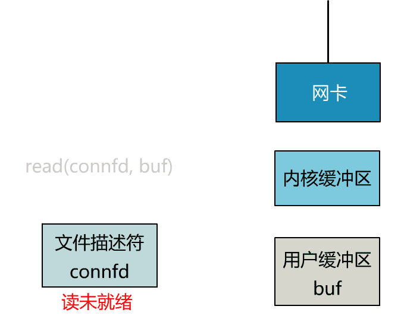

这就是传统的阻塞 IO。

整体流程如下图：


也可参考另一张读UDP数据报的图：


> 所以，blocking IO的特点就是在IO执行的两个阶段都被block了。

## 1.2 非阻塞I/O模型 （nonblocking IO）

为了解决上面的问题，其关键在于改造这个 read 函数。

<font color="8e8e8e">有一种聪明的办法是，每次都创建一个新的进程或线程，去调用 read 函数，并做业务处理。</font>>

```c
while(1) {
  connfd = accept(listenfd);  // 阻塞建立连接
  pthread_create（doWork);  // 创建一个新的线程
}
void doWork() {
  int n = read(connfd, buf);  // 阻塞读数据
  doSomeThing(buf);  // 利用读到的数据做些什么
  close(connfd);     // 关闭连接，循环等待下一个连接
}
```

<font color="8e8e8e">这样，当给一个客户端建立好连接后，就可以立刻等待新的客户端连接，而不用阻塞在原客户端的 read 请求上。</font>


<font color="8e8e8e">不过，这不叫非阻塞 IO，只不过用了多线程的手段使得主线程没有卡在 read 函数上不往下走罢了。操作系统为我们提供的 read 函数仍然是阻塞的。</font>

所以真正的非阻塞 IO，不能是通过我们用户层的小把戏，**而是要恳请操作系统为我们提供一个非阻塞的 read 函数**。

这个 read 函数的效果是，如果没有数据到达时（到达网卡并拷贝到了内核缓冲区），立刻返回一个错误值（-1），而不是阻塞地等待。

操作系统提供了这样的功能，只需要在调用 read 前，将文件描述符设置为非阻塞即可。

```c
fcntl(connfd, F_SETFL, O_NONBLOCK);
int n = read(connfd, buffer) != SUCCESS);
```

这样，就需要用户线程循环调用 read，直到返回值不为 -1，再开始处理业务。【轮询】


这里我们注意到一个细节。

非阻塞的 read，指的是在数据到达前，即数据还未到达网卡，或者到达网卡但还没有拷贝到内核缓冲区之前，这个阶段是非阻塞的。

当数据已到达内核缓冲区，此时调用 read 函数仍然是阻塞的，需要等待数据从内核缓冲区拷贝到用户缓冲区，才能返回。

整体流程如下图


也可参考另一张读UDP数据报的图：


> 所以，nonblocking IO的特点是用户进程需要不断的主动询问kernel数据好了没有，第一阶段没有阻塞。

## 1.3 I/O多路复用模型（ IO multiplexing）

为每个客户端创建一个线程，服务器端的线程资源很容易被耗光。


<font color="8e8e8e">当然还有个聪明的办法，我们可以每 accept 一个客户端连接后，将这个文件描述符（connfd）放到一个数组里。</font>

```c
fdlist.add(connfd);
```

<font color="8e8e8e">然后弄一个新的线程去不断遍历这个数组，调用每一个元素的非阻塞 read 方法。</font>

```c
while(1) {
  for(fd <-- fdlist) {
    if(read(fd) != -1) {
      doSomeThing();
    }
  }
}
```

<font color="8e8e8e">这样，我们就成功用一个线程处理了多个客户端连接。</font>

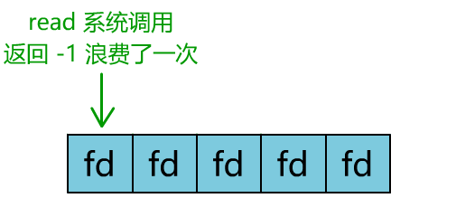

<font color="8e8e8e">你是不是觉得这有些多路复用的意思？</font>

<font color="8e8e8e">但这和我们用多线程去将阻塞 IO 改造成看起来是非阻塞 IO 一样，这种遍历方式也只是我们用户自己想出的小把戏，每次遍历遇到 read 返回 -1 时仍然是一次浪费资源的系统调用。</font>

<font color="8e8e8e">在 while 循环里做系统调用，就好比你做分布式项目时在 while 里做 rpc 请求一样，是不划算的。</font>

所以，还是得恳请操作系统老大，提供给我们一个有这样效果的函数，我们将一批文件描述符通过一次系统调用传给内核，由内核层去遍历，才能真正解决这个问题。

### select

select 是操作系统提供的系统调用函数，通过它，我们可以把一个文件描述符的数组发给操作系统， 让操作系统去遍历，确定哪个文件描述符可以读写， 然后告诉我们去处理：


select系统调用的函数定义如下:

```c
int select(
    int nfds,
    fd_set *readfds,
    fd_set *writefds,
    fd_set *exceptfds,
    struct timeval *timeout);
// nfds:监控的文件描述符集里最大文件描述符加1
// readfds：监控有读数据到达文件描述符集合，传入传出参数
// writefds：监控写数据到达文件描述符集合，传入传出参数
// exceptfds：监控异常发生达文件描述符集合, 传入传出参数
// timeout：定时阻塞监控时间，3种情况
//  1.NULL，永远等下去
//  2.设置timeval，等待固定时间
//  3.设置timeval里时间均为0，检查描述字后立即返回，轮询
```

服务端代码，这样来写。

首先一个线程不断接受客户端连接，并把 socket 文件描述符放到一个 list 里。

```c
while(1) {
  connfd = accept(listenfd);
  fcntl(connfd, F_SETFL, O_NONBLOCK);
  fdlist.add(connfd);
}
```

然后，另一个线程不再自己遍历，而是调用 select，将这批文件描述符 list 交给操作系统去遍历。

```c
while(1) {
  // 把一堆文件描述符 list 传给 select 函数
  // 有已就绪的文件描述符就返回，nready 表示有多少个就绪的
  nready = select(list);
  ...
}
```

不过，当 select 函数返回后，用户依然需要遍历刚刚提交给操作系统的 list。

只不过，操作系统会将准备就绪的文件描述符做上标识，用户层将不会再有无意义的系统调用开销。

```c
while(1) {
  nready = select(list);
  // 用户层依然要遍历，只不过少了很多无效的系统调用
  for(fd <-- fdlist) {
    if(fd != -1) {
      // 只读已就绪的文件描述符
      read(fd, buf);
      // 总共只有 nready 个已就绪描述符，不用过多遍历
      if(--nready == 0) break;
    }
  }
}
```

正如刚刚的动图中所描述的，其直观效果如下：


可以看出几个细节：

1. select 调用需要传入 fd 数组，需要拷贝一份到内核，高并发场景下这样的拷贝消耗的资源是惊人的。（可优化为不复制）

2. select 在内核层仍然是通过遍历的方式检查文件描述符的就绪状态，是个同步过程，只不过无系统调用切换上下文的开销。（<font color="ff0000">内核层可优化为异步事件通知。</font><font color="8e8e8e">Y：大概由此将多路复用归为了异步阻塞类型。</font>）

3. select 仅仅返回可读文件描述符的个数，具体哪个可读还是要用户自己遍历。（可优化为只返回给用户就绪的文件描述符，无需用户做无效的遍历）。
4. Y：fd_set是一个bitmap，Linux上其默认大小为1024，限制了select能够处理的最大文件描述符数量即能处理的最大连接数。

整个 select 的流程图如下：


可以看到，这种方式，既做到了一个线程处理多个客户端连接（文件描述符），又减少了系统调用的开销（多个文件描述符只有一次 select 的系统调用 + n 次就绪状态的文件描述符的 read 系统调用）。

也可参考另一张读UDP数据报的图：


### poll

poll 也是操作系统提供的系统调用函数。

```c
int poll(struct pollfd *fds, nfds_tnfds, int timeout);

struct pollfd {
  intfd; /*文件描述符*/
  shortevents; /*监控的事件*/
  shortrevents; /*监控事件中满足条件返回的事件*/
};
```

它和 select 的主要区别就是，去掉了 select 只能监听 1024 个文件描述符的限制。

### epoll

epoll 是最终的大 boss，它解决了 select 和 poll 的一些问题。

还记得上面说的 select 的三个细节么？

1. select 调用需要传入 fd 数组，需要拷贝一份到内核，高并发场景下这样的拷贝消耗的资源是惊人的。（可优化为不复制）

2. select 在内核层仍然是通过遍历的方式检查文件描述符的就绪状态，是个同步过程，只不过无系统调用切换上下文的开销。（内核层可优化为异步事件通知）

3. select 仅仅返回可读文件描述符的个数，具体哪个可读还是要用户自己遍历。（可优化为只返回给用户就绪的文件描述符，无需用户做无效的遍历）

所以 epoll 主要就是针对这三点进行了改进。

1. 内核中保存一份文件描述符集合，无需用户每次都重新传入，只需告诉内核修改的部分即可。

2. 内核不再通过轮询的方式找到就绪的文件描述符，而是通过异步 IO 事件唤醒。

3. 内核仅会将有 IO 事件的文件描述符返回给用户，用户也无需遍历整个文件描述符集合。

具体，操作系统提供了这三个函数。

第一步，创建一个 epoll 句柄

```c
int epoll_create(int size);
```

第二步，向内核添加、修改或删除要监控的文件描述符。

```c
int epoll_ctl(
  int epfd, int op, int fd, struct epoll_event *event);
```

第三步，类似发起了 select() 调用

```c
int epoll_wait(
  int epfd, struct epoll_event *events, int max events, int timeout);
```

使用起来，其内部原理如下：


epoll 的底层原理，详见《[图解 | 深入揭秘 epoll 是如何实现 IO 多路复用的！](http://mp.weixin.qq.com/s?__biz=MjM5Njg5NDgwNA==&mid=2247484905&idx=1&sn=a74ed5d7551c4fb80a8abe057405ea5e&chksm=a6e304d291948dc4fd7fe32498daaae715adb5f84ec761c31faf7a6310f4b595f95186647f12&scene=21#wechat_redirect)》

总结：

- IO multiplexing就是我们说的select，poll，epoll，有些地方也称这种IO方式为event driven IO。
- 多路复用产生的效果，完全可以由用户态去遍历文件描述符并调用其非阻塞的 read 函数实现。而多路复用快的原因在于，操作系统提供了这样的系统调用，使得原来的 while 循环里多次系统调用，变成了一次系统调用 + 内核层遍历这些文件描述符。<font color="ff0000">即减少大量的系统调用</font>。
- 如果处理的连接数不是很高的话，使用select/epoll的web server不一定比使用multi-threading + blocking IO的web server性能更好，可能延迟还更大。select/epoll的优势并不是对于单个连接能处理得更快，而是**在于能在更快的时间里处理更多的连接**。
- Y：IO多路复用，好像是在用户程序与文件描述符之间加了一个代理，统一管理所有的连接，而且该代理是在内核态工作的，其与文件描述符之间的操作避免了系统调用。

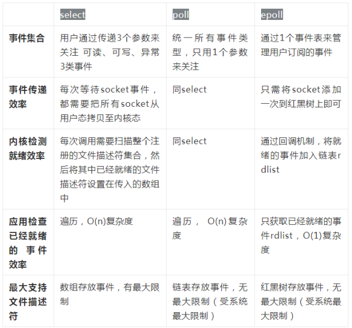

## 1.4 信号驱动I/O模型

我们也可以用信号，让内核在描述符就绪时发送SIGIO信号通知我们。通过sigaction系统调用安装一个信号处理函数。该系统调用将立即返回，我们的进程继续工作，也就是说它没有被阻塞。当数据报准备好读取时，内核就为该进程产生一个SIGIO信号。我们随后既可以在信号处理函数中调用recvfrom读取数据报，并通知主循环数据已经准备好待处理。

优势：等待数据报到达期间进程不被阻塞。主循环可以继续执行，只要等待来自信号处理函数的通知：既可以是数据已准备好被处理，也可以是数据报已准备好被读取。

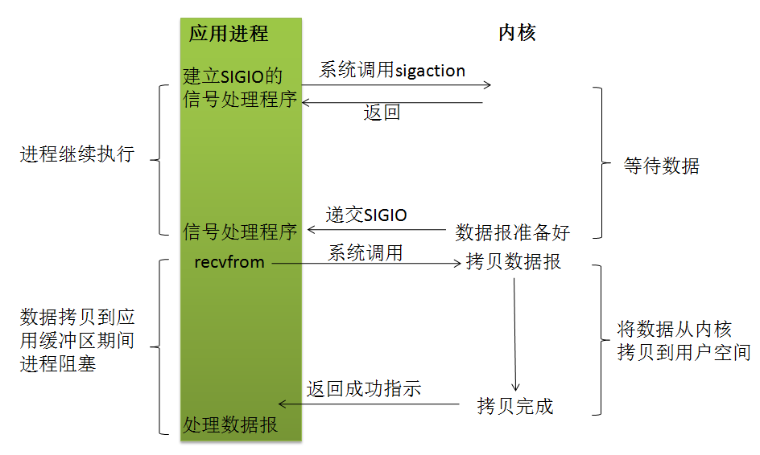

## 1.5 异步I/O模型（asynchronous IO）

告知内核启动某个操作，并让内核在整个操作(包括将内核复制到我们自己的缓冲区)完成后通知我们。

**与信号驱动模型的主要区别在于：**信号驱动式I/O是由内核通知我们何时可以启动一个I/O操作，而异步模型是由内核通知我们I/O操作何时完成。

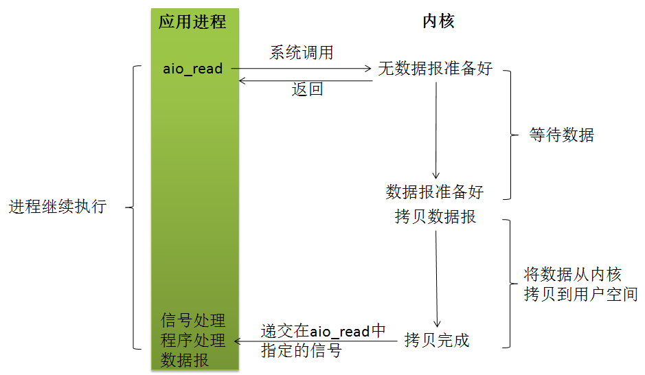

调用aio_read（Posix异步I/O函数以aio\_或lio\_开头）函数，给内核传递描述字、缓冲区指针、缓冲区大小（与read相同的3个参数）、文件偏移以及通知的方式，然后系统立即返回。我们的进程不阻塞于等待I/0操作的完成。当内核将数据拷贝到缓冲区后，再通知应用程序。 

用户进程发起read操作之后，立刻就可以开始去做其它的事。而另一方面，从kernel的角度，当它受到一个asynchronous read之后，首先它会立刻返回，所以不会对用户进程产生任何block。然后，kernel会等待数据准备完成，然后将数据拷贝到用户内存，当这一切都完成之后，kernel会给用户进程发送一个signal，告诉它read操作完成了。

## 1.6 各个IO 模型的比较


# 2. Java中的IO

## 2.1 基于字节的IO操作

### InputStream

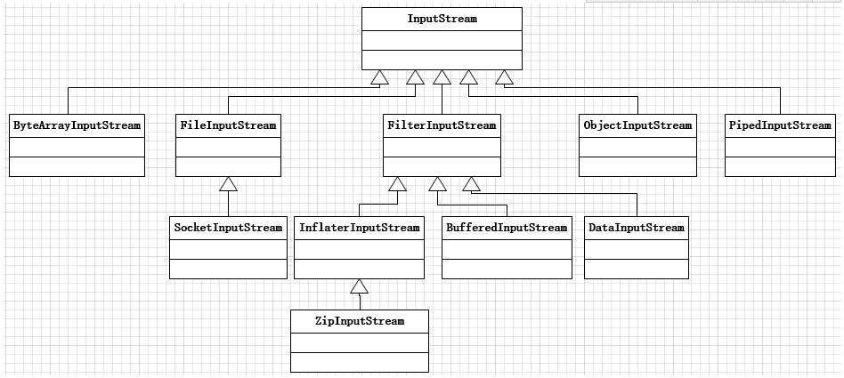

InputStream的作用表示那些从不同数据源产生输入的类，即其派生类多是不同数据源对应的流对象。如下：

- ByteArrayInputStream：从内存缓冲区读取字节数组

- FileInputStream：从文件中读取字节，其构造参数可以是文件名、File对象或FileDescriptor

- ObjectInputStream：主要用于反序列化，读取基本数据类型或对象

- PipedInputStream：产生用于写入相关PipedOutputStream的数据，实现“管道化”概念，多用于多线程中。

- FilterInputStream：作为**装饰器类**，其子类与上述不同流对象叠合使用，通过添加属性或有用的接口，以控制特定输入流。常见的有如下几个：
  - DataInputStream：与DataOutputStream搭配使用，读取基本类型数据及String对象。
  - BufferdInputStream：使用缓冲区的概念，避免每次都进行实际读操作，提升I/O性能。
    - 不是减少磁盘IO操作次数（这个OS已经帮我们做了），而是通过减少系统调用次数来提高性能的。
  - InflaterInputStream：其子类GZIPInputStream和ZipInputStream可以读取GZIP和ZIP格式的数据。

### OutputStream


与InputStream相对应，OutputStream的作用表示将数据写入不同的数据源，常用的输出流对象如下：

- ByteArrayOutputStream：在内存中创建缓冲区，写入字节数组

- FileOutputStream：将字节数据写入文件中，其构造参数可以是文件名、File对象或FileDescriptor

- ObjectOutputStream：主要用于序列化，作用于基本数据类型或对象

- PipedOutputStream：任何写入其中的数据，都会自动作为相关PipedInputStream的输出，实现“管道化”概念，多用于多线程中。

- FilterOutputStream：作为装饰器类，其子类与上述不同流对象叠合使用，通过添加属性或有用的接口，以控制特定输出流。常见的几个如下：
  - DataOutputStream：与DataInputStream搭配使用，写入基本类型数据及String对象。
  - PrintStream：用于格式化输出显示。
  - BufferdOutputStream：使用缓冲区的概念，避免每次都进行实际写操作，提升I/O性能。
  - DeflaterOutputStream：其子类GZIPOutputStream和ZipOutputStream可以写GZIP和ZIP格式的数据。

## 2.2 基于字符的IO操作

不管是磁盘还是网络传输，数据处理的最小单元都是字节，而不是字符。故所有I/O操作的都是字节而不是字符。为了方便引入了字符操作，其中涉及字节到字符的转换适配，InputStreamReader可以把InputStream转为Reader，OutputStreamWriter可以把OutputStream转为Writer。对上述按字节操作的流对象，可以采用FilterInputStream和FilterOutputStream的装饰器子类控制流。Reader和Writer沿用相似的思想，但不完全相同。

### 1. Reader类型


继承自Reader类的，字符型数据来源常用类，如下：

- InputStreamReader：字节与字符适配器，子类包含FileReader（以字符形式读取文件）　

- CharArrayReader：读取字符数组

- StringReader：数据源是字符串

- BufferedReader：读取字符输入流，并进行缓存， 表示采用缓存的方式从文件读取数据。
  - 常用法：```sql BufferedReader in = new BufferedReader(new FileReader("foo.in"));```

- PipedReader：管道形式读取字符　　

- FilterReader：对Reader装饰，直接使用的不多，如PushbackReader

### 2. Writer类型


继承自Writer类的，字符型数据来源常用类，如下：

　　OutputStreamReader：字节与字符适配器，子类包含FileWriter（以字符形式写文件）　

　　CharArrayWriter：写字符数组

　　StringWriter：内部有StringBuffer，用于缓存构造字符串

　　BufferedWriter：字符输出流，常用法：PrintWriter out = new PrintWriter(new BufferedWriter(new FileWriter("foo.out"))); 表示将数据格式化并用缓存的方式写入文件

　　PipedWriter：管道形式输出字符　　

　　FilterWriter：对Writer装饰，如XMLWriter

## 2.3 RandomAccessFile

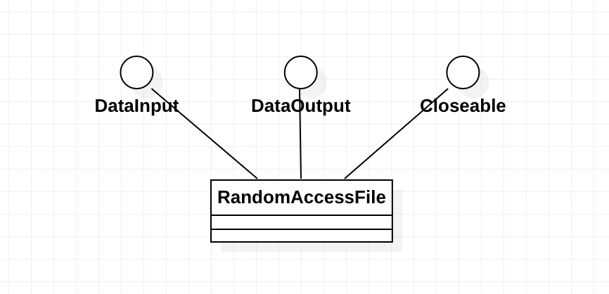

此类的实例支持**读取和写入随机访问文件**。 随机访问文件的行为类似于存储在文件系统中的一个很大的字节数组。 有一种游标，或隐含数组的索引，称为**文件指针**； 输入操作从文件指针开始读取字节，并将文件指针前进到读取的字节之后。 如果随机存取文件是以 read/write 模式创建的，那么也可以进行输出操作； 输出操作从文件指针开始写入字节，并将文件指针前进到写入的字节之后。 写入超过隐含数组当前末尾的输出操作会导致数组被扩展。 文件指针可以通过*getFilePointer*方法读取并通过*seek*方法设置。
此类中的所有读取例程通常都是如此，如果在读取所需的字节数之前到达文件尾，则会抛出EOFException （这是IOException的一种）。 如果由于文件结束以外的任何原因无法读取任何字节，则抛出EOFException以外的IOException 。 特别是，如果流已关闭，则可能会抛出IOException 。

## 2.4 总结

1. I/O操作本质是基于字节流的操作，InputStream和OutputStream对输入和输出源进行了抽象，其子类代表不同的数据源。

2. FilterInputStream和FilterOutputStream采用装饰器模式，对输入和输出流进行控制，如采用缓冲器、读基本数据类型等。

3. Reader和Writer代表基于字符的操作，底层是基于字节操作，经过InputStreamReader和OutputStreamWriter，采用StreamEncoder和StreamDecoder，将输入输出流，按Charset进行转换。

4. 所有基于字节或字符的操作，基本都采用叠合的方式。如输入流采用缓存的方式从文件中读取，输出流采用缓存的方式按格式输出到文件。

# 3. Java中的NIO

新I/O（NIO）是JDK1.4引入的新Java I/O类库，目的在于提速，现在旧I/O也是基于NIO实现的。I/O包括文件I/O和网络I/O。速度的提升源自于所使用的结构更接近操作系统执行I/O的方式：**通道和缓冲器**。应用与缓冲器交互，缓冲器与通道交互。其中，最基础的与通道交互的是ByteBuffer，即用于存储字节的缓冲器。

**NIO的核心包括**：通道（Channel）、缓冲器（ByteBuffer）和选择器（Selector）。其中通道与缓冲器交互方式如下图，缓冲器可以从通道读数据和写数据，通道与具体数据来源对应。


## 3.1 通道


通道表示与实体的开放连接，可以通过通道进行读写。常用的通道有：

- FileChannel：用于读取、写入、映射和操作文件的通道。
- SocketChannel：面向流的（stream-oriented）连接套接字的selectable通道。
  - 通过TCP读写网络中的数据。
- ServerSocketChannel：面向流的（stream-oriented）侦听套接字的selectable通道。
  - 可以监听新进来的TCP连接，像Web服务器那样。对每一个新进来的连接都会创建一个SocketChannel。
- DatagramChanne：面向数据报的（datagram-oriented）套接字的selectable通道。
  - 通过UDP读写网络中的数据。

FileChannel用于本地磁盘文件的操作，后三者用于网络传输。

### 3.1.1 FileChannel

**文件通道总是阻塞式的**，因此不能被置于非阻塞模式。现代操作系统都有复杂的缓存和预取机制，使得本地磁盘I/O操作延迟很少。网络文件系统一般而言延迟会多些，不过却也因该优化而受益。面向流的I/O的非阻塞范例对于面向文件的操作并无多大意义，这是由文件I/O本质上的不同性质造成的。**对于文件I/O，最强大之处在于异步I/O（asynchronous I/O）**，它允许一个进程可以从操作系统请求一个或多个I/O操作而不必等待这些操作的完成。发起请求的进程之后会收到它请求的I/O操作已完成的通知。

　　FileChannel对象是线程安全（thread-safe）的。多个进程可以在同一个实例上并发调用方法而不会引起任何问题，不过并非所有的操作都是多线程的（multithreaded）。影响通道位置或者影响文件大小的操作都是单线程的（single-threaded）。如果有一个线程已经在执行会影响通道位置或文件大小的操作，那么其他尝试进行此类操作之一的线程必须等待。并发行为也会受到底层的操作系统或文件系统影响。

　　每个FileChannel对象都同一个文件描述符（file descriptor）有一对一的关系，所以上面列出的API方法与在您最喜欢的POSIX（可移植操作系统接口）兼容的操作系统上的常用文件I/O系统调用紧密对应也就不足为怪了。本质上讲，RandomAccessFile类提供的是同样的抽象内容。在通道出现之前，底层的文件操作都是通过RandomAccessFile类的方法来实现的。FileChannel模拟同样的I/O服务，因此它的API自然也是很相似的。

三者之间的方法对比：

| FILECHANNEL                 | RANDOMACCESSFILE  | POSIX SYSTEM CALL |
| --------------------------- | ----------------- | ----------------- |
| read( )                     | read( )           | read( )           |
| write( )                    | write( )          | write( )          |
| size( )                     | length( )         | fstat( )          |
| position( )                 | getFilePointer( ) | lseek( )          |
| position (long newPosition) | seek( )           | lseek( )          |
| truncate( )                 | setLength( )      | ftruncate( )      |
| force( )                    | getFD().sync( )   | fsync( )          |

下面是一个使用FileChannel读取数据到Buffer中的示例：

```java
package com.coder.love.demo.trys;

import java.io.FileInputStream;
import java.io.FileNotFoundException;
import java.io.FileOutputStream;
import java.io.IOException;
import java.io.RandomAccessFile;
import java.nio.ByteBuffer;
import java.nio.channels.FileChannel;
import java.nio.file.Files;
import java.nio.file.Paths;

public class FileChannelTry {
  public static void main(String[] args) {
    try (
      // 方式1: 使用FileInputStream、FileOutputStream分别打开输入、输出 FileChannel。
      FileInputStream is = new FileInputStream("./pom.xml");
      FileChannel iC = is.getChannel();
      FileOutputStream os = new FileOutputStream("./tmp_out_pom.xml");
      FileChannel oC = os.getChannel()) {
      //通道之间的数据传输：transferTo和transferFrom方法
      iC.transferTo(0, iC.size(), oC);
    } catch (FileNotFoundException e) {
      e.printStackTrace();
    } catch (IOException e) {
      e.printStackTrace();
    }
    try (
      // 方式2: 使用RandomAccessFile打开FileChannel。
        RandomAccessFile aFile = new RandomAccessFile("./tmp_out_pom.xml", "r");
      //1. 获取通道
        FileChannel inChannel = aFile.getChannel()) {
      //2. 创建缓冲区
      ByteBuffer buf = ByteBuffer.allocate(48);
      //3. 读取数据到缓冲区
      int bytesRead = inChannel.read(buf);
      while (bytesRead != -1) {
        System.out.println("Read: " + bytesRead);
        buf.flip();
        while (buf.hasRemaining()) {
          System.out.print((char) buf.get());
        }
        System.out.println();
        buf.clear();
        bytesRead = inChannel.read(buf);
      }
      System.out.println("End.");
    } catch (FileNotFoundException e) {
      e.printStackTrace();
    } catch (IOException e) {
      e.printStackTrace();
    }
    try {
      Files.delete(Paths.get("./tmp_out_pom.xml"));
    } catch (IOException e) {
      e.printStackTrace();
    }
  }
}
```

- FileChannel不能直接获取，需要通过FileInputStream、FileOutputStream、RandomAccessFile来获取。
- FileChannel 需要配合ByteBuffer（唯一直接与通道交互的缓冲器）来完成读写。

### 3.1.2 Socket Channel

- 新的socket通道类可以运行非阻塞模式并且是可选择的。

- 全部socket通道类（DatagramChannel、SocketChannel和ServerSocketChannel）在被实例化时都会创建一个**对等socket对象**。这些是我们所熟悉的来自java.net的类（Socket、ServerSocket和DatagramSocket），它们已经被更新以识别通道。对等socket可以通过调用socket( )方法从一个通道上获取。此外，这三个java.net类现在都有getChannel( )方法。
- Socket通道将与通信协议相关的操作委托给相应的socket对象。socket的方法看起来好像在通道类中重复了一遍，但**实际上通道类上的方法会有一些新的或者不同的行为**。

AbstractSelectableChannel

- 此类定义了处理通道注册、取消注册和关闭机制的方法。 它保持该通道的当前阻塞模式及其当前的selection keys。 它完成实现SelectableChannel规范所需的所有同步。 此类中定义的抽象受保护方法的实现不需要与可能参与相同操作的其他线程同步。

#### 3.1.2.1 ServerSocketChannel

ServerSocketChannel负责监听传入的连接和创建新的SocketChannel对象，它本身从不传输数据。

```java
public static final String GREETING = "Hello I must be going.\n";

  public static void channelAccept() {
    int port = 9123;
    ByteBuffer buffer = ByteBuffer.wrap(GREETING.getBytes());
    try (ServerSocketChannel ssc = ServerSocketChannel.open()) {
      // 设置监听的端口
      ssc.socket().bind(new InetSocketAddress(port));
      // 设置accept方法是否阻塞。
      ssc.configureBlocking(false);
      while (true) {
        System.out.println("Waiting for connections.");
        // 监听新进来的连接。
        SocketChannel sc = ssc.accept();
        if (sc == null) {
          System.out.println("sc is null.");
          Thread.sleep(2000);
        } else {
          System.out.println("Incoming connection from: " + sc.socket().getRemoteSocketAddress());
          buffer.rewind();
          // 响应，curl "http://localhost:9123"
          sc.write(buffer);
          sc.close();
        }
      }
    } catch (IOException e) {
      e.printStackTrace();
    } catch (InterruptedException e) {
      e.printStackTrace();
    }
  }
```

#### 3.1.2.2 SocketChannel

Java NIO中的SocketChannel是一个连接到TCP网络套接字的通道。可以通过以下2种方式创建SocketChannel：

- 打开一个SocketChannel并连接到互联网上的某台服务器。
- 一个新连接到达ServerSocketChannel时，会创建一个SocketChannel。

```java
public static void socketChannelTry() {
    // 内容可在浏览器中复制，"Request -> View source"，但还是有问题，返回400。
    String request =
            "GET /step/one HTTP/1.1 " + "Host: localhost " + "Connection: keep-alive "
                + "User-Agent: Mozilla/5.0 (Macintosh; Intel Mac OS X 10_15_7) AppleWebKit/537.36 (KHTML, like Gecko) "
                + "Chrome/92.0.4515.159 Safari/537.36 "
                + "Accept: text/html,application/xhtml+xml,application/xml;q=0.9,image/avif,image/webp,image/apng,*/*;q=0"
                + ".8,application/signed-exchange;v=b3;q=0.9 "
                + "Accept-Encoding: gzip, deflate " + "Accept-Language: zh-CN,zh;q=0.9";
    try (SocketChannel socketChannel = SocketChannel.open()) {
      // 设置为非阻塞
      socketChannel.configureBlocking(false);
      socketChannel.connect(new InetSocketAddress("localhost", 8080));
      // 轮询，直至连接建立。
      while (!socketChannel.finishConnect()) {
        Thread.sleep(10);
      }
      // 向SocketChannel中写入数据，即Http Request。
      ByteBuffer wb = ByteBuffer.wrap(request.getBytes(StandardCharsets.UTF_8));
      // 非阻塞模式下，write()方法在尚未写出任何内容时可能就返回了。所以需要在循环中调用write()。
      while (wb.hasRemaining()) {
        socketChannel.write(wb);
      }
      //从SocketChannel中读取数据
      ByteBuffer buf = ByteBuffer.allocate(1024);
      // 非阻塞模式下,read()方法在尚未读取到任何数据时可能就返回了。所以需要关注它的int返回值，它会告诉你读取了多少字节。
      int bytesRead = socketChannel.read(buf);
      boolean readed = false;
      while (bytesRead != -1) {
        if (bytesRead == 0 && readed) {
          break;
        } else if (bytesRead == 0) {
          continue;
        }
        buf.flip();
        while (buf.hasRemaining()) {
          System.out.print((char) buf.get());
        }
        System.out.println();
        buf.clear();
        readed = true;
        bytesRead = socketChannel.read(buf);
      }
      System.out.println(bytesRead);
    } catch (IOException | InterruptedException e) {
      e.printStackTrace();
    }
  }
```

- 非阻塞模式与选择器搭配会工作的更好，通过将一或多个SocketChannel注册到Selector，可以询问选择器哪个通道已经准备好了读取，写入等。

#### 3.1.2.3 DatagramChannel

- DatagramChannel则模拟包导向的无连接协议（如UDP/IP）。
- 每个数据报（datagram）都是一个自包含的实体，拥有它自己的目的地址及不依赖其他数据报的数据负载。

## 3.2 缓冲

缓冲器除了基本的ByteBuffer外，还有CharBuffer、IntBuffer、ShortBuffer、LongBuffer、FloatBuffer、DoubleBuffer等基本类型缓冲器。


- 仅ByteBuffer可直接与Channel交互，完成读写。

- 可以通过**视图缓冲器** 以特定基本数据类型查看底层的ByteBuffer，这个过程涉及编码的问题。如：

  ```java
  ByteBuffer buffer = ByteBuffer.wrap(new byte[] {0, 0, 0, 0, 0, 0, 0, 'a'});
  IntBuffer intBuffer = buffer.asIntBuffer();
  ```

## 3.3 选择器 -> 多路复用


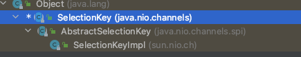

选择器（Selector)

- SelectableChannel对象的**多路复用器**。
- 可以通过调用该类的 `open` 方法来创建选择器，该方法将使用系统默认的 `SelectorProvider` 来创建新的选择器。 也可以通过调用自定义选择器提供者的`openSelector`方法来创建选择器。 选择器保持打开状态，直到通过其`close`方法关闭为止。
- 一个 selectable channel 向选择器的注册由SelectionKey对象表示。 选择器维护三组选择键：
  - **`key set`** 包含着代表此选择器当前通道注册的键。 这个集合由keys方法返回。
  - **`selected-key set`** 是这样一组key，在先前的选择操作期间，检测到每个键的通道为键的 **`interest set`** 中标识的至少一个操作做好了准备。 该集合由selectedKeys方法返回。 它始终是**`key set`** 的子集。
  - **`cancelled-key set`** 是已经被取消但其通道还没有被注销的key集。 这个集合不能直接访问。 **`cancelled-key set`**集始终是**`key set`**的子集。

**interest集合**

Selector 监听四种不同类型的事件：

1. Connect   ->   SelectionKey.OP_CONNECT
2. Accept     ->   SelectionKey.OP_ACCEPT
3. Read        ->   SelectionKey.OP_READ
4. Write        ->   SelectionKey.OP_WRITE

如果对不止一种事件感兴趣，那么可以用“位或”操作符将常量连接起来，如下：

```
int interestSet = SelectionKey.OP_READ | SelectionKey.OP_WRITE;
```

```java
// 创建一个Selector
Selector selector = Selector.open();
// channel必须设置为非阻塞的。
channel.configureBlocking(false);
// 将channel注册到selector上
SelectionKey key = channel.register(selector, SelectionKey.OP_READ);
while(true) {
  // select()阻塞到至少有一个通道在你注册的事件上就绪了。
  int readyChannels = selector.select();
  if(readyChannels == 0) continue;
  // 可以遍历这个已选择的键集合来访问就绪的通道。
  Set selectedKeys = selector.selectedKeys();
  Iterator keyIterator = selectedKeys.iterator();
  while(keyIterator.hasNext()) {
    SelectionKey key = keyIterator.next();
    if(key.isAcceptable()) {
        // a connection was accepted by a ServerSocketChannel.
    } else if (key.isConnectable()) {
        // a connection was established with a remote server.
    } else if (key.isReadable()) {
        // a channel is ready for reading
    } else if (key.isWritable()) {
        // a channel is ready for writing
    }
    keyIterator.remove();
  }
}
```

注意：

- 在每次迭代时, 我们都调用 "keyIterator.remove()" 将这个 key 从迭代器中删除, 因为 select() 方法仅仅是简单地将就绪的 IO 操作放到 selectedKeys 集合中, 因此如果我们从 selectedKeys 获取到一个 key, 但是没有将它删除, 那么下一次 select 时, 这个 key 所对应的 IO 事件还在 selectedKeys 中。
  - 例如此时我们收到 OP_ACCEPT 通知, 然后我们进行相关处理, 但是并没有将这个 Key 从 SelectedKeys 中删除, 那么下一次 select() 返回时 我们还可以在 SelectedKeys 中获取到 OP_ACCEPT 的 key.
-  我们可以动态更改 SekectedKeys 中的 key 的 interest set。 例如在 OP_ACCEPT 中, 我们可以将 interest set 更新为 OP_READ, 这样 Selector 就会将这个 Channel 的 读 IO 就绪事件包含进来了。

**关于Selector执行选择的过程**

在每个选择操作期间，键可以被添加到选择器的选择键集中和从中删除，并且可以从其**`cancelled-key set`**和**`key set`**中删除。

选择由select() 、 select(long)和selectNow()方法执行，包括三个步骤：

- **`cancelled-key set`**中的每个key都从它所属的每个key set中删除，并取消其通道的注册。 此步骤将**`cancelled-key set`**置空。
- 在选择操作开始的那一刻，底层操作系统被查询关于每个剩余通道是否准备好执行由其键的兴趣集标识的任何操作的更新。 对于准备好进行至少一项此类操作的通道，将执行以下两个操作之一：
  - 如果通道的key不在**`selected-key set`**中，则将其添加到该集中，并修改其**`ready-operation set`** 以准确标识通道现在报告已准备就绪的那些操作。 任何先前记录在**`ready-operation set`**中的就绪信息都将被丢弃。
  - 否则，通道的密钥已经在**`selected-key set`**中，因此它的**`ready-operation set`** 被修改以标识通道报告为准备就绪的任何新操作。 先前记录在**`ready-operation set`**中的任何就绪信息都将保留； 换句话说，底层系统返回的**`ready-operation set`**被逐位分解为键的当前**`ready-operation set`**。
    如果在此步骤开始时**`key set`**中的所有键都具有空的兴趣集，则**`selected-key set`**和任何键的**`ready-operation set`**都不会更新。
- 如果在执行步骤 (2) 时将任何键添加到**`cancelled-key set`**中，则它们将按照步骤 (1) 进行处理。

选择操作是否阻塞等待一个或多个通道准备就绪，如果阻塞又等待多长时间，是三种选择方法之间唯一的本质区别。

**并发**

选择器本身对于多个并发线程使用是安全的； 然而，他们的键集不是。

在select()或select(long)方法之一中阻塞的线程可能会被其他线程以三种方式之一中断：

- 通过调用选择器的wakeup方法；
- 通过调用选择器的close方法；
- 通过调用被阻塞线程的interrupt方法，在这种情况下将设置其中断状态并调用选择器的wakeup方法。

#### Selector 的实现

Selector.open()

```java
public static Selector open() throws IOException {
  return SelectorProvider.provider().openSelector();
}
```

SelectorProvider.provider()

```java
		/**
		 * 为 Java 虚拟机的此调用返回系统范围的默认选择器提供程序。
 		 * 此方法的第一次调用将定位默认提供程序对象，如下所示：
 		 * 1. 如果定义了系统属性java.nio.channels.spi.SelectorProvider则它被视为具体提供者类的完全限定名称。 
 		 * 类被加载并实例化； 如果此过程失败，则会引发未指定的错误。
		 * 2. 如果提供程序类已安装在系统类加载器可见的 jar 文件中，并且该 jar 文件在资源目录META-INF/services 中包含名为	  
		 * java.nio.channels.spi.SelectorProvider的提供程序配置文件，然后采用该文件中指定的第一个类名。 
		 * 类被加载并实例化； 如果此过程失败，则会引发未指定的错误。
 		 * 3. 最后，如果上述任何一种方式都没有指定提供者，则系统默认提供者类将被实例化并返回结果。
 		 * 此方法的后续调用返回第一次调用返回的提供程序。
 		 * 返回：系统范围的默认选择器提供程序
		 **/
		public static SelectorProvider provider() {
        synchronized (lock) {
            if (provider != null)
                return provider;
            return AccessController.doPrivileged(
                new PrivilegedAction<SelectorProvider>() {
                    public SelectorProvider run() {
                            if (loadProviderFromProperty())
                                return provider;
                            if (loadProviderAsService())
                                return provider;
                            provider = sun.nio.ch.DefaultSelectorProvider.create();
                            return provider;
                        }
                    });
        }
    }
```

sun.nio.ch下有两个SelectorProvider实现类

- KQueueSelectorProvider -> KQueueSelectorImpl -> doSelect -> kqueueWrapper.poll -> native kevent0
- PollSelectorProvider -> PollSelectorImpl -> doSelect -> pollWrapper.poll -> native poll0

可见最终是基于平台提供的实现了IO多路复用的系统调用函数（select、pool、epool、kqueue等）。

# 4. Java 中的 AIO

同样基于事件驱动的思想，通常采用Proactor(前摄器模式)实现。在进行I/O操作时，直接调用API的read或write，这两种方法均为异步。对于读操作，操作系统将数据读到缓冲区，并通知应用程序，对于写操作，操作系统将write方法传递的流写入并主动通知应用程序。它节省了NIO中select函数遍历事件通知队列的代价(红黑树遍历)。

增加的新的类如下:

- AsynchronousChannel：支持异步通道，包括服务端AsynchronousServerSocketChannel和普通AsynchronousSocketChannel等实现。
- CompletionHandler：用户处理器。定义了一个用户处理就绪事件的接口，由用户自己实现，异步io的数据就绪后回调该处理器消费或处理数据。
- AsynchronousChannelGroup：一个用于资源共享的异步通道集合。处理IO事件和分配给CompletionHandler。


另外，主要在java.nio.channels包下增加了下面四个异步通道：

- AsynchronousSocketChannel
- AsynchronousServerSocketChannel
- AsynchronousFileChannel

AIO的实施需充分调用OS参与，IO需要操作系统支持、并发也同样需要操作系统的支持，所以性能方面不同操作系统差异会比较明显。因此在实际中AIO使用不是很广泛。

## Netty使用NIO放弃使用AIO的原因

Netty并没有使用AIO，只使用了NIO。

至于原因，先看下作者原话：

- Not faster than NIO (epoll) on unix systems (which is true)
- There is no daragram suppport
- Unnecessary threading model (too much abstraction without usage)

扩展一下如下：

1. Netty不看重Windows上的使用（这也不只是netty这一个开源框架的事）。在Linux2.6之后系统上，AIO的底层实现仍使用EPOLL，由于实现方式的不成熟，因此在性能上没有明显的优势，而且被JDK封装了一层不容易深度优化。
2. Netty整体架构是reactor模型, 而AIO是proactor模型, 混合在一起会非常混乱，把AIO也改造成reactor模型看起来是把epoll绕个弯又绕回来。
3. AIO有个重要的缺点是接收数据需要预先分配缓存，而NIO只需要在接收时才分配缓存, 所以对连接数量非常大但流量小的情况, 造成了大量的内存浪费。

# 5. 零拷贝与直接内存映射

## 5.1 缓冲区与虚拟内存映射

下面看一个java进程发起read请求加载数据大致的流程图：


 进程发起read请求之后，内核接收到read请求之后，会先检查内核空间中是否已经存在进程所需要的数据，如果已经存在，则直接把数据copy给进程的缓冲区；如果没有内核随即向磁盘控制器发出命令，要求从磁盘读取数据，磁盘控制器把数据直接写入内核read缓冲区，这一步通过DMA完成；接下来就是内核将数据copy到进程的缓冲区；
      如果进程发起write请求，同样需要把用户缓冲区里面的数据copy到内核的socket缓冲区里面，然后再通过DMA把数据copy到网卡中，发送出去。

所有现代操作系统都使用虚拟内存，使用虚拟的地址取代物理地址，这样做的好处是：
      1.一个以上的虚拟地址可以指向同一个物理内存地址，
      2.虚拟内存空间可大于实际可用的物理地址；
利用第一条特性可以把内核空间地址和用户空间的虚拟地址映射到同一个物理地址，这样DMA就可以填充对内核和用户空间进程同时可见的缓冲区了，大致如下图所示：

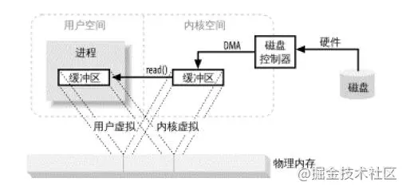

## 5.2 先读然后直接写情况下四种IO方式对比

### 5.2.1 缓存IO（Buffered I/O）


**过程描述：**

1. read()系统调用使上下文从用户态切换到内核态。DMA engine从磁盘中读取文件内容，然后把数据保存在内核地址空间缓存。
2. CPU从内核缓存复制数据到用户缓存，read()系统调用返回。Read()返回后，上下文从内核态切换到用户态。现在，数据储存在用户地址空间缓存。
3. write()系统调用使上下文从用户态切换到内核态。CPU把用户缓存中的数据复制到内核缓存中。这个内核缓存通常与某个特定的socket关联。
4. write()系统调用返回，使上下文从内核态切换到用户态。DMA engine把数据从内核缓存传递到protocal engine，这个过程是独立且异步的。独立且异步的意思是，write()返回不代表已经将所有数据写入到protocal engine，甚至不代表数据传输已经开始。write()返回仅仅表示Ethernet driver已经接受我们的数据传输，这项任务被置入一个队列。

这种IO被称为缓存IO(buffered io). 当应用程序访问某块数据的时候，操作系统内核会先检查这块数据是不是因为前一次对相同文件的访问而已经被存放在操作系统内核地址空间的缓冲区(页缓存)内，如果在内核缓冲区中找不到这块数据，Linux操作系统内核会先将这块数据从磁盘读出来放到操作系统内核的缓冲区里去。

### 5.2.2 直接IO（Direct I/O）

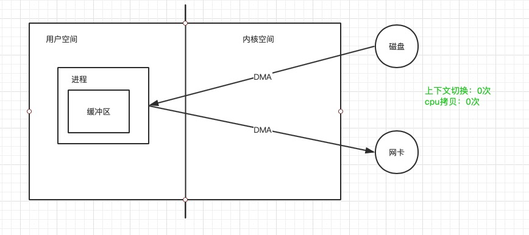

直接IO会把磁盘上的数据直接复制到用户地址空间，而不经过内核地址空间。直接IO适合自缓存应用(self-caching applications)。某些应用程序有自己的数据缓存机制，不需要使用操作系统内核缓存，这种应用程序称为自缓存应用。

> 内核缓存区对读写磁盘数据做了优化,包括按顺序预读取,在成簇磁盘块上执行IO等等。因此在普通的应用中使用直接IO会降低性能。
>
> 一般会在数据库系统使用直接IO。数据库系统的高速缓存和IO优化机制均自成一体，无需内核消耗CPU时间和内存去完成相同的任务。
>
> 直接IO中read和write的行为必须是同步的，但是O_DIRECT不保证同步，因此O_DIRECT必须与O_SYNC连用来保证同步行为。
>
> 请慎用。

### 5.2.3 零拷贝：mmap + write

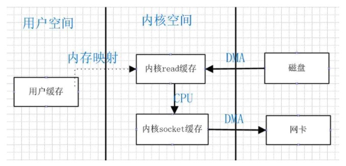


**过程描述：**

1. mmap()系统调用使上下文从用户态切换到内核态。DMA engine从磁盘中读取文件内容，然后把数据保存在内核地址空间缓存。CPU将该内核缓存区与用户进程共享。
2. write()系统调用使上下文从用户态切换到内核态。 CPU把数据从原来的内核缓存复制到另一片与socket关联的内核缓存区。
3. write()系统调用返回，使上下文从内核态切换到用户态。DMA engine把数据从内核缓存传递到protocal engine。

**使用mmap()代替read()可以减少一次CPU copy，但增加了share动作**。当复制的数据量很大，一次CPU copy的花费大于share的花费时，使用mmap()代替read()是能优化性能的。但是，mmap()+write()有一个陷阱：You will fall into one of them when you memory map a file and then call write while another process truncates the same file.write()系统调用会被信号SIGBUS中断，这个信号的默认动作是kill进程然后dump core。作为一个server程序，我们通常不希望被KILL。我们有两种方法解决这个问题：

1. 第一个方法是修改SIGBUS的信号处理程序，将其改为简单的return。这样，SIGBUS信号就不会kill进程，write()会返回被信号中断前已经成功写入的字符数，并设置errno。但是当该进程因其他问题收到SIGBUS信号时，却也简单的return了，这会掩盖运行时出现的巨大问题。因此，不推荐使用方法一。
2. 第二个方法是使用文件租借锁 (windows系统中称为opportunistic lock)。让进程a获得租借锁，当进程b对正在传输的文件进行截断时，内核会给进程a发送信号，进程a会被中断，以防止该进程访问到无效地址并被SIGBUS中断。进程a的write()会返回中断前写入的字符数，并设置errno。以下是租借锁的示例代码

```c
/* l_type can be F_RDLCK F_WRLCK */
if(fcntl(fd, F_SETLEASE, l_type)){
    perror("kernel lease set type");
    return -1;
}
```

你应该在mapping file前获得租借锁，在你完成写之后释放租借锁。

``` c
fcntl(fd, F_SETLEASE, F_UNLCK)
```

### 5.2.4 零拷贝：sendfile

CPU copy次数取决于硬件是否支持gather operation。

**如果硬件不支持gather operation：**


**过程描述：**

1. sendfile()系统调用使上下文从用户态切换到内核态。DMA engine把文件内容复制到内核缓存区。然后CPU把该内核缓存区的数据复制到另一片与socket关联的内核缓存区。
2. sendfile()系统调用返回，使上下文从内核态切换到用户态。DMA engine把数据从内核缓存传递到protocal engine。

如果调用sendfile()时，文件被截断。sendfile()会在在访问到无效地址前返回，以防止被SIGBUS信号中断。

**如果硬件支持gather operation,且Linux2.4以上：**


数据不会从kernel buffer复制到sokcet buffer，仅会把包含kernel buffer地址和长度的信息的描述符append到socket buffer，DMA engine会把数据从kernel buffer直接传到protocol engine。

**sendfile()如果想要做到zero copy，那么被读文件的未写入到被写文件的部分不能被修改。**

> 目前sendfile()由splice()实现的，是对splice()的包装。
>
> splice() moves data between two file descriptors without copying between kernel address space and user address space.
>
> 但是两个fd中必须有一个是pipe。[Stack over flow的Damon](https://stackoverflow.com/questions/24254098/does-linux-have-zero-copy-splice-or-sendfile)不建议使用splice(),因为现在的实现不够完善。

## 5.3 Java 零拷贝

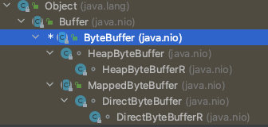

### 5.3.1 MappedByteBuffer

java nio提供的**FileChannel**提供了**map()**方法，该方法可以在一个打开的文件和MappedByteBuffer之间建立一个**虚拟内存映射**，MappedByteBuffer继承于ByteBuffer，类似于一个基于内存的缓冲区，只不过该对象的数据元素存储在磁盘的一个文件中；调用get()方法会从磁盘中获取数据，此数据反映该文件当前的内容，调用put()方法会更新磁盘上的文件，并且对文件做的**修改**对其他阅读者也是**可见**的；下面看一个简单的读取实例，然后在对MappedByteBuffer进行分析：

```java
public class MappedByteBufferTest {

    public static void main(String[] args) throws Exception {
        File file = new File("./db.txt");
        long len = file.length();
        byte[] ds = new byte[(int) len];
        MappedByteBuffer mappedByteBuffer = new FileInputStream(file).getChannel().map(FileChannel.MapMode.READ_ONLY, 0,
                len);
        for (int offset = 0; offset < len; offset++) {
            byte b = mappedByteBuffer.get();
            ds[offset] = b;
        }
        Scanner scan = new Scanner(new ByteArrayInputStream(ds)).useDelimiter(" ");
        while (scan.hasNext()) {
            System.out.print(scan.next() + " ");
        }
    }
}
```

主要通过FileChannel提供的map()来实现映射，map()方法如下：

```java
/**
 * 将此通道的文件的一个区域（region）直接映射到内存中。
 * 文件的一个区域可以以三种模式之一映射到内存:
 * 1. Read-only: 任何修改结果缓冲区的尝试都将导致抛出java.nio.ReadOnlyBufferException. (MapMode.READ_ONLY)
 * 2. Read/write: 对生成的缓冲区所做的更改最终将传播到文件;它们可能对映射了同一文件的其他程序可见，也可能不可见。 
 * (MapMode.READ_WRITE)
 * 3. Private: 对生成的缓冲区所做的更改将不会传播到文件中，并且对映射了同一文件的其他程序也不可见;
 * 相反，它们将导致创建缓冲区中 已修改部分的私有副本。(MapMode.PRIVATE)
 * 对于只读映射，此通道必须已打开用于读取； 对于读/写或私有映射，必须已打开此通道用于读和写。
 * 此方法返回的mapped byte buffer的位置为零，限制和容量为size ；它的标记将是未定义的。 
 * 缓冲区及其表示的映射将保持有效，直到缓 冲区本身被垃圾收集。
 * 映射一旦建立，就不再依赖于用于创建它的文件通道。 特别是关闭通道对映射的有效性没有影响。
 * 内存映射文件的许多细节本质上取决于底层操作系统，因此未指定。 当请求的区域未完全包含在此通道的文件中时，此方法的行为未指定。 
 * 未指定此程序或其他程序对基础文件的内容或大小所做的更改是否传播到缓冲区。 未指定缓冲区更改传播到文件的速率。
 * 对于大多数操作系统，文件映射到内存比通过一般的read和write读写几十k字节数据更昂贵。 
 * 从性能的角度来看，通常只值得将相对较大的文  件映射到内存中。
 **/
public abstract MappedByteBuffer map(MapMode mode,
                                     long position, long size)
    throws IOException;
```

### 5.3.2 DirectByteBuffer

DirectByteBuffer继承于MappedByteBuffer，从名字就可以猜测出开辟了一段直接内存，并不会占用jvm的内存空间；上一节中通过Filechannel映射出的MappedByteBuffer其实际也是DirectByteBuffer，当然除了这种方式，也可以手动开辟一段空间：

```java
// 开辟100字节的直接内存空间。
ByteBuffer directByteBuffer = ByteBuffer.allocateDirect(100);
```

### 5.3.3 Channel-to-Channel传输

经常需要从一个位置将文件传输到另外一个位置，FileChannel提供了transferTo()方法用来提高传输的效率，首先看一个简单的实例：

```java
public class ChannelTransfer {
    public static void main(String[] argv) throws Exception {
        String files[]=new String[1];
        files[0]="D://db.txt";
        catFiles(Channels.newChannel(System.out), files);
    }

    private static void catFiles(WritableByteChannel target, String[] files)
            throws Exception {
        for (int i = 0; i < files.length; i++) {
            FileInputStream fis = new FileInputStream(files[i]);
            FileChannel channel = fis.getChannel();
            channel.transferTo(0, channel.size(), target);
            channel.close();
            fis.close();
        }
    }
}
```

通过FileChannel的transferTo()方法将文件数据传输到System.out通道，接口定义如下：

```java
/**
 * 将字节从此通道的文件传输到给定的可写字节通道。
 * 尝试从该通道文件中的给定位置开始读取count个字节并将它们写入目标通道。调用此方法可能会也可能不会传输所有请求的字节；是否这样做 
 * 取决于通道的性质和状态。如果此通道的文件从给定位置开始包含少于count个字节，或者如果目标通道是非阻塞的并且其输出缓冲区中的空闲
 * 字节少于count个字节，则传输的字节数少于请求的字节数。
 * 此方法不会修改此通道的位置。 如果给定的位置大于文件的当前大小，则不会传输任何字节。 如果目标通道有一个位置，则从该位置开始写入	* 字节，然后该位置增加写入的字节数。
 * 这种方法可能比从该通道读取并写入目标通道的简单循环更有效。许多操作系统可以将字节直接从文件系统缓存传输到目标通道，而无需实际复
 * 制它们。
 */
public abstract long transferTo(long position, long count,
                                WritableByteChannel target)
    throws IOException;
```

## 5.4 Netty零拷贝

netty提供了零拷贝的buffer，在传输数据时，最终处理的数据会需要对单个传输的报文，进行组合和拆分，Nio原生的ByteBuffer无法做到，netty通过提供的Composite(组合)和Slice(拆分)两种buffer来实现零拷贝；看下面一张图会比较清晰：


TCP层HTTP报文被分成了两个ChannelBuffer，这两个Buffer对我们上层的逻辑(HTTP处理)是没有意义的。 但是两个ChannelBuffer被组合起来，就成为了一个有意义的HTTP报文，这个报文对应的ChannelBuffer，才是能称之为”Message”的东西，这里用到了一个词”Virtual Buffer”。
 可以看一下netty提供的CompositeChannelBuffer源码：

```java
public class CompositeChannelBuffer extends AbstractChannelBuffer {

    private final ByteOrder order;
    private ChannelBuffer[] components;
    private int[] indices;
    private int lastAccessedComponentId;
    private final boolean gathering;
    
    public byte getByte(int index) {
        int componentId = componentId(index);
        return components[componentId].getByte(index - indices[componentId]);
    }
    ...省略...
```

components用来保存的就是所有接收到的buffer，indices记录每个buffer的起始位置，lastAccessedComponentId记录上一次访问的ComponentId；CompositeChannelBuffer并不会开辟新的内存并直接复制所有ChannelBuffer内容，而是直接保存了所有ChannelBuffer的引用，并在子ChannelBuffer里进行读写，实现了零拷贝。

## 5.5 其他零拷贝

- RocketMQ的消息采用顺序写到commitlog文件，然后利用consume queue文件作为索引；RocketMQ采用零拷贝mmap+write的方式来回对应Consumer的请求。
- 同样kafka中存在大量的网络数据持久化到磁盘和磁盘文件通过网络发送的过程，kafka使用了sendfile零拷贝方式。

# 6. 服务端线程模型

在高性能的I/O设计中，有两个著名的模型：Reactor模型和Proactor模型，其中Reactor模型用于同步I/O，而Proactor模型运用于异步I/O操作。

> Y：这到底是线程模型还是IO设计模型？
>
> 为什么说Reactor用于同步IO？按下文描述Reactor应该基于的IO多路复用，而IO多路复用在IO模型中分为了异步阻塞IO。

无论是Reactor模型还是Proactor模型，对于支持多连接的服务器，一般可以总结为2种fd和3种事件，如下图：


**2种fd**

1. listenfd：一般情况，只有一个。用来监听一个特定的端口(如80)。
2. connfd：每个连接都有一个connfd。用来收发数据。

> fd：file descriptor，文件描述符。

**3种事件**

1. listenfd进行accept阻塞监听，创建一个connfd
2. 用户态/内核态copy数据。每个connfd对应着2个应用缓冲区：readbuf和writebuf。
3. 处理connfd发来的数据。业务逻辑处理，准备response到writebuf。

## 6.1 Reactor 模型

无论是C++还是Java编写的网络框架，大多数都是基于Reactor模型进行设计和开发，**Reactor模型基于事件驱动**，特别适合处理**海量的I/O事件**。

基于IO多路复用。

**Reactor模型的三种角色：**

- Reactor（事件分离器）：负责监听和分配事件，将I/O事件分派给对应的Handler。新的事件包含连接建立就绪、读就绪、写就绪等。
- Acceptor：处理客户端新连接，并分派请求到处理器链中。
- Handler（事件处理器）：将自身与事件绑定，执行非阻塞读/写任务，完成channel的读入，完成处理业务逻辑后，负责将结果写出channel。可用资源池来管理。

**Reactor模型处理请求的流程：**

读取操作：

1. 应用程序注册读就绪事件和相关联的事件处理器；
2. 事件分离器等待事件的发生；
3. 当发生读就绪事件的时候，事件分离器调用第一步注册的事件处理器。

写入操作类似于读取操作，只不过第一步注册的是写就绪事件。

### 6.1.1 单Reactor单线程模型

Reactor线程负责多路分离套接字，accept新连接，并分派请求到handler。**Redis**使用单Reactor单线程的模型。

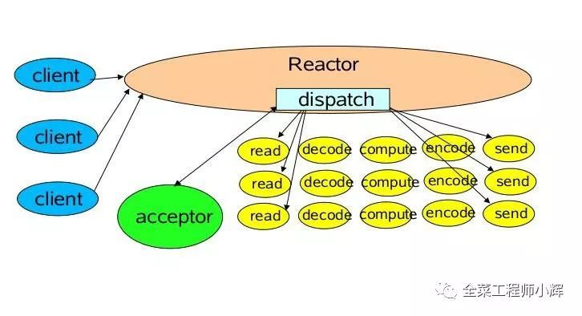

**消息处理流程：**

1. Reactor对象通过select监控连接事件，收到事件后通过dispatch进行转发；
2. 如果是连接建立的事件，则由acceptor接受连接，并创建关联的handler以处理后续事件；
3. 如果不是建立连接事件，则Rreactor会分发调用该连接关联的handler来响应该事件；
4. handler会完成read->业务处理->send的完整业务流程。

> 单Reactor单线程模型只是在代码上进行了组件的区分，但是整体操作还是单线程，不能充分利用硬件资源。handler业务处理部分没有异步。

对于一些小容量应用场景，可以使用单Reactor单线程模型。但是对于高负载、大并发的应用场景通常却不合适（Redis例外），主要原因如下：

1. 即便Reactor线程的CPU负荷达到100%，也无法满足海量消息的编码、解码、读取和发送。
2. 当Reactor线程负载过重之后，处理速度将变慢，这会导致大量客户端连接超时，超时之后往往会进行重发，这更加重Reactor线程的负载，最终会导致大量消息积压和处理超时，成为系统的性能瓶颈。
3. 一旦Reactor线程意外中断或者进入死循环，会导致整个系统通信模块不可用，不能接收和处理外部消息，造成节点故障。

为了解决这些问题，演进出单Reactor多线程模型。

### 6.1.2 单Reactor多线程模型

**该模型在事件处理器（Handler）部分采用了多线程（线程池）。**


**消息处理流程：**

1. Reactor对象通过select监控客户端请求事件，收到事件后通过dispatch进行分发；
2. 如果是建立连接请求事件，则由acceptor通过accept处理连接请求，然后创建一个关联的Handler对象以处理后续的各种事件；
3. 如果不是建立连接事件，则Reactor会分发调用该连接关联的Handler来响应该事件；
4. Handler**只负责响应事件，不做具体业务处理**，通过Read读取数据后，会分发给后面的**Worker线程池**进行业务处理；
5. Worker线程池会分配独立的线程完成真正的业务处理，然后将响应结果发给Handler；
6. Handler收到响应结果后通过send将响应结果返回给Client。

相对于第一种模型来说，在处理业务逻辑，也就是获取到IO的读写事件之后，交由线程池来处理，handler收到响应后通过send将响应结果返回给客户端。这样可以降低Reactor的性能开销，从而更专注的做事件分发工作了，提升整个应用的吞吐。

> Y：为什么说降低了Reactor的性能开销，不应是提高了handler的处理效率吗？大概指循环遍历调用handler的过程在Reactor中，降低了这一块儿的性能开销。
>
> 单线程（Reactor + acceptor + handler[]）+ Worker线程池（处理handler中抽象出来的业务task）。

但是这个模型存在的问题：

1. 多线程数据共享和访问比较复杂。如果子线程完成业务处理后，把结果传递给主线程Reactor进行发送，就会涉及共享数据的互斥和保护机制。
2. Reactor承担所有事件的监听和响应，只在主线程中运行，可能会存在性能问题。例如并发百万客户端连接，或者服务端需要对客户端握手进行安全认证，但是认证本身非常损耗性能。

为了解决性能问题，产生了第三种主从Reactor多线程模型。

### 6.1.3 主从Reactor多线程模型

比起第二种模型，它是将Reactor组件分成两部分：

1. mainReactor负责监听server socket，用来处理网络IO连接建立操作，将建立的socketChannel指定注册给subReactor。
2. subReactor主要做和建立起来的socket做数据交互和事件业务处理操作。**通常，subReactor个数上可与CPU个数等同**。

> Y：即将上文中的handler的遍历调用等工作也一并交给了subReactor。

**Nginx**、Swoole、Memcached和**Netty**都是采用这种实现。

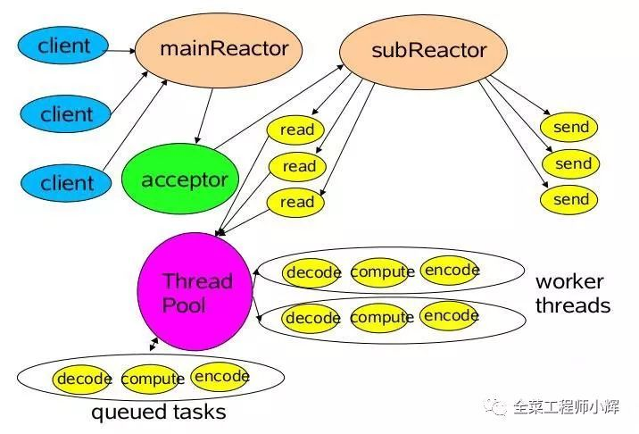

**消息处理流程：**

1. 从主线程池中随机选择一个Reactor线程作为acceptor线程，用于绑定监听端口，接收客户端连接；
2. acceptor线程接收客户端连接请求之后创建新的SocketChannel，将其注册到主线程池的其它Reactor线程上，由其负责接入认证、IP黑白名单过滤、握手等操作；
3. 步骤2完成之后，业务层的链路正式建立，将SocketChannel从主线程池的Reactor线程的多路复用器上摘除，重新注册到Sub线程池的线程上，并创建一个该连接关联的Handler用于处理后续各种事件；
4. 当有新的事件发生时，SubReactor会调用该连接关联的Handler进行响应；
5. Handler通过Read读取数据后，会分发给后面的Worker线程池进行业务处理；
6. Worker线程池会分配独立的线程完成真正的业务处理，然后将响应结果发给Handler；
7. Handler收到响应结果后通过Send将响应结果返回给Client。

> mainReactor线程池（Reactor + acceptor） + subReactor线程池（监听已有连接上的事件并触发hanler的task） + Worker线程池（处理handler中抽象出来的业务task）。

### 6.1.4 总结

Reactor模型具有如下的优点：

1. 响应快，不必为单个同步时间所阻塞，虽然Reactor本身依然是同步的；
2. 编程相对简单，可以最大程度的避免复杂的多线程及同步问题，并且避免了多线程/进程的切换开销；
3. 可扩展性，可以方便地通过增加Reactor实例个数来充分利用CPU资源；
4. 可复用性，Reactor模型本身与具体事件处理逻辑无关，具有很高的复用性。

## 6.2 Proactor 模型

基于异步IO。

UML类图：


**模块关系：**

1. Procator Initiator负责创建Procator和Handler，并将Procator和Handler都通过Asynchronous operation processor注册到内核。
2. Asynchronous operation processor负责处理注册请求，并完成IO操作。完成IO操作后会通知procator。
3. procator根据不同的事件类型回调不同的handler进行业务处理。handler完成业务处理，handler也可以注册新的handler到内核进程。

**消息处理流程：**

读取操作：

1. 应用程序初始化一个异步读取操作，然后注册相应的事件处理器，**此时事件处理器不关注读取就绪事件，而是关注读取完成事件**，这是区别于Reactor的关键；
2. 事件分离器等待读取操作完成事件；
3. 在事件分离器等待读取操作完成的时候，操作系统调用内核线程完成读取操作，并将读取的内容放入用户传递过来的缓存区中，这也是区别于Reactor的一点，Proactor中，应用程序需要传递缓存区；
4. 事件分离器捕获到读取完成事件后，激活应用程序注册的事件处理器，事件处理器直接从缓存区读取数据，而不需要进行实际的读取操作。

> Y：零拷贝与直接内存映射。

Proactor中写入操作和读取操作，只不过感兴趣的事件是写入完成事件。

Proactor有如下缺点：

1. 编程复杂性，由于异步操作流程的事件的初始化和事件完成在时间和空间上都是相互分离的，因此开发异步应用程序更加复杂。应用程序还可能因为反向的流控而变得更加难以Debug；
2. 内存使用，缓冲区在读或写操作的时间段内必须保持住，可能造成持续的不确定性，并且每个并发操作都要求有独立的缓存，相比Reactor模型，在Socket已经准备好读或写前，是不要求开辟缓存的；
3. 操作系统支持，Windows下通过IOCP实现了真正的异步 I/O，而在Linux系统下，Linux2.6才引入，并且异步I/O使用epoll实现的，所以还不完善。

因此在 Linux 下实现高并发网络编程都是以Reactor模型为主。

## 6.3 从设计模式角度比较Reactor与Proactor模型

其来自另一篇文章《[IO设计模式：Reactor和Proactor对比](https://www.cnblogs.com/me115/p/4452801.html)》，结合着看可帮助理解。

### 6.3.1 Reactor 反应器


**Reactor包含如下角色：**

- Handle 句柄；用来标识socket连接或是打开文件；
- Synchronous Event Demultiplexer：同步事件多路分解器：由操作系统内核实现的一个函数；用于阻塞等待发生在句柄集合上的一个或多个事件；（如select/epoll；）
- Event Handler：事件处理接口
- Concrete Event HandlerA：实现应用程序所提供的特定事件处理逻辑；
- Reactor：反应器，定义一个接口，实现以下功能：
  1）供应用程序注册和删除关注的事件句柄；
  2）运行事件循环；
  3）有就绪事件到来时，分发事件到之前注册的回调函数上处理；

**业务流程及时序图**


1. 应用启动，将关注的事件handle注册到Reactor中；
2. 调用Reactor，进入无限事件循环，等待注册的事件到来；
3. 事件到来，select返回，Reactor将事件分发到之前注册的回调函数中处理。

### 6.3.2 Proactor 主动器


**Proactor主动器模式包含如下角色：**

- Handle 句柄；用来标识socket连接或是打开文件；
- Asynchronous Operation Processor：异步操作处理器；负责执行异步操作，一般由操作系统内核实现；
- Asynchronous Operation：异步操作
- Completion Event Queue：完成事件队列；异步操作完成的结果放到队列中等待后续使用
- Proactor：主动器；为应用程序进程提供事件循环；从完成事件队列中取出异步操作的结果，分发调用相应的后续处理逻辑；
- Completion Handler：完成事件接口；一般是由回调函数组成的接口；
- Concrete Completion Handler：完成事件处理逻辑；实现接口定义特定的应用处理逻辑。

**业务流程及时序图**


1. 应用程序启动，调用异步操作处理器提供的异步操作接口函数，调用之后应用程序和异步操作处理就独立运行；应用程序可以调用新的异步操作，而其它操作可以并发进行；
2. 应用程序启动Proactor主动器，进行无限的事件循环，等待完成事件到来；
3. 异步操作处理器执行异步操作，完成后将结果放入到完成事件队列；
4. 主动器从完成事件队列中取出结果，分发到相应的完成事件回调函数处理逻辑中。

# 7. Netty中的线程模型

Netty采用的是**主从线程模型**。下面是Netty使用中很常见的一段代码。

下面是Netty使用中很常见的一段代码：

```java
public class Server {
    public static void main(String[] args) throws Exception {
        EventLoopGroup bossGroup = new NioEventLoopGroup(1);
        EventLoopGroup workerGroup = new NioEventLoopGroup();
        try {
            ServerBootstrap b = new ServerBootstrap();
            b.group(bossGroup, workerGroup)
                    .channel(NioServerSocketChannel.class)
                    .childOption(ChannelOption.TCP_NODELAY, true)
                    .childAttr(AttributeKey.newInstance("childAttr"), "childAttrValue")
                    .handler(new ServerHandler())
                    .childHandler(new ChannelInitializer<SocketChannel>() {
                        @Override
                        public void initChannel(SocketChannel ch) {
                        }
                    });
            ChannelFuture f = b.bind(8888).sync();
            f.channel().closeFuture().sync();
        } finally {
            bossGroup.shutdownGracefully();
            workerGroup.shutdownGracefully();
        }
    }
}
```

对Netty示例代码进行分析：

1. 定义了两个EventLoopGroup，其中bossGroup对应的就是主线程池，只接收客户端的连接（注册，初始化逻辑），具体的工作由workerGroup这个从线程池来完成。可以理解为老板负责招揽接待，员工负责任务完成。线程池和线程组是一个概念，所以名称里有group。之后就采用ServerBootstrap启动类，传入这两个主从线程组。
2. 客户端和服务器建立连接后，NIO会在两者之间建立Channel，所以启动类调用channel方法就是为了指定建立什么类型的通道。这里指定的是NioServerSocketChannel这个通道类。
3. 启动类还调用了handler()和childHandler()方法，这两个方法中提及的handler是一个处理类的概念，他负责处理连接后的一个个通道的相应处理。handler()指定的处理类是主线程池中对通道的处理类，childHandler()方法指定的是从线程池中对通道的处理类。
4. 执行ServerBootstrap的bind方法进行绑定端口的同时也执行了sync()方法进行同步阻塞调用。
5. 关闭通道采用Channel的closeFuture()方法关闭。
6. 最终优雅地关闭两个线程组，执行shutdownGracefully()方法完成关闭线程组。

> 如果需要在客户端连接前的请求进行handler处理，则需要配置handler()；如果是处理客户端连接之后的handler，则需要配置在childHandler()。option和childOption也是一样的道理。

boss线程池作用：

1. 接收客户端的连接，初始化Channel参数。
2. 将链路状态变更时间通知给ChannelPipeline。

worker线程池作用：

1. 异步读取通信对端的数据报，发送读事件到ChannelPipeline。
2. 异步发送消息到通信对端，调用ChannelPipeline的消息发送接口。
3. 执行系统调用Task。
4. 执行定时任务Task。

通过配置boss和worker线程池的线程个数以及是否共享线程池等方式，Netty的线程模型可以在以上三种Reactor模型之间进行切换。

# 8. Nginx中的IO

Nginx采用的是**多进程（单线程）& 多路IO复用模型**。

工作模型：

1. Nginx在启动后，会有一个master进程和多个相互独立的worker进程。
2. 接收来自外界的信号，向所有worker进程发送信号，每个进程都有可能来处理这个连接。
3. master进程能监控worker进程的运行状态，当worker进程退出后(异常情况下)，会自动启动新的worker进程。

master进程和worker进程

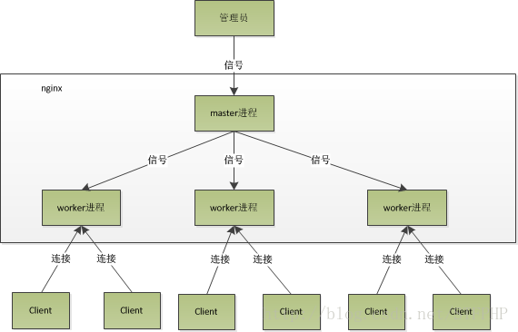

> 1、master  首先nginx 创建一个master 进程，通过socket() 创建一个sock文件描述符用来监听（sockfd） 绑定端口(bind) 开启监听（listen）。 nginx 一般监听80（http） 或 443 （https）端口 （fork 多个子进程后，master 会监听worker进程，和等待信号） 
>
> 2、worker 然后 创建(fork)多个 worker子进程（复制master 进程的数据）， 此时所有的worker进程 继承了sockfd(socket文件描述符)， 当有连接进来之后 worker进程就可以accpet()创建已连接描述符， 然后通过已连接描述符与客户端通讯

> 惊群现象
>
> 由于worker进程 继承了master进程的sockfd,当连接进来是，所有的子进程都将收到通知并“争着”与
> 它建立连接，这就叫惊群现象。大量的进程被激活又挂起，最后只有一个进程accpet() 到这个连接，这会消耗系统资源
> （等待通知，进程被内核全部唤醒，只有一个进程accept成功，其他进程又休眠。这种浪费现象叫惊群）
>
> - nginx 对惊群现象的处理
>   - 原因：多个进程监听同一个端口引发的。 
>   - 解决：如果可以同一时刻只能有一个进程监听端口，这样就不会发生“惊群”了，此时新连接事件只能唤醒正在监听的唯一进程。
>     - 如何保持一个时刻只能有一个worker进程监听端口呢？
>       - nginx设置了一个accept_mutex锁，在使用accept_mutex锁时，只有进程成功调用了ngx_trylock_accept_mutex方法获取锁后才可以监听端口 。（linux 内核2.6 之后 不会出现惊群现象，只会有一个进程被唤醒）

# 9. Redis中的IO

**文件事件处理器**

Redis基于**单Reactor单线程模式**开发了网络事件处理器，这个处理器被称为**文件事件处理器**。它的组成结构为4部分：

- 多个套接字
- IO多路复用程序
- 文件事件分派器
- 事件处理器

**因为文件事件分派器队列的消费是单线程的，所以Redis才叫单线程模型。**


**消息处理流程**

- 文件事件处理器使用I/O多路复用(multiplexing)程序来同时监听多个套接字，并根据套接字目前执行的任务来为套接字关联不同的事件处理器。
- 当被监听的套接字准备好执行连接应答(accept)、读取(read)、写入(write)、关闭(close)等操作时，与操作相对应的文件事件就会产生，这时文件事件处理器就会调用套接字之前关联好的事件处理器来处理这些事件。

尽管多个文件事件可能会并发地出现，但I/O多路复用程序总是会将所有产生事件的套接字都推到一个队列里面，然后通过这个队列，以有序（sequentially）、同步（synchronously）、每次一个套接字的方式向文件事件分派器传送套接字：当上一个套接字产生的事件被处理完毕之后（该套接字为事件所关联的事件处理器执行完毕）， I/O多路复用程序才会继续向文件事件分派器传送下一个套接字。

**I/O 多路复用程序的实现**

Redis的I/O多路复用程序的所有功能是通过包装select、epoll、evport和kqueue这些I/O多路复用函数库来实现的，每个I/O多路复用函数库在Redis源码中都对应一个单独的文件，比如ae_select.c、ae_epoll.c、ae_kqueue.c等。

因为Redis为每个I/O多路复用函数库都实现了相同的API，所以I/O多路复用程序的底层实现是可以互换的，如下图所示。


**文件事件的类型**

I/O 多路复用程序可以监听多个套接字的ae.h/AE_READABLE事件和ae.h/AE_WRITABLE事件，这两类事件和套接字操作之间的对应关系如下：

- 当套接字变得可读时（客户端对套接字执行write操作，或者执行close操作），或者有新的可应答（acceptable）套接字出现时（客户端对服务器的监听套接字执行connect操作），套接字产生AE_READABLE 事件。
- 当套接字变得可写时（客户端对套接字执行read操作），套接字产生AE_WRITABLE事件。I/O多路复用程序允许服务器同时监听套接字的AE_READABLE事件和AE_WRITABLE事件，如果一个套接字同时产生了这两种事件，那么文件事件分派器会优先处理AE_READABLE事件，等到AE_READABLE事件处理完之后，才处理AE_WRITABLE 事件。这也就是说，如果一个套接字又可读又可写的话，那么服务器将先读套接字，后写套接字。

**文件事件的处理器**

Redis为文件事件编写了多个处理器，这些事件处理器分别用于实现不同的网络通讯需求，常用的处理器如下：

- 为了对连接服务器的各个客户端进行应答， 服务器要为监听套接字关联**连接应答处理器**。
- 为了接收客户端传来的命令请求， 服务器要为客户端套接字关联**命令请求处理器**。
- 为了向客户端返回命令的执行结果， 服务器要为客户端套接字关联**命令回复处理器**。

**连接应答处理器**

networking.c中acceptTcpHandler函数是Redis的连接应答处理器，这个处理器用于对连接服务器监听套接字的客户端进行应答，具体实现为sys/socket.h/accept函数的包装。

当Redis服务器进行初始化的时候，程序会将这个连接应答处理器和服务器监听套接字的AE_READABLE事件关联起来，当有客户端用sys/socket.h/connect函数连接服务器监听套接字的时候， 套接字就会产生AE_READABLE 事件， 引发连接应答处理器执行， 并执行相应的套接字应答操作，如图所示。

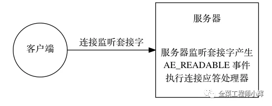

**命令请求处理器**

networking.c中readQueryFromClient函数是Redis的命令请求处理器，这个处理器负责从套接字中读入客户端发送的命令请求内容， 具体实现为unistd.h/read函数的包装。

当一个客户端通过连接应答处理器成功连接到服务器之后， 服务器会将客户端套接字的AE_READABLE事件和命令请求处理器关联起来，当客户端向服务器发送命令请求的时候，套接字就会产生 AE_READABLE事件，引发命令请求处理器执行，并执行相应的套接字读入操作，如图所示。


在客户端连接服务器的整个过程中，服务器都会一直为客户端套接字的AE_READABLE事件关联命令请求处理器。

**命令回复处理器**

networking.c中sendReplyToClient函数是Redis的命令回复处理器，这个处理器负责将服务器执行命令后得到的命令回复通过套接字返回给客户端，具体实现为unistd.h/write函数的包装。

当服务器有命令回复需要传送给客户端的时候，服务器会将客户端套接字的AE_WRITABLE事件和命令回复处理器关联起来，当客户端准备好接收服务器传回的命令回复时，就会产生AE_WRITABLE事件，引发命令回复处理器执行，并执行相应的套接字写入操作， 如图所示。


当命令回复发送完毕之后， 服务器就会解除命令回复处理器与客户端套接字的 AE_WRITABLE 事件之间的关联。

**一次完整的客户端与服务器连接事件示例**

假设Redis服务器正在运作，那么这个服务器的监听套接字的AE_READABLE事件应该正处于监听状态之下，而该事件所对应的处理器为连接应答处理器。

如果这时有一个Redis客户端向Redis服务器发起连接，那么监听套接字将产生AE_READABLE事件， 触发连接应答处理器执行：处理器会对客户端的连接请求进行应答， 然后创建客户端套接字，以及客户端状态，并将客户端套接字的 AE_READABLE 事件与命令请求处理器进行关联，使得客户端可以向主服务器发送命令请求。

之后，客户端向Redis服务器发送一个命令请求，那么客户端套接字将产生 AE_READABLE事件，引发命令请求处理器执行，处理器读取客户端的命令内容， 然后传给相关程序去执行。

执行命令将产生相应的命令回复，为了将这些命令回复传送回客户端，服务器会将客户端套接字的AE_WRITABLE事件与命令回复处理器进行关联：当客户端尝试读取命令回复的时候，客户端套接字将产生AE_WRITABLE事件， 触发命令回复处理器执行， 当命令回复处理器将命令回复全部写入到套接字之后， 服务器就会解除客户端套接字的AE_WRITABLE事件与命令回复处理器之间的关联。

# 10. Tomcat的线程模型

Tomcat支持四种接收请求的处理方式：BIO、NIO、APR和AIO

- NIO 同步非阻塞，比传统BIO能更好的支持大并发，tomcat 8.0 后默认采用该模型。 使用方法(配置server.xml)：

  ```xml
  <Connector port="8080" protocol="HTTP/1.1"/> 
  <!-- 改为 -->
  <Connector port="8080" protocol="org.apache.coyote.http11.Http11NioProtocol"/>
  ```

- BIO 阻塞式IO，tomcat7之前默认，采用传统的java IO进行操作，该模型下每个请求都会创建一个线程，适用于并发量小的场景。 使用方法(配置server.xml)：

  ```xml
  <Connector port="8080" protocol =" org.apache.coyote.http11.Http11Protocol">
  ```

- APR tomcat 以JNI形式调用http服务器的核心动态链接库来处理文件读取或网络传输操作，需要编译安装APR库。 使用方法(配置server.xml)：

  ```xml
  <Connector port="8080" protocol ="org.apache.coyote.http11.Http11AprProtocol">
  ```

- AIO 异步非阻塞 (NIO2)，tomcat8.0后支持。多用于连接数目多且连接比较长（重操作）的架构，比如相册服务器，充分调用OS参与并发操作，编程比较复杂，JDK7开始支持。 使用方法(配置server.xml)：

  ```xml
  <Connector port="8080" protocol ="org.apache.coyote.http11.Http11Nio2Protocol">
  ```


------

> 内容来源：
>
> - [JAVA I/O（一）基本字节和字符IO流](https://www.cnblogs.com/shuimuzhushui/p/10269203.html)
> - [套接字之读写：recvfrom()、read() 和sendto() 、write()](https://blog.csdn.net/fengxianghui01/article/details/104398214)
> - [I/O模型之一：Unix的五种I/O模型](https://www.cnblogs.com/duanxz/p/5507051.html)
> - [IO多路复用到底是不是异步的？](https://www.zhihu.com/question/59975081)
> - [你管这破玩意叫 IO 多路复用？](https://mp.weixin.qq.com/s/YdIdoZ_yusVWza1PU7lWaw)
> - [JAVA I/O（二）文件NIO](https://www.cnblogs.com/shuimuzhushui/p/10269216.html)
> - [Java NIO系列教程（二） Channel通道介绍及FileChannel详解](https://www.cnblogs.com/duanxz/p/6759814.html)
> - [Java NIO系列教程（三） Channel之Socket通道](https://www.cnblogs.com/duanxz/p/6759823.html)
> - [NIO--SocketChannel发送HTTP请求](https://blog.csdn.net/weixin_34290631/article/details/86005087)
> - [Java NIO系列教程（六） Selector](https://ifeve.com/selectors/)
> - [Java NIO系列教程（六） 多路复用器Selector](https://www.cnblogs.com/duanxz/p/6782783.html)
> - [从网络I/O模型到Netty，先深入了解下I/O多路复用](https://network.51cto.com/art/202102/645464.htm?pc)
> - [从I/O多路复用到Netty，还要跨过Java NIO包](https://mp.weixin.qq.com/s?__biz=MzA4NjQ3ODQ2Mw==&mid=2247484168&idx=1&sn=fc68f2dfa7b061a547f7acf979aa9c32&chksm=9fc95818a8bed10e7b190c46b5a28d9013d38dca8fe7cdb4772302192b4a1197880e6dbed23c&scene=178&cur_album_id=1690085097271574533#rd)
> - [nginx 多进程 + io多路复用 实现高并发](https://www.cnblogs.com/xiaobaiskill/p/10969180.html)
> - [Redis和IO多路复用技术](https://www.jianshu.com/p/0d40c69eb7ca)
> - [彻底搞懂Reactor模型和Proactor模型](https://cloud.tencent.com/developer/article/1488120)
> - [彻底搞懂Java的网络IO](https://mp.weixin.qq.com/s?__biz=MzUyNzgyNzAwNg==&mid=2247483941&idx=1&sn=97628f4d69d8607badf39bfeb7557457&scene=21#wechat_redirect)
> - [NIO效率高的原理之零拷贝与直接内存映射](https://cloud.tencent.com/developer/article/1488087)
> - [IO设计模式：Reactor和Proactor](https://www.cnblogs.com/me115/p/4452801.html)
> - [彻底搞懂Redis的线程模型](https://mp.weixin.qq.com/s?__biz=MzUyNzgyNzAwNg==&mid=2247483945&idx=1&sn=1524a8ebf7adbdf61a98369c7f8ab145&scene=21#wechat_redirect)
> - [深入Netty逻辑架构，从Reactor线程模型开始](https://mp.weixin.qq.com/s?__biz=MzA4NjQ3ODQ2Mw==&mid=2247484205&idx=1&sn=2fe626dd4a3e2fa74e388715522c97fd&chksm=9fc9583da8bed12b899eabb6d69ec1fcc4359d9bb3bb681ff275a476f63c6c54843a08b93bee&scene=178&cur_album_id=1690085097271574533#rd)
> - [关于零拷贝的一点认识](https://juejin.cn/post/6844903815913668615)
> - [kafka消息存储机制和原理](https://blog.csdn.net/zhangxm_qz/article/details/87636094)
> - [Linux -- 如何减少IO过程中的CPU copy](https://www.cnblogs.com/tuowang/p/9398876.html)
> - [深度分析mmap：是什么 为什么 怎么用 性能总结（转载）](https://www.jianshu.com/p/56da33b287dd)

