# 1. Redis 数据类型

Redis 不是一个*普通的*键值存储，它实际上是一个*数据结构服务器*，支持不同类型的值。这意味着，在传统的键值存储中，您将字符串键与字符串值相关联，而在 Redis 中，值不仅限于简单的字符串，还可以包含更复杂的数据结构。以下是Redis支持的所有数据结构的列表：

- Binary-safe strings。
- Lists
- Sets
- Sorted sets
- Hashes
- Bit arrays (or simply bitmaps)
- HyperLogLogs
- Streams

## 1.0 Redis 键（非数据类型）

Redis 键是**二进制安全**的，这意味着您可以使用任何二进制序列作为键，从像“foo”这样的字符串到 JPEG 文件的内容。空字符串也是一个有效的键。

关于key的其他一些规则：

- 很长的键不是一个好主意。例如，1024 字节的键不仅在内存方面是个坏主意，而且因为在数据集中查找键可能需要多次昂贵的键比较。即使手头的任务是匹配一个大值的存在，对其进行散列（例如使用 SHA1）也是一个更好的主意，尤其是从内存和带宽的角度来看。
- 很短的键通常不是一个好主意。如果您可以改写成“user:1000:followers”，那么将“u1000flw”写为键就没有什么意义了。前者更具可读性，与键对象本身和值对象使用的空间相比，增加的空间较小。虽然短键显然会消耗更少的内存，但您的工作是找到正确的平衡点。
- 尝试坚持使用一种模式。例如“object-type:id”是个好主意，如“user:1000”。点或破折号通常用于多词字段，如“comment:234:reply.to”或“comment:234:reply-to”。
- 允许的最大key大小为 512 MB。

> **SHA-1**是一种安全散列算法，SHA-1可以生成一个被称为消息摘要的160位（20字节）散列值，散列值通常的呈现形式为40个十六进制数。

有些命令没有在特定类型上定义，但对于与键空间交互很有用，因此可以与任何类型的键一起使用。

```shell
> set mykey hello
OK
# 例如，EXISTS 命令返回 1 或 0 以表示数据库中是否存在给定的键
> exists mykey
(integer) 1
# 还有TYPE命令，它返回存储在指定键上的值的种类
> type mykey
string
# 而DEL 命令删除键和关联的值，无论值是什么。
> del mykey
(integer) 1
> exists mykey
(integer) 0
> type mykey
none
```

### Redis 过期：生存时间有限的键

基本上，您可以为key设置超时，这是有限的生存时间。当生存时间结束时，key会自动销毁，就像用户使用key调用DEL命令一样。

关于 Redis 过期的一些快速信息：

- 它们可以使用秒或毫秒精度进行设置；
- 但是，过期时间**分辨率**始终为 **1 毫秒**；
- 有关过期的信息被复制并保存在磁盘上，当您的 Redis 服务器保持停止状态时，时间实际上已经过去了（这意味着 Redis 会保存key的过期日期）。

```shell
> set key some-value
OK
# 设置过期
> expire key 5
(integer) 1
> get key (immediately)
"some-value"
> get key (after some time)
(nil)
# 也可以使用其他 Redis 命令创建带有过期时间的键。expire 单位是秒，对应pexpire是毫秒。
> set key 100 ex 10
OK
# 查看剩余过期时间，单位是秒，对应pttl是毫秒
> ttl key
(integer) 9
```

### 自动删除和创建key

当列表为空时，Redis会负责删除该键；如果键不存在，而我们又试图添加元素到它，Redis会负责创建一个空列表。这并不是特定于列表，它适用于所有由多个元素组成的Redis数据类型——Streams, Sets, Sorted Sets and Hashes。

基本上，我们可以用三条规则来总结这种行为:

- 在向聚合数据类型添加元素时，如果目标键不存在，则在添加元素之前创建一个空的聚合数据类型。
- 当从聚合数据类型中删除元素时，如果值仍然为空，则自动销毁键。Stream数据类型是此规则的唯一例外。
- 调用只读命令，如LLEN(它返回列表的长度)，或使用空键删除元素的write命令，总是产生与该键持有命令期望查找的空聚合类型相同的结果。


常用的五种数据结构：


## 1.1 Redis Strings

Redis 字符串类型是您可以与 Redis 键关联的最简单的值类型。String类型是二进制安全的，可以是各种字符串（包括二进制数据），例如您可以在值中存储 jpeg 图像。值不能大于 512 MB。

```shell
> set mykey somevalue
OK
> get mykey
"somevalue"
# nx 选项，如果键已经存在，则set失败。
> set mykey newval nx
(nil)
# xx 选项，只有键已经村子，才会成功。
> set mykey newval xx
OK
# 即使字符串是 Redis 的基本值，您也可以使用它们执行一些	有趣的操作。例如，一个原子增量：
> set counter 100
OK
> incr counter
(integer) 101
> incr counter
(integer) 102
> incrby counter 50
(integer) 152
# 在单个命令中设置或检索多个键的值的能力对于减少延迟也很有用。出于这个原因，有MSET和MGET命令：
> mset a 10 b 20 c 30
OK
> mget a b c
1) "10"
2) "20"
3) "30"
```

### 实战场景

1. 缓存： 经典使用场景，把常用信息，字符串，图片或者视频等信息放到redis中，redis作为缓存层，mysql做持久化层，降低mysql的读写压力。
2. 计数器：redis是单线程模型，一个命令执行完才会执行下一个，同时数据可以一步落地到其他的数据源。
3. session：常见方案spring session + redis实现session共享。

## 1.2 Redis Lists

Redis 列表是通过链表实现的。这意味着即使列表中有数百万个元素，在列表的头部或尾部添加新元素的操作也是*在常数时间内*执行的。使用[LPUSH](https://redis.io/commands/lpush)命令在10个元素的列表头添加一个新元素的速度与在1000万个元素的列表头添加一个元素的速度是一样的。

```shell
> rpush mylist A
(integer) 1
# RPUSH命令在右侧（在尾部）向列表中添加一个新元素
> rpush mylist B
(integer) 2
# LPUSH命令在左侧（头部）向列表中添加一个新元素
> lpush mylist first
(integer) 3
# 请注意，LRANGE需要两个索引，即要返回的范围的第一个和最后一个元素。两个索引都可以是负数，告诉 Redis 从末尾开始计数：所以 -1 是最后一个元素，-2 是列表的倒数第二个元素，依此类推。
> lrange mylist 0 -1
1) "first"
2) "A"
3) "B"
> rpush mylist 1 2 3 4 5 "foo bar"
(integer) 9
> rpush mylist a b c
(integer) 3
# 从右侧弹出元素
> rpop mylist
"foo bar"
```

### 列表的常见用例

列表对许多任务有用，以下两个非常有代表性的用例：

- 记住用户发布到社交网络的最新更新。
- 进程之间的通信，使用消费者-生产者模式，将项目推入列表，消费者（通常是*工人*）消费这些项目并执行操作。Redis有特殊的列表命令，使此用例更加可靠和高效。

例如，流行的Ruby库resque和sidekiq都在幕后使用Redis列表来实现后台任务。

流行的Twitter社交网络将用户发布的最新推文放到Redis列表中。

为了一步一步地描述一个常用的用例，假设您的主页显示了在照片分享社交网络中发布的最新照片，并且您希望加快访问速度。

- 每当用户发布一张新照片时，我们就使用LPUSH将其ID添加到列表中。
- 当用户访问主页时，我们使用`LRANGE 0 9`来获取最新的10个发布项目。

### 上限列表

在许多用例中，我们只想使用列表来存储*最新项目*，无论它们是：社交网络更新、日志或其他任何东西。

Redis允许我们使用列表作为带上限的集合，只记住最新的N项，并使用[LTRIM](https://redis.io/commands/ltrim)命令丢弃所有最古老的项。

LTRIM命令类似于LRANGE，但是它不显示指定的元素范围，而是将该范围设置为新的列表值。所有超出给定范围的元素都将被删除。

一个例子将使它更加清晰：

```shell
> rpush mylist 1 2 3 4 5
(integer) 5
> ltrim mylist 0 2
OK
> lrange mylist 0 -1
1) "1"
2) "2"
3) "3"
```

上面的LTRIM命令告诉Redis只取索引0到2的列表元素，其他的元素将被丢弃。这允许了一个非常简单但有用的模式:同时执行List push操作和List trim操作，以添加新元素和丢弃超出限制的元素:

```shell
LPUSH mylist <some element>
LTRIM mylist 0 999
```

上面的组合添加了一个新元素，并且只接受1000个最新元素到列表中。使用LRANGE，您可以访问最重要的项，而不需要记住非常旧的数据。

注意:虽然LRANGE在技术上是一个O(N)命令，但在列表的头部或尾部访问小范围是一个常数时间操作。

### 列表上的阻塞操作

列表有一个特殊功能，使其适合实现队列，通常作为进程间通信系统的基石：阻塞操作。

Redis实现了叫做BRPOP和BLPOP的命令，这是RPOP和LPOP的阻塞版本，如果列表是空的，它们会阻塞:它们只会在列表中添加新元素时返回给调用者，或者当用户指定的超时到达时。

这是一个我们可以在worker中使用的BRPOP调用示例:

```shell
> brpop tasks 5
1) "tasks"
2) "do_something"
```

它的意思是:“等待列表任务中的元素，但如果5秒后没有元素可用则返回”。

注意，可以使用0作为超时来永远等待元素，还可以指定多个列表而不是一个，以便同时在多个列表上等待，并在第一个列表接收到元素时获得通知。

关于BRPOP有几点需要注意:

- **客户端以有序的方式被服务**:第一个客户端阻塞等待列表，当某个元素被其他客户端推入时，第一个客户端被服务，以此类推。
- 返回值与RPOP不同:它是一个**双元素数组，因为它还包括键名**，因为BRPOP和BLPOP能够阻塞等待来自多个列表的元素。
- 如果超时，则返回NULL。

关于列表和阻塞操作，还有更多你应该知道的事情。我们建议你多阅读以下内容:

- 可以使用[LMOVE](https://redis.io/commands/lmove)构建更安全的队列或旋转队列；
- 该命令还有一个阻塞变体，称为[BLMOVE](https://redis.io/commands/blmove)。

**LMOVE**

**原子地**返回并删除存储在**源列表**的第一个/最后一个元素(head/tail取决于wherefrom参数)，并将元素推入存储在**目标列表**的第一个/最后一个元素(head/tail取决于whereto参数)。时间复杂度O(1)。

这个命令代替了现在已弃用的RPOPLPUSH。LMOVE RIGHT LEFT 是等价的。

```shell
redis> RPUSH mylist "one"
(integer) 1
redis> RPUSH mylist "two"
(integer) 2
redis> RPUSH mylist "three"
(integer) 3
redis> LMOVE mylist myotherlist RIGHT LEFT
"three"
redis> LMOVE mylist myotherlist LEFT RIGHT
"one"
redis> LRANGE mylist 0 -1
1) "two"
redis> LRANGE myotherlist 0 -1
1) "three"
2) "one"
redis> 
```

- **模式:可靠队列**

  > Redis经常被用作消息服务器来实现后台任务或其他类型的消息任务的处理。一种简单的队列形式通常是在生产者端将值压入列表，然后在消费者端使用RPOP(使用轮询)或BRPOP(如果阻塞操作更好地服务客户端)等待该值。
  >
  > 然而，在这种上下文中，获得的队列并不可靠，因为消息可能会丢失，例如，在出现网络问题或消费者刚刚收到消息但仍在处理时崩溃的情况下。
  >
  > LMOVE(或阻塞变量的BLMOVE)提供了一种避免这个问题的方法:使用者获取消息，同时将其推入**处理列表**。一旦消息被处理，它将使用LREM命令从处理列表中删除消息。
  >
  > 另一个客户端可能会**监视处理列表中停留时间过长的项目**，如果需要，将把那些超时的项目再次推入队列。
  >
  > Y：通过加一个中间环节来保障未处理元素是可知的。

- **模式:循环列表**

  > **使用具有相同源和目标键的LMOVE，客户端可以在O(N)中依次访问N个元素列表的所有元素，而无需使用单个LRANGE操作将整个列表从服务器传输到客户端。**
  >
  > 即使有以下两个条件，上面的模式也可以工作:
  >
  > - 有多个客户端在旋转列表:它们将获取不同的元素，直到列表中的所有元素都被访问并重新启动。
  >   即使其他客户端在列表的末尾积极地推送新项目。
  > - 上述情况使得实现一个必须由N个工人以尽可能快的速度连续处理一组项的系统变得非常简单。一个例子是一个监控系统，它必须检查一组网站是否可达，以尽可能最小的延迟，使用多个并行工作器。
  >
  > 请注意，workers的这种实现可扩展性和可靠性都很低，因为即使消息丢失，该项仍在队列中，并将在下一次迭代时进行处理。

BLMOVE

BLMOVE是LMOVE的阻塞变体。当source包含元素时，此命令的行为与LMOVE完全相同。当在MULTI/EXEC块中使用时，此命令的行为与LMOVE完全相同。**当源是空的，Redis将阻塞连接**，直到另一个客户端推到它或直到超时(一个双值指定阻塞的最大秒数)达到。timeout值为0可用于无限期阻塞。

### 使用列表的技巧

- lpush+lpop=Stack(栈)
- lpush+rpop=Queue（队列）
- lpush+ltrim=Capped Collection（有限集合）
- lpush+brpop=Message Queue（消息队列）

### 实战场景

1.timeline：例如微博的时间轴，有人发布微博，用lpush加入时间轴，展示新的列表信息。

## 1.3 Redis Hashes

```shell
> hmset user:1000 username antirez birthyear 1977 verified 1
OK
> hget user:1000 username
"antirez"
> hget user:1000 birthyear
"1977"
> hgetall user:1000
1) "username"
2) "antirez"
3) "birthyear"
4) "1977"
5) "verified"
6) "1"
```

虽然哈希用于表示对象很方便，但实际上您可以在哈希中放入的字段的数量没有实际限制(除了可用内存)，因此您可以在应用程序中以许多不同的方式使用哈希。

命令HMSET设置散列的多个字段，而HGET检索单个字段。HMGET与HGET类似，但返回一个值数组:

```shell
> hmget user:1000 username birthyear no-such-field
1) "antirez"
2) "1977"
3) (nil)
```

还有一些命令可以对单个字段执行操作，比如HINCRBY:

```shell
> hincrby user:1000 birthyear 10
(integer) 1987
> hincrby user:1000 birthyear 10
(integer) 1997
```

您可以在文档中找到[散列命令的完整列表](https://redis.io/commands#hash)。

值得注意的是，小哈希(即带有小值的几个元素)在内存中以特殊的方式编码，这使得它们非常高效。

### 实战场景

1.缓存： 能直观，相比string更节省空间，的维护缓存信息，如用户信息，视频信息等。

> Y: 为什么说比String更节省空间？可能是value分层，避免了key的重复。

## 1.4 Redis Sets

Redis集合是无序的字符串集合。SADD命令向集合中添加新元素。还可以对集合执行许多其他操作，比如测试给定元素是否已经存在，执行多个集合之间的交集、并集或差集，等等。

```shell
> sadd myset 1 2 3
(integer) 3
# Redis在每次调用时都可以自由地以任何顺序返回元素，因为与用户没有关于元素排序的约定。
> smembers myset
1. 3
2. 1
3. 2
# 检查元素是否存在。
> sismember myset 3
(integer) 1
> sismember myset 30
(integer) 0
```

**集合适合于表达对象之间的关系**。例如，我们可以很容易地使用set来实现标记。

建模这个问题的一个简单方法是为我们想要标记的每个对象设置一个集合。集合包含与对象关联的标记的id。

其中一个例子是给新闻贴标签。如果文章ID 1000被标记为标签1、2、5和77，一个集合可以将这些标签ID与新闻项目关联起来:

```shell
> sadd news:1000:tags 1 2 5 77
(integer) 4
```

我们也可能想要有相反的关系:所有带有给定标签的新闻列表:

```shell
> sadd tag:1:news 1000
(integer) 1
> sadd tag:2:news 1000
(integer) 1
> sadd tag:5:news 1000
(integer) 1
> sadd tag:77:news 1000
(integer) 1

```

获取给定对象的所有标签是很简单的:

```shell
> smembers news:1000:tags
1. 5
2. 1
3. 77
4. 2
```

注意:在这个例子中，我们假设你有另一个数据结构，例如一个Redis哈希，它将标签id映射到标签名称。

使用正确的Redis命令还可以轻松实现其他非琐碎的操作。例如，我们可能想要包含标记为1、2、10和27的所有对象的列表。我们可以使用SINTER命令来实现这一点，它执行不同集合之间的交集。我们可以使用:

```shell
> sinter tag:1:news tag:2:news tag:10:news tag:27:news
... results here ...
```

除了交集之外，您还可以执行联合、差分、提取随机元素等等。

提取元素的命令称为SPOP，它便于对某些问题建模。例如，为了实现一个基于web的扑克游戏，你可能想要用一组牌来表示你的牌组。假设我们使用一个单字符前缀(C)lubs， (D)iamond， (H)earts， (S)pades:

```shell
>  sadd deck C1 C2 C3 C4 C5 C6 C7 C8 C9 C10 CJ CQ CK
   D1 D2 D3 D4 D5 D6 D7 D8 D9 D10 DJ DQ DK H1 H2 H3
   H4 H5 H6 H7 H8 H9 H10 HJ HQ HK S1 S2 S3 S4 S5 S6
   S7 S8 S9 S10 SJ SQ SK
   (integer) 52
```

现在我们想给每个玩家5张牌。**SPOP命令删除一个随机元素，将其返回给客户端**，因此它是本例中的完美操作。

然而，如果我们直接针对牌组调用它，那么在游戏的下一回合中，我们就需要再次填充牌组，这可能并不理想。首先，我们可以复制一套存储在牌组键中的牌组game:1:deck 键。

这是使用**SUNIONSTORE**完成的，它通常执行多个集之间的并集，并将结果存储到另一个集。然而，由于**单个集合的并集是它本身**，我可以用以下方法**复制**我的deck:

```shell
> sunionstore game:1:deck deck
(integer) 52
```

现在我准备给第一个玩家五张牌:

```shell
> spop game:1:deck
"C6"
> spop game:1:deck
"CQ"
> spop game:1:deck
"D1"
> spop game:1:deck
"CJ"
> spop game:1:deck
"SJ"
```

现在是引入set命令的好时机，该命令提供集合中元素的数量。在集合理论的背景下，这通常被称为集合的基数，因此Redis命令被称为SCARD。

```shell
> scard game:1:deck
(integer) 47
```

算式是:52 - 5 = 47。

当您需要只获取随机元素而不从集合中删除它们时，有适合该任务的SRANDMEMBER命令。它还具有返回重复和非重复元素的功能。

### 实战场景

1.标签（tag）,给用户添加标签，或者用户给消息添加标签，这样有同一标签或者类似标签的可以给推荐关注的事或者关注的人。

2.点赞，或点踩，收藏等，可以放到set中实现

##  1.5 Redis Sorted sets

排序集是一种数据类型，类似于集合和哈希的混合。与集合一样，排序集合也是由唯一的、非重复的字符串元素组成的，所以在某种意义上，一个排序集合也是一个集合。

然而，尽管集合中的元素不是有序的，但已排序集合中的每个元素都与一个浮点值关联，称为score(这就是为什么该类型也类似于散列，因为每个元素都映射到一个值)。

此外，排序集中的元素是按顺序取的(所以它们不是按请求排序的，顺序是用于表示排序集的数据结构的特性)。它们是按照以下**规则**排列的:

- 如果A和B是两个不同分数的元素，则A > B 如果A.score> B.score。
- 如果A和B有完全相同的分数，那么A > B如果A字符串在字典顺序上大于B字符串。A和B字符串不能相等，因为排序集只有唯一的元素。

```shell
> zadd hackers 1940 "Alan Kay"
(integer) 1
> zadd hackers 1957 "Sophie Wilson"
(integer) 1
> zadd hackers 1953 "Richard Stallman"
(integer) 1
> zadd hackers 1949 "Anita Borg"
(integer) 1
> zadd hackers 1965 "Yukihiro Matsumoto"
(integer) 1
> zadd hackers 1914 "Hedy Lamarr"
(integer) 1
> zadd hackers 1916 "Claude Shannon"
(integer) 1
> zadd hackers 1969 "Linus Torvalds"
(integer) 1
> zadd hackers 1912 "Alan Turing"
(integer) 1
```

正如您所看到的，ZADD类似于SADD，但是有一个附加参数(放在要添加的元素之前)，即分数。ZADD也是可变的，所以您可以自由地指定多个分数-值对，即使在上面的示例中没有使用。

使用排序集，返回一个按出生年份排序的黑客列表是很简单的，因为实际上他们已经排序了。

**实现说明**:排序集是通过一个**双端口数据结构**实现的，它包含一个**跳跃表**和一个**哈希表**，所以每次我们**添加**一个元素时，Redis都会执行一个**O(log(N))**操作。这很好，但当我们要求排序元素时，Redis不需要做任何工作，它**已经全部排序**:

```shell
> zrange hackers 0 -1
1) "Alan Turing"
2) "Hedy Lamarr"
3) "Claude Shannon"
4) "Alan Kay"
5) "Anita Borg"
6) "Richard Stallman"
7) "Sophie Wilson"
8) "Yukihiro Matsumoto"
9) "Linus Torvalds"
```

注意:0和-1表示从元素索引0到最后一个元素(-1在这里就像在LRANGE命令中一样)。

如果我想按**相反的顺序排列**呢，从最小到最大?使用**ZREVRANGE**代替ZRANGE:

```shell
> zrevrange hackers 0 -1
1) "Linus Torvalds"
2) "Yukihiro Matsumoto"
3) "Sophie Wilson"
4) "Richard Stallman"
5) "Anita Borg"
6) "Alan Kay"
7) "Claude Shannon"
8) "Hedy Lamarr"
9) "Alan Turing"
```

也可以使用WITHSCORES参数返回scores:

```shell
> zrange hackers 0 -1 withscores
1) "Alan Turing"
2) "1912"
3) "Hedy Lamarr"
4) "1914"
5) "Claude Shannon"
6) "1916"
7) "Alan Kay"
8) "1940"
9) "Anita Borg"
10) "1949"
11) "Richard Stallman"
12) "1953"
13) "Sophie Wilson"
14) "1957"
15) "Yukihiro Matsumoto"
16) "1965"
17) "Linus Torvalds"
18) "1969"
```

**操作范围**
排序集比这个更强大。它们可以在范围内操作。让我们把1950年之前出生的所有人包括在内。我们使用ZRANGEBYSCORE命令来完成:

```shell
> zrangebyscore hackers -inf 1950
1) "Alan Turing"
2) "Hedy Lamarr"
3) "Claude Shannon"
4) "Alan Kay"
5) "Anita Borg"
```

我们要求Redis返回所有得分在负无穷到1950之间的元素(包括两个极端)。

还可以删除元素的范围。让我们将所有出生于1940年至1960年之间的黑客从已排序的集合中删除:

```shell
> zremrangebyscore hackers 1940 1960
(integer) 4
```

**zremangebyscore**可能不是最好的命令名，但它可能非常有用，并返回删除元素的数量。

为已排序的集合元素定义的另一个非常有用的操作是get-rank操作。可以**询问一个元素在有序元素集合中的排名**。

```shell
> zrank hackers "Anita Borg"
(integer) 4
```

考虑到按**降序排序**的元素，也可以使用**ZREVRANK**命令来获取排名。

**字典序 scores**

```shell
> zadd hackers 0 "Alan Kay" 0 "Sophie Wilson" 0 "Richard Stallman" 0
  "Anita Borg" 0 "Yukihiro Matsumoto" 0 "Hedy Lamarr" 0 "Claude Shannon"
  0 "Linus Torvalds" 0 "Alan Turing"
# score相同，按字典序排序
> zrange hackers 0 -1
1) "Alan Kay"
2) "Alan Turing"
3) "Anita Borg"
4) "Claude Shannon"
5) "Hedy Lamarr"
6) "Linus Torvalds"
7) "Richard Stallman"
8) "Sophie Wilson"
9) "Yukihiro Matsumoto"
# 使用ZRANGEBYLEX，我们可以使用字典序范围查询:
> zrangebylex hackers [B [P
1) "Claude Shannon"
2) "Hedy Lamarr"
3) "Linus Torvalds"
```

**更新分数:排行榜**

排序集的分数可以在任何时候更新。仅对已包含在已排序集合中的元素调用ZADD，就会以**O(log(N))**时间复杂度更新其分数(和位置)。因此，当有大量更新时，排序集是合适的。

由于这个特点，一个常见的用例是排行榜。典型的应用是Facebook游戏，你可以根据用户的高分来排序，再加上“获得排名”操作，以显示排名前n的用户，以及用户在排行榜上的排名(游戏邦注:例如，“你在这里排名第4932”)。

### 实战场景

1.排行榜：有序集合经典使用场景。例如小说视频等网站需要对用户上传的小说视频做排行榜，榜单可以按照用户关注数，更新时间，字数等打分，做排行。

## 1.6 Bitmaps

**位图不是一种实际的数据类型，而是一组定义在String类型上的面向位操作。**因为字符串是二进制安全的blob，它们的最大长度是512 MB，所以它们**适合设置为232个不同的位**。

位操作分为两组:

- 常数时间单位操作，如设置位为1或0，或获取其值。
- 对位组的操作，例如计算给定位范围内的集合位数(例如population counting)。

位图的最大优势之一是，在存储信息时，它们通常可以极大地节省空间。例如，在一个用增量用户id表示不同用户的系统中，只使用512 MB内存就可以记住40亿用户的单个位信息(例如，知道用户是否想要接收时事通讯)。

使用SETBIT和GETBIT命令设置和检索位:

```shell
> setbit key 10 1
(integer) 1
> getbit key 10
(integer) 1
> getbit key 11
(integer) 0
```

SETBIT命令的第一个参数是位号，第二个参数是将位设置为1或0的值。如果指定的位超出了当前字符串的长度，该命令将自动扩大字符串。

GETBIT只是返回指定索引处的位的值。超出范围的位(寻址位超出了存储在目标键中的字符串的长度)总是被认为是零。

有三个命令对一组位进行操作:

- BITOP在不同的字符串之间执行按位操作。提供的操作有AND、OR、XOR和NOT。
- BITCOUNT执行人口计数，报告设置为1的位数。
- BITPOS查找第一个具有指定值0或1的位。

```shell
> setbit key 0 1
(integer) 0
> setbit key 100 1
(integer) 0
> bitcount key
(integer) 2
```

位图的常见使用情况有:

- 所有类型的实时分析。
- 存储与对象id相关联的高效且高性能的boolean信息。

例如，假设你想知道网站用户每天最长的访问记录。你从零开始计算天数，也就是你公开你的网站的那一天，并且每次用户访问网站的时候都用SETBIT设置一个点。作为位索引，只需取当前unix时间，减去初始偏移量，然后除以一天中的秒数(通常为3600*24)。

这样，每个用户都有一个包含每天访问信息的小字符串。通过BITCOUNT，可以很容易地得到给定用户访问网站的天数，而通过一些BITPOS调用，或简单地获取和分析位图客户端，可以很容易地计算最长连胜。

将位图分割成多个键是很简单的，例如为了分片数据集，因为一般来说最好避免使用大键。要在不同的键之间分割位图，而不是将所有位设置为一个键，一个简单的策略是每个键存储M位，并获得位号为/M的键名和位号为MOD M的键内的第n位地址。

## 1.7 HyperLogLogs

HyperLogLog是一种**用于计数唯一事物的概率数据结构**(技术上这是指估计集合的基数)。通常，计算唯一的元素需要使用与你想要计算的元素数量成比例的内存，因为你需要记住你以前见过的元素，以避免多次计算它们。然而，有一套算法是用内存换取精度的:你最终得到的是一个带有标准误差的估计值，在Redis实现的情况下，这个误差小于1%。这个算法的神奇之处在于，您不再需要使用与所计数的项目数量成比例的内存，而是可以使用恒定数量的内存!最坏的情况是12k字节，或者更少，如果你的HyperLogLog(我们现在就叫他们HLL)看到的元素很少。

**HLL在Redis中，虽然技术上是一种不同的数据结构，但被编码为一个Redis字符串**，所以你可以调用GET来序列化一个HLL，并调用SET来反序列化它回服务器。

从概念上讲，HLL API就像使用set来完成相同的任务。您可以将每个观察到的元素添加到一个集合中，并使用SCARD检查集合中元素的数量，这是惟一的，因为SADD不会重新添加现有的元素。

因为数据结构只包含一个不包含实际元素的状态，所以你并没有真正地在HLL中添加项，API是相同的:

- 每次看到新元素时，就使用PFADD将其添加到计数中。
- 每次您想要检索到目前为止使用PFADD添加的惟一元素的当前近似值时，都要使用PFCOUNT。

```shell
> pfadd hll a b c d
(integer) 1
> pfcount hll
(integer) 4
```

这个数据结构的一个用例示例是计算用户每天在搜索表单中执行的唯一查询。

Redis也能够执行联合的hls，请查看完整的文档以获得更多信息。

# 2. Redis 数据类型的底层实现

## 2.1 简单动态字符串

Redis 没有直接使用 C 语言传统的字符串表示（以空字符结尾的字符数组，以下简称 C 字符串）， 而是自己构建了一种名为简单动态字符串（simple dynamic string，SDS）的抽象类型， 并将 SDS 用作 Redis 的默认字符串表示。

### SDS 的定义

sds.h/sdshdr 结构：

```c
struct sdshdr {
    // 记录 buf 数组中已使用字节的数量，等于 SDS 所保存字符串的长度。
    int len;
    // 记录 buf 数组中未使用字节的数量
    int free;
    // 字节数组，用于保存字符串
    char buf[];
};
```

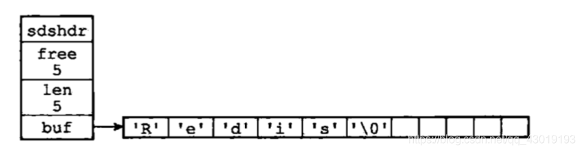

### C 字符串和 SDS 之间的区别

| C 字符串                                     | SDS                                          |
| -------------------------------------------- | -------------------------------------------- |
| 获取字符串长度的复杂度为O(N)。               | 获取字符串长度的复杂度为O(1)。               |
| API 是不安全的，可能会造成缓冲区溢出。       | API 是安全的，不会造成缓冲区溢出。           |
| 修改字符串长度N次必然需要执行N次内存重分配。 | 修改字符串长度N次最多需要执行N次内存重分配。 |
| 只能保存文本数据。                           | 可以保存文本或者二进制数据。                 |
| 可以使用所有<string.h>库中的函数。           | 可以使用一部分<string.h>库中的函数。         |

**SDS 减少修改字符串时带来的内存重分配次数**

- 空间预分配：通过这种策略， SDS 将连续增长 N 次字符串所需的内存重分配次数从必定 N 次降低为最多 N 次。
- 惰性空间释放：通过这种策略， SDS 避免了缩短字符串时所需的内存重分配操作， 并为将来可能有的增长操作提供了优化。

**二进制安全**

- 所有 SDS API 都会以处理二进制的方式来处理 SDS 存放在 buf 数组里的数据， 程序不会对其中的数据做任何限制、过滤、或者假设 —— 数据在写入时是什么样的， 它被读取时就是什么样。这也是我们将 SDS 的 buf 属性称为字节数组的原因 —— Redis 不是用这个数组来保存字符， 而是用它来保存一系列二进制数据。
- SDS 使用 len 属性的值而不是空字符来判断字符串是否结束。
- 通过使用二进制安全的 SDS ， 而不是 C 字符串， 使得 Redis 不仅可以保存文本数据， 还可以保存任意格式的二进制数据。

## 2.2 链表

每个链表节点使用一个 adlist.h/listNode 结构来表示：

```c
// 双向链表。
typedef struct listNode {
    struct listNode *prev;
    struct listNode *next;
    void *value;
} listNode;
```

虽然仅仅使用多个 listNode 结构就可以组成链表， 但使用 adlist.h/list 来持有链表的话， 操作起来会更方便：

```c
typedef struct list {
    // 表头节点
    listNode *head;
    // 表尾节点
    listNode *tail;
    // 链表所包含的节点数量。
    unsigned long len;
    // 节点值复制函数，函数用于复制链表节点所保存的值。
    void *(*dup)(void *ptr);
    // 节点值释放函数，用于释放链表节点所保存的值。
    void (*free)(void *ptr);
    // 节点值对比函数，用于对比链表节点所保存的值和另一个输入值是否相等。
    int (*match)(void *ptr, void *key);
} list;
```

一个由一个 list 结构和三个 listNode 结构组成的链表：


## 2.3 字典

字典

- 字典， 又称符号表（symbol table）、关联数组（associative array）或者映射（map）， 是一种用于保存键值对（key-value pair）的抽象数据结构。
- 在字典中， 一个键（key）可以和一个值（value）进行关联（或者说将键映射为值）， 这些关联的键和值就被称为键值对。
- 字典中的每个键都是独一无二的， 程序可以在字典中根据键查找与之关联的值， 或者通过键来更新值， 又或者根据键来删除整个键值对， 等等。

Redis 所使用的 C 语言并没有内置这种数据结构， 因此 Redis 构建了自己的字典实现。

- 字典被广泛用于实现 Redis 的各种功能， 其中包括数据库和哈希键。
- Redis 中的字典**使用哈希表作为底层实现**， 每个字典带有**两个哈希表， 一个用于平时使用， 另一个仅在进行 rehash 时使用**。
- 当字典被用作数据库的底层实现， 或者哈希键的底层实现时， Redis 使用 MurmurHash2 算法来计算键的哈希值。
- 哈希表使用**链地址法**来解决键冲突， 被分配到同一个索引上的多个键值对会连接成一个**单向链表**。
- 在对哈希表进行扩展或者收缩操作时， 程序需要将现有哈希表包含的所有键值对 rehash 到新哈希表里面， 并且这个 rehash 过程并不是一次性地完成的， 而是**渐进式**地完成的。

Redis 中的字典由 dict.h/dict 结构表示：

```c
typedef struct dict {
    // 类型特定函数
    dictType *type;
    // 私有数据
    void *privdata;
    // 哈希表
    dictht ht[2];
    // rehash 索引
    // 当 rehash 不在进行时，值为 -1
    int rehashidx; /* rehashing not in progress if rehashidx == -1 */
} dict;
```

- type 属性和 privdata 属性是针对不同类型的键值对， 为创建多态字典而设置的：
  - type 属性是一个指向 dictType 结构的指针， 每个 dictType 结构保存了一簇用于操作特定类型键值对的函数， Redis 会为用途不同的字典设置不同的类型特定函数。
  - 而 privdata 属性则保存了需要传给那些类型特定函数的可选参数。
- ht 属性是一个包含两个项的数组， 数组中的每个项都是一个 dictht 哈希表， 一般情况下， 字典只使用 ht[0] 哈希表， ht[1] 哈希表只会在对 ht[0] 哈希表进行 rehash 时使用。
  - 除了 ht[1] 之外， 另一个和 rehash 有关的属性就是 rehashidx ： 它记录了 rehash 目前的进度， 如果目前没有在进行 rehash ， 那么它的值为 -1 。

Redis 字典所使用的哈希表由 dict.h/dictht 结构定义：

```c
typedef struct dictht {
    // 哈希表数组
    dictEntry **table;
    // 哈希表大小
    unsigned long size;
    // 哈希表大小掩码，用于计算索引值
    // 总是等于 size - 1
    unsigned long sizemask;
    // 该哈希表已有节点的数量
    unsigned long used;
} dictht;
//table 属性是一个数组， 数组中的每个元素都是一个指向 dict.h/dictEntry 结构的指针， 每个 dictEntry 结构保存着一个键值对。
```

- table 属性是一个数组， 数组中的每个元素都是一个指向 dict.h/dictEntry 结构的指针， 每个 dictEntry 结构保存着一个键值对。
- size 属性记录了哈希表的大小， 也即是 table 数组的大小， 而 used 属性则记录了哈希表目前已有节点（键值对）的数量。
- sizemask 属性的值总是等于 size - 1 ， 这个属性和哈希值一起决定一个键应该被放到 table 数组的哪个索引上面。

**哈希表节点**

- 哈希表节点使用 dictEntry 结构表示， 每个 dictEntry 结构都保存着一个键值对。

```c
typedef struct dictEntry {
    // 键
    void *key;
    // 值
    union {
        void *val;
        uint64_t u64;
        int64_t s64;
    } v;
    // 指向下个哈希表节点，形成链表，用于冲突链表。
    struct dictEntry *next;
} dictEntry;
```

- key 属性保存着键值对中的键。
- v 属性则保存着键值对中的值， 其中键值对的值可以是一个指针， 或者是一个 uint64_t 整数， 又或者是一个 int64_t 整数。
- next 属性是指向另一个哈希表节点的指针， 这个指针可以将多个哈希值相同的键值对连接在一次， 以此来解决键冲突（collision）的问题。

一个普通状态下（没有进行 rehash）的字典：

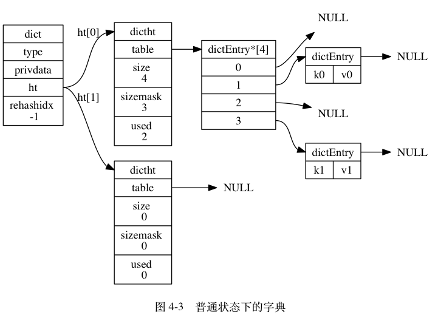

**渐进式 rehash**

哈希表渐进式 rehash 的详细步骤：

1. 为 ht[1] 分配空间， 让字典同时持有 ht[0] 和 ht[1] 两个哈希表。
2. 在字典中维持一个索引计数器变量 rehashidx ， 并将它的值设置为 0 ， 表示 rehash 工作正式开始。
3. 在 rehash 进行期间， 每次对字典执行添加、删除、查找或者更新操作时， 程序除了执行指定的操作以外， 还会顺带将 ht[0] 哈希表在 rehashidx 索引上的所有键值对 rehash 到 ht[1] ， 当 rehash 工作完成之后， 程序将 rehashidx 属性的值增一。
4. 随着字典操作的不断执行， 最终在某个时间点上， ht[0] 的所有键值对都会被 rehash 至 ht[1] ， 这时程序将 rehashidx 属性的值设为 -1 ， 表示 rehash 操作已完成。

## 2.4 跳跃表

### 2.4.1 跳跃表原理

学过数据结构的都知道，在单链表中查询一个元素的时间复杂度为O(n)，即使该单链表是有序的，我们也不能通过2分的方式缩减时间复杂度。 


   如上图，我们要查询元素为55的结点，必须从头结点，循环遍历到最后一个节点，不算-INF(负无穷)一共查询8次。那么用什么办法能够用更少的次数访问55呢？最直观的，当然是新开辟一条捷径去访问55。 


   如上图，我们要查询元素为55的结点，只需要在L2层查找4次即可。在这个结构中，查询结点为46的元素将耗费最多的查询次数5次。即先在L2查询46，查询4次后找到元素55，因为链表是有序的，46一定在55的左边，所以L2层没有元素46。然后我们退回到元素37，到它的下一层即L1层继续搜索46。非常幸运，我们只需要再查询1次就能找到46。这样一共耗费5次查询。

那么，如何才能更快的搜寻55呢？有了上面的经验，我们就很容易想到，再开辟一条捷径。 


如上图，我们搜索55只需要2次查找即可。这个结构中，查询元素46仍然是最耗时的，需要查询5次。即首先在L3层查找2次，然后在L2层查找2次，最后在L1层查找1次，共5次。很显然，这种思想和2分非常相似，那么我们最后的结构图就应该如下图。


我们可以看到，最耗时的访问46需要6次查询。即L4访问55，L3访问21、55，L2访问37、55，L1访问46。我们直觉上认为，这样的结构会让查询有序链表的某个元素更快。那么究竟算法复杂度是多少呢？

如果有n个元素，因为是2分，所以层数就应该是log n层 (本文所有log都是以2为底)，再加上自身的1层。以上图为例，如果是4个元素，那么分层为L3和L4，再加上本身的L2，一共3层；如果是8个元素，那么就是3+1层。最耗时间的查询自然是访问所有层数，耗时logn+logn，即2logn。为什么是2倍的logn呢？我们以上图中的46为例，查询到46要访问所有的分层，每个分层都要访问2个元素，中间元素和最后一个元素。所以时间复杂度为O(logn)。

至此为止，我们引入了**最理想的跳跃表**，但是如果想要在上图中插入或者删除一个元素呢？比如我们要插入一个元素22、23、24……，自然在L1层，我们将这些元素插入在元素21后，那么L2层，L3层呢？我们是不是要考虑插入后怎样调整连接，才能维持这个理想的跳跃表结构。我们知道，平衡二叉树的调整是一件令人头痛的事情，左旋右旋左右旋……一般人还真记不住，而调整一个理想的跳跃表将是一个比调整平衡二叉树还复杂的操作。幸运的是，我们并不需要通过复杂的操作调整连接来维护这样完美的跳跃表。**有一种基于概率统计的插入算法，也能得到时间复杂度为O(logn)的查询效率，这种跳跃表才是我们真正要实现的**。

#### 插入过程分析

 先讨论插入，我们先看理想的跳跃表结构，L2层的元素个数是L1层元素个数的1/2，L3层的元素个数是L2层的元素个数的1/2，以此类推。从这里，我们可以想到，只要**在插入时尽量保证上一层的元素个数是下一层元素的1/2**，我们的跳跃表就能成为理想的跳跃表。那么怎么样才能在插入时保证上一层元素个数是下一层元素个数的1/2呢？很简单，抛硬币就能解决了！假设元素X要插入跳跃表，很显然，L1层肯定要插入X。那么L2层要不要插入X呢？我们希望上层元素个数是下层元素个数的1/2，所以我们有1/2的概率希望X插入L2层，那么抛一下硬币吧，正面就插入，反面就不插入。那么L3到底要不要插入X呢？相对于L2层，我们还是希望1/2的概率插入，那么继续抛硬币吧！以此类推，元素X插入第n层的概率是(1/2)的n次。这样，我们能在跳跃表中插入一个元素了。

在此还是以上图为例：跳跃表的初试状态如下图，表中没有一个元素： 


如果我们要插入元素2，首先是在底部插入元素2，如下图： 

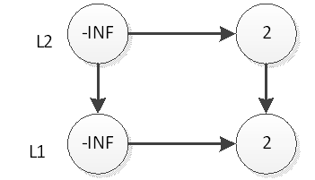

继续抛硬币，结果是反面，那么元素2的插入操作就停止了，插入后的表结构就是上图所示。接下来，我们插入元素33，跟元素2的插入一样，现在L1层插入33，如下图： 


然后抛硬币，结果是反面，那么元素33的插入操作就结束了，插入后的表结构就是上图所示。接下来，我们插入元素55，首先在L1插入55，插入后如下图： 


然后抛硬币，结果是正面，那么L2层需要插入55，如下图： 

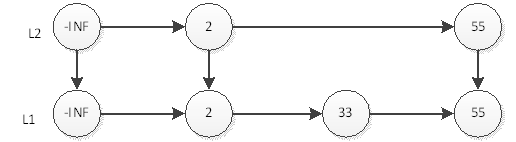

继续抛硬币，结果又是正面，那么L3层需要插入55，如下图： 

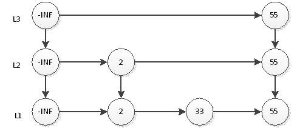

 以此类推，插入剩余的元素。当然因为规模小，结果很可能不是一个理想的跳跃表。但是如果元素个数n的规模很大，基于概率，最终的表结构可能非常接近于理想跳跃表。

再讨论删除，直接删除元素，然后调整一下删除元素后的指针即可，跟普通的链表删除操作完全一样。插入和删除的时间复杂度就是查询元素插入位置的时间复杂度，所以是O(logn)。关于时间复杂度的证明，感兴趣的话可以去看关于跳跃表的paper。

### 2.4.2 Redis 中的跳跃表

#### Redis跳跃表的实现

Redis 的跳跃表

- redis.h/zskiplistNode：zskiplistNode 结构用于表示跳跃表节点。
- redis.h/zskiplist：zskiplist 结构则用于保存跳跃表节点的相关信息， 比如节点的数量， 以及指向表头节点和表尾节点的指针， 等等。


zskiplist （图片最左边）属性：

- header ：指向跳跃表的表头节点。
- tail ：指向跳跃表的表尾节点。
- level ：记录目前跳跃表内，层数最大的那个节点的层数（表头节点的层数不计算在内）。
- length ：记录跳跃表的长度，即跳跃表目前包含节点的数量（表头节点不计算在内）。

zskiplistNode （zskiplist 结构右方的是四个zskiplistNode  ）属性：

- 层（level）：节点中用 L1 、 L2 、 L3 等字样标记节点的各个层， L1 代表第一层， L2 代表第二层，以此类推。每个层都带有两个属性：前进指针和跨度。前进指针用于访问位于表尾方向的其他节点，而跨度则记录了前进指针所指向节点和当前节点的距离。在上面的图片中，连线上带有数字的箭头就代表前进指针，而那个数字就是跨度。当程序从表头向表尾进行遍历时，访问会沿着层的前进指针进行。
- 后退（backward）指针：节点中用 BW 字样标记节点的后退指针，它指向位于当前节点的前一个节点。后退指针在程序从表尾向表头遍历时使用。
- 分值（score）：各个节点中的 1.0 、 2.0 和 3.0 是节点所保存的分值。在跳跃表中，节点按各自所保存的分值从小到大排列。
- 成员对象（obj）：各个节点中的 o1 、 o2 和 o3 是节点所保存的成员对象。

注意表头节点和其他节点的构造是一样的： 表头节点也有后退指针、分值和成员对象， 不过表头节点的这些属性都不会被用到， 所以图中省略了这些部分， 只显示了表头节点的各个层。

**zskiplist 结构的定义如下：**

```c
typedef struct zskiplist {
    // header 和 tail 指针分别指向跳跃表的表头和表尾节点， 通过这两个指针， 程序定位表头节点和表尾节点的复杂度为 O(1) 。
    struct zskiplistNode *header, *tail;
    // 用来记录表中节点的数量， 程序可以在 O(1) 复杂度内返回跳跃表的长度。
    unsigned long length;
    // 表中层数最大的节点的层数，用于在 O(1) 复杂度内获取跳跃表中层高最大的那个节点的层数，注意表头节点的层高并不计算在内。
    int level;
} zskiplist;
```

**zskiplistNode 结构定义：**

```c
typedef struct zskiplistNode {
    // 后退指针，一个节点只有一个
    struct zskiplistNode *backward;
    // 分值
    double score;
    // 成员对象
    robj *obj;
    // 层
    struct zskiplistLevel {
        // 前进指针，对于该节点每层一个
        struct zskiplistNode *forward;
        // 跨度
        unsigned int span;
    } level[];
} zskiplistNode;
```

**层**

- 跳跃表节点的 level 数组可以包含多个元素， 每个元素都包含一个指向其他节点的前进指针， 程序可以通过这些层来加快访问其他节点的速度， 一般来说， 层的数量越多， 访问其他节点的速度就越快。

- 每次创建一个新跳跃表节点的时候， 程序都根据**幂次定律** （[power law](http://en.wikipedia.org/wiki/Power_law)，越大的数出现的概率越小） 随机生成一个介于 1 和 32 之间的值作为 level 数组的大小， 这个大小就是层的“高度”。

  > Y：第n（n>1）层有节点x，则第n-1层也一定有x节点。

图 5-2 分别展示了三个高度为 1 层、 3 层和 5 层的节点， 因为 C 语言的数组索引总是从 0 开始的， 所以节点的第一层是 level[0] ， 而第二层是 level[1] ， 以此类推。

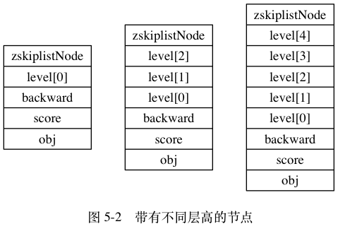

**前进指针**

用于从表头向表尾方向访问该层节点，即层的遍历。

**跨度**

- 用于记录两个节点之间的距离：
  -   两个节点之间的跨度越大， 它们相距得就越远。
  -   指向 NULL 的所有前进指针的跨度都为 0 ， 因为它们没有连向任何节点。
-  **跨度实际上是用来计算排位（rank）的**： 在查找某个节点的过程中， 将沿途访问过的所有层的跨度累计起来， 得到的结果就是目标节点在跳跃表中的排位。

举个例子， 图 5-4 用虚线标记了在跳跃表中查找分值为 3.0 、 成员对象为 o3 的节点时， 沿途经历的层： 查找的过程只经过了一个层L3， 并且层的跨度为 3 ， 所以目标节点在跳跃表中的排位为 3 。

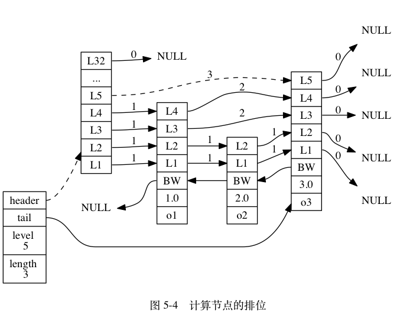

再举个例子， 图 5-5 用虚线标记了在跳跃表中查找分值为 2.0 、 成员对象为 o2 的节点时， 沿途经历的层： 在查找节点的过程中， 程序经过了两个跨度为 1 的节点， 因此可以计算出， 目标节点在跳跃表中的排位为 2 。

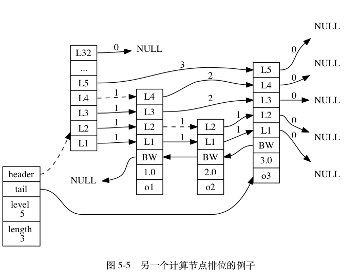

**后退指针**

- 节点的后退指针（backward 属性）用于从表尾向表头方向访问节点： 跟可以一次跳过多个节点的前进指针不同， 因为每个节点只有一个后退指针， 所以每次只能后退至前一个节点。

图 5-6 用虚线展示了如何**从表尾向表头遍历跳跃表中的所有节点**： 程序首先通过跳跃表的 tail 指针访问表尾节点， 然后通过后退指针访问倒数第二个节点， 之后再沿着后退指针访问倒数第三个节点， 再之后遇到指向 NULL 的后退指针， 于是访问结束。

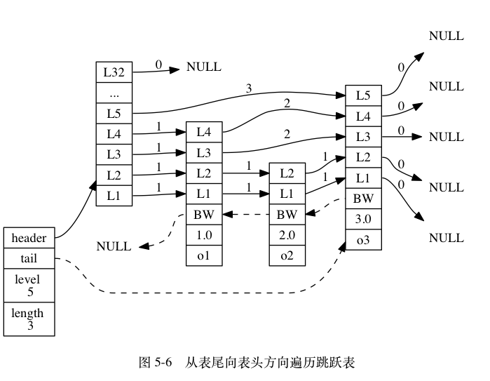

**分值和成员**

- 节点的分值（score 属性）是一个 **double** 类型的浮点数， 跳跃表中的所有节点都按**分值**从小到大来排序。
- 节点的成员对象（obj 属性）是一个指针， 它指向一个字符串对象， 而字符串对象则保存着一个 SDS 值。
- 在同一个跳跃表中， 各个节点保存的成员对象必须是唯一的， 但是多个节点保存的分值却可以是相同的： 分值相同的节点将按照成员对象在字典序中的大小来进行排序， 成员对象较小的节点会排在前面（靠近表头的方向）， 而成员对象较大的节点则会排在后面（靠近表尾的方向）。

举个例子， 在图 5-7 所示的跳跃表中， 三个跳跃表节点都保存了相同的分值 10086.0 ， 但保存成员对象 o1 的节点却排在保存成员对象 o2 和 o3 的节点之前， 而保存成员对象 o2 的节点又排在保存成员对象 o3 的节点之前， 由此可见， o1 、 o2 、 o3 三个成员对象在字典中的排序为 o1 <= o2 <= o3 。

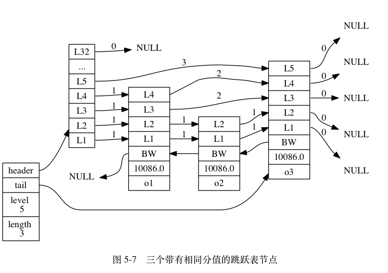

**总结**

- 跳跃表基于单链表加索引的方式实现
- 跳跃表以空间换时间的方式提升了查找速度
- Redis有序集合在节点元素较大或者元素数量较多时使用跳跃表实现，它在 Redis 中没有其他应用。
- Redis的跳跃表实现由 zskiplist和 zskiplistnode两个结构组成,其中 zskiplist用于保存跳跃表信息(比如表头节点、表尾节点、长度),而zskiplistnode则用于表示跳跃表节点
- Redis每个跳跃表节点的层高都是1至32之间的随机数
- 在同一个跳跃表中,多个节点可以包含相同的分值,但每个节点的成员对象必须是唯一的跳跃表中的节点按照分值大小进行排序,当分值相同时,节点按照成员对象的大小进行排序。

### 2.4.3 Redis跳跃表常用操作的时间复杂度

| 操作                                                         | 时间复杂度                               |
| :----------------------------------------------------------- | :--------------------------------------- |
| 创建一个跳跃表                                               | O(1)                                     |
| 释放给定跳跃表以及其中包含的节点                             | O(N)                                     |
| 添加给定成员和分值的新节点                                   | 平均O(logN),最坏O(logN)(N为跳跃表的长度) |
| 删除除跳跃表中包含给定成员和分值的节点                       | 平均O(logN),最坏O(logN)(N为跳跃表的长度) |
| 返回给定成员和分值的节点再表中的排位                         | 平均O(logN),最坏O(logN)(N为跳跃表的长度) |
| 返回在给定排位上的节点                                       | 平均O(logN),最坏O(logN)(N为跳跃表的长度) |
| 给定一个分值范围,返回跳跃表中第一个符合这个范围的节点        | O(1)                                     |
| 给定一个分值范围,返回跳跃表中最后一个符合这个范围的节点      | 平均O(logN),最坏O(logN)(N为跳跃表的长度) |
| 给定一个分值范围,除跳跃表中所有在这个范围之内的节点          | 平均O(logN),最坏O(logN)(N为跳跃表的长度) |
| 给定一个排位范围,鼎除跳跃表中所有在这个范围之内的节点        | O(N),N为被除节点数量                     |
| 给定一个分值范固(range),比如0到15,20到28,诸如此类,如果跳氏表中有至少一个节点的分值在这个范間之内,那么返回1,否则返回0 | O(N),N为被除节点数量                     |

## 2.5 整数集合

当一个集合中只包含整数，并且元素的个数不是很多的话，redis 会用整数集合作为底层存储，它的一个优点就是可以节省很多内存，虽然字典结构的效率很高，但是它的实现结构相对复杂并且会分配较多的内存空间。

而我们的整数集合（intset）可以做到使用较少的内存空间却达到和字典一样效率的实现，但也是前提的，集合中只能包含整型数据并且数量不能太多。整数集合最多能存多少个元素在 redis 中也是有体现的。

```properties
OBJ_SET_MAX_INTSET_ENTRIES 512
```

也就是超过 512 个元素，或者向集合中添加了字符串或其他数据结构，redis 会将整数集合向字典结构进行转换。

intset 的结构定义：

```c
typedef struct intset {
    uint32_t encoding;
    // 记录整数集合中目前存储了多少个元素。
    uint32_t length;
    // 记录我们实际的数据集合。虽然我们看到结构体中给数组元素的类型定死成 int8_t，但实际上这个 int8_t 定义的毫无意义，因为这里的处理方式非常规的数组操作，content 字段虽然被定义成指向一个 int8_t 类型数据的指针，但实际上 redis 无论是读取数组元素还是新增元素进去都依赖 encoding 和 length 两个字段直接操作的内存。
    int8_t contents [];
} intset;
```

encoding 记录当前 intset 使用编码，有三个取值：

```c
#define INTSET_ENC_INT16 (sizeof(int16_t))
#define INTSET_ENC_INT32 (sizeof(int32_t))
#define INTSET_ENC_INT64 (sizeof(int64_t))
```

## 2.6 压缩列表

​    压缩列表（ziplist）是列表键和哈希键的底层实现之一。当一个列表键只包含少量列表项， 并且每个列表项要么就是小整数值， 要么就是长度比较短的字符串， 那么 Redis 就会使用压缩列表来做列表键的底层实现。

## 2.7 对象

- Redis 并没有直接使用简单动态字符串（SDS）、双端链表、字典、压缩列表、整数集合等数据结构来实现键值对数据库， 而是**基于这些数据结构创建了一个对象系统**， 这个系统包含**字符串对象**、**列表对象**、**哈希对象**、**集合对象**和**有序集合对象**这五种类型的对象， 每种对象都用到了至少一种我们前面所介绍的数据结构。
- 通过这五种不同类型的对象
  1. Redis 可以在执行命令之前， 根据对象的类型来判断一个对象是否可以执行给定的命令。
  2. 可以针对不同的使用场景， 为对象设置多种不同的数据结构实现， 从而优化对象在不同场景下的使用效率。
- Redis 的对象系统还实现了基于**引用计数技术**的内存回收机制： 当程序不再使用某个对象的时候， 这个对象所占用的内存就会被自动释放； 另外， Redis 还通过引用计数技术实现了对象共享机制， 这一机制可以在适当的条件下， 通过让多个数据库键共享同一个对象来节约内存。
- 最后， Redis 的对象带有访问时间记录信息， 该信息可以用于计算数据库键的空转时长， 在服务器启用了 maxmemory 功能的情况下， 空转时长较大的那些键可能会优先被服务器删除。

### 2.7.1 对象的类型与编码

- Redis 使用对象来表示数据库中的键和值， 每次当我们在 Redis 的数据库中新创建一个键值对时， 我们至少会创建两个对象， 一个对象用作键值对的键（键对象）， 另一个对象用作键值对的值（值对象）。

- Redis 中的每个对象都由一个 redisObject 结构表示， 该结构中和保存数据有关的三个属性分别是 type 属性、 encoding 属性和 ptr 属性：

  ```c
  typedef struct redisObject {
      // 对象类型
      unsigned type:4;
      // 编码
      unsigned encoding:4;
      // 指向底层实现数据结构的指针
      void *ptr;
      // ...
      // 引用计数，用于内存回收与对象共享
      int refcount;
    	// ...
    	// 该属性记录了对象最后一次被命令程序访问的时间，用于计算空转时长
    	unsigned lru:22;
  } robj;
  ```
  
  **对象类型**
  
  | 类型常量     | 对象的名称   | TYPE 命令的输出 |
  | ------------ | ------------ | --------------- |
  | REDIS_STRING | 字符串对象   | "string"        |
  | REDIS_LIST   | 列表对象     | "list"          |
  | REDIS_HASH   | 哈希对象     | "hash"          |
  | REDIS_SET    | 集合对象     | "set"           |
  | REDIS_ZSET   | 有序集合对象 | "zset"          |

  - 对于 Redis 数据库保存的键值对来说， 键总是一个字符串对象， 而值则可以是字符串对象、列表对象、哈希对象、集合对象或者有序集合对象的其中一种， 因此：

    - 当我们称呼一个数据库键为“字符串键”时， 我们指的是“这个数据库键所对应的值为字符串对象”；
    - 当我们称呼一个键为“列表键”时， 我们指的是“这个数据库键所对应的值为列表对象”，诸如此类。
  
  - TYPE 命令的实现方式也与此类似， 当我们对一个数据库键执行 TYPE 命令时， 命令返回的结果为数据库键对应的值对象的类型， 而不是键对象的类型：
  
    ```shell
    # 键为字符串对象，值为列表对象
    redis> RPUSH numbers 1 3 5
    (integer) 6
    redis> TYPE numbers
    list
    ```

**编码和底层实现**

对象的 ptr 指针指向对象的底层实现数据结构， encoding 属性记录了对象所使用的编码， 也即是说这个对象使用了什么数据结构作为对象的底层实现。

| 编码常量                  | 编码所对应的底层数据结构    | OBJECT ENCODING 命令输出 |
| ------------------------- | --------------------------- | ------------------------ |
| REDIS_ENCODING_INT        | long 类型的整数             | "int"                    |
| REDIS_ENCODING_EMBSTR     | embstr 编码的简单动态字符串 | "embstr"                 |
| REDIS_ENCODING_RAW        | 简单动态字符串              | "raw"                    |
| REDIS_ENCODING_HT         | 字典                        | "hashtable"              |
| REDIS_ENCODING_LINKEDLIST | 双端链表                    | "linkedlist"             |
| REDIS_ENCODING_ZIPLIST    | 压缩列表                    | "ziplist"                |
| REDIS_ENCODING_INTSET     | 整数集合                    | "intset"                 |
| REDIS_ENCODING_SKIPLIST   | 跳跃表和字典                | "skiplist"               |

其中，每种type类型的对象都至少使用了两种不同的编码，使用 OBJECT ENCODING 命令可以查看一个数据库键的值对象的编码。

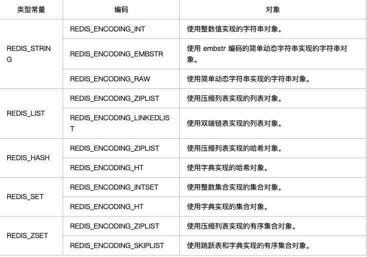

### 2.7.2 对象编码转换条件

#### 2.7.2.1 字符串对象

- 字符串对象的编码可以是 int 、embstr 或者raw。
  - 如果一个字符串对象保存的是整数值， 并且这个整数值可以用 long 类型来表示， 那么字符串对象会将整数值保存在字符串对象结构的 ptr 属性里面（将 void* 转换成 long ）， 并将字符串对象的编码设置为 int 。
  - 如果字符串对象保存的是一个字符串值， 并且这个字符串值的长度小于等于 39 字节， 那么字符串对象将使用 embstr 编码的方式来保存这个字符串值。
  - 如果字符串对象保存的是一个字符串值， 并且这个字符串值的长度大于 39 字节， 那么字符串对象将使用一个简单动态字符串（SDS）来保存这个字符串值， 并将对象的编码设置为 raw 。
- 最后要说的是， 可以用 long double 类型表示的浮点数在 Redis 中也是作为字符串值来保存的： 如果我们要保存一个浮点数到字符串对象里面， 那么程序会先将这个浮点数转换成字符串值， 然后再保存起转换所得的字符串值。在有需要的时候， 程序会将保存在字符串对象里面的字符串值转换回浮点数值， 执行某些操作， 然后再将执行操作所得的浮点数值转换回字符串值， 并继续保存在字符串对象里面。

字符串对象保存各类型值的编码方式：

| 值                                                           | 编码            |
| ------------------------------------------------------------ | --------------- |
| 可以用 long 类型保存的整数。                                 | int             |
| 可以用 long double 类型保存的浮点数。                        | embstr 或者 raw |
| 字符串值， 或者因为长度太大而没办法用 long 类型表示的整数， 又或者因为长度太大而没办法用 long double 类型表示的浮点数。 | embstr 或者 raw |

**编码的转换**

- int 编码的字符串对象和 embstr 编码的字符串对象在条件满足的情况下， 会被转换为 raw 编码的字符串对象。
- 对于 int 编码的字符串对象来说， 如果我们向对象执行了一些命令， 使得这个对象保存的不再是整数值， 而是一个字符串值， 那么字符串对象的编码将从 int 变为 raw 。比如APPEND 命令
- 另外， 因为 Redis 没有为 embstr 编码的字符串对象编写任何相应的修改程序 （只有 int 编码的字符串对象和 raw 编码的字符串对象有这些程序）， 所以 embstr 编码的字符串对象实际上是只读的： 当我们对 embstr 编码的字符串对象执行任何修改命令时， 程序会先将对象的编码从 embstr 转换成 raw ， 然后再执行修改命令； 因为这个原因， embstr 编码的字符串对象在执行修改命令之后， 总会变成一个 raw 编码的字符串对象。

#### 2.7.2.2 列表对象

- 列表对象的编码可以是 ziplist 或者 linkedlist 。
- ziplist 编码的列表对象使用**压缩列表**作为底层实现， 每个压缩列表节点（entry）保存了一个列表元素。
- 另一方面， linkedlist 编码的列表对象使用**双端链表**作为底层实现， 每个双端链表节点（node）都保存了一个字符串对象， 而每个字符串对象都保存了一个列表元素。

**编码转换**

当列表对象可以同时满足以下两个条件时， 列表对象使用 ziplist 编码：

1. 列表对象保存的所有字符串元素的长度都小于 64 字节；
2. 列表对象保存的元素数量小于 512 个；

不能满足这两个条件的列表对象需要使用 linkedlist 编码。

- 对于使用 ziplist 编码的列表对象来说， 当使用 ziplist 编码所需的两个条件的任意一个不能被满足时， 对象的编码转换操作就会被执行： 原本保存在压缩列表里的所有列表元素都会被转移并保存到双端链表里面， 对象的编码也会从 ziplist 变为 linkedlist 。

> **注意**：以上两个条件的上限值是可以修改的， 具体请看配置文件中关于 list-max-ziplist-value 选项和 list-max-ziplist-entries 选项的说明。

#### 2.7.2.3 哈希对象

- 哈希对象的编码可以是 **ziplist** 或者 **hashtable** 。
- ziplist 编码的哈希对象使用**压缩列表**作为底层实现， 每当有新的键值对要加入到哈希对象时， 程序会先将保存了键的压缩列表节点推入到压缩列表表尾， 然后再将保存了值的压缩列表节点推入到压缩列表表尾， 因此：
  - 保存了同一键值对的两个节点总是紧挨在一起， 保存键的节点在前， 保存值的节点在后；
  - 先添加到哈希对象中的键值对会被放在压缩列表的表头方向， 而后来添加到哈希对象中的键值对会被放在压缩列表的表尾方向。
- 另一方面， hashtable 编码的哈希对象使用**字典**作为底层实现， 哈希对象中的每个键值对都使用一个字典键值对来保存：
  - 字典的每个键都是一个字符串对象， 对象中保存了键值对的键；
  - 字典的每个值都是一个字符串对象， 对象中保存了键值对的值。

**编码转换**

当哈希对象可以同时满足以下两个条件时， 哈希对象使用 ziplist 编码：

1. 哈希对象保存的所有键值对的键和值的字符串长度都小于 64 字节；

2. 哈希对象保存的键值对数量小于 512 个。 

   > Y：应该是键值对数量小于256？

不能满足这两个条件的哈希对象需要使用 hashtable 编码。

- 对于使用 ziplist 编码的列表对象来说， 当使用 ziplist 编码所需的两个条件的任意一个不能被满足时， 对象的编码转换操作就会被执行： 原本保存在压缩列表里的所有键值对都会被转移并保存到字典里面， 对象的编码也会从 ziplist 变为 hashtable 。

> **注意**：这两个条件的上限值是可以修改的， 具体请看配置文件中关于 hash-max-ziplist-value 选项和 hash-max-ziplist-entries 选项的说明。

#### 2.7.2.4 集合对象

- 集合对象的编码可以是 **intset** 或者 **hashtable** 。
- intset 编码的集合对象使用**整数集合**作为底层实现， 集合对象包含的所有元素都被保存在整数集合里面。
- 另一方面， hashtable 编码的集合对象使用**字典**作为底层实现， 字典的每个键都是一个字符串对象， 每个字符串对象包含了一个集合元素， 而字典的值则全部被设置为 NULL 。

**编码的转换**

当集合对象可以同时满足以下两个条件时， 对象使用 intset 编码：

1. 集合对象保存的所有元素都是整数值；
2. 集合对象保存的元素数量不超过 512 个；

不能满足这两个条件的集合对象需要使用 hashtable 编码。

- 对于使用 intset 编码的集合对象来说， 当使用 intset 编码所需的两个条件的任意一个不能被满足时， 对象的编码转换操作就会被执行： 原本保存在整数集合中的所有元素都会被转移并保存到字典里面， 并且对象的编码也会从 intset 变为 hashtable 。

> **注意**：第二个条件的上限值是可以修改的， 具体请看配置文件中关于 set-max-intset-entries 选项的说明。

#### 2.7.2.5 有序集合对象

- 有序集合的编码可以是 **ziplist** 或者 **skiplist** 。

- ziplist 编码的有序集合对象使用**压缩列表**作为底层实现， 每个集合元素使用两个紧挨在一起的压缩列表节点来保存， 第一个节点保存元素的成员（member）， 而第二个元素则保存元素的分值（score）。

- 压缩列表内的集合元素按分值从小到大进行排序， 分值较小的元素被放置在靠近表头的方向， 而分值较大的元素则被放置在靠近表尾的方向。

- skiplist 编码的有序集合对象使用 **zset 结构**作为底层实现，**一个 zset 结构同时包含一个字典和一个跳跃表**：

  ```c
  typedef struct zset {
      zskiplist *zsl;
      dict *dict;     
  } zset;
  ```

  - **zset 结构中的 zsl 跳跃表按分值从小到大保存了所有集合元素**， 每个跳跃表节点都保存了一个集合元素： 跳跃表节点的 object 属性保存了元素的成员， 而跳跃表节点的 score 属性则保存了元素的分值。 通过这个跳跃表， 程序可以对有序集合进行范围型操作， 比如 ZRANK 、 ZRANGE 等命令就是基于跳跃表 API 来实现的。
  - **zset 结构中的 dict 字典为有序集合创建了一个从成员到分值的映射**， 字典中的每个键值对都保存了一个集合元素： 字典的键保存了元素的成员， 而字典的值则保存了元素的分值。 通过这个字典， 程序可以用 O(1) 复杂度查找给定成员的分值， ZSCORE 命令就是根据这一特性实现的， 而很多其他有序集合命令都在实现的内部用到了这一特性。
  - 值得一提的是， 虽然 zset 结构同时使用跳跃表和字典来保存有序集合元素， 但**这两种数据结构都会通过指针来共享相同元素的成员和分值**， 所以同时使用跳跃表和字典来保存集合元素不会产生任何重复成员或者分值， 也不会因此而浪费额外的内存。
  
- 有序集合每个元素的成员都是一个字符串对象， 而每个元素的分值都是一个 double 类型的浮点数。

**为什么有序集合需要同时使用跳跃表和字典来实现？**

- 在理论上来说， 有序集合可以单独使用字典或者跳跃表的其中一种数据结构来实现， 但无论单独使用字典还是跳跃表， 在性能上对比起同时使用字典和跳跃表都会有所降低。
- 举个例子， 如果我们只使用字典来实现有序集合， 那么虽然以 O(1) 复杂度查找成员的分值这一特性会被保留， 但是， 因为字典以无序的方式来保存集合元素， 所以每次在执行范围型操作 —— 比如 ZRANK 、 ZRANGE 等命令时， 程序都需要对字典保存的所有元素进行排序， 完成这种排序需要至少 O(N \log N) 时间复杂度， 以及额外的 O(N) 内存空间 （因为要创建一个数组来保存排序后的元素）。
- 另一方面， 如果我们只使用跳跃表来实现有序集合， 那么跳跃表执行范围型操作的所有优点都会被保留， 但因为没有了字典， 所以根据成员查找分值这一操作的复杂度将从 O(1) 上升为 O(\log N) 。
- 因为以上原因， 为了让有序集合的查找和范围型操作都尽可能快地执行， Redis 选择了同时使用字典和跳跃表两种数据结构来实现有序集合。

**编码的转换**

当有序集合对象可以同时满足以下两个条件时， 对象使用 ziplist 编码：

1. 有序集合保存的元素数量小于 128 个；
2. 有序集合保存的所有元素成员的长度都小于 64 字节；

不能满足以上两个条件的有序集合对象将使用 skiplist 编码。

- 对于使用 ziplist 编码的有序集合对象来说， 当使用 ziplist 编码所需的两个条件中的任意一个不能被满足时， 程序就会执行编码转换操作， 将原本储存在压缩列表里面的所有集合元素转移到 zset 结构里面， 并将对象的编码从 ziplist 改为 skiplist 。

> **注意**：以上两个条件的上限值是可以修改的， 具体请看配置文件中关于 zset-max-ziplist-entries 选项和 zset-max-ziplist-value 选项的说明。

## 2.8 类型检查与命令多态

略

## 2.9 内存回收

略

## 2.10 对象共享

- 在 Redis 中， 让多个键共享同一个值对象需要执行以下两个步骤：
  1. 将数据库键的值指针指向一个现有的值对象；
  2. 将被共享的值对象的引用计数增一。

- 目前来说， Redis 会在初始化服务器时， 创建一万个字符串对象， 这些对象包含了从 0 到 9999 的所有整数值， 当服务器需要用到值为 0 到 9999 的字符串对象时， 服务器就会使用这些共享对象， 而不是新创建对象。

> **注意**：创建共享字符串对象的数量可以通过修改 redis.h/REDIS_SHARED_INTEGERS 常量来修改。

- 另外， 这些共享对象不单单只有字符串键可以使用， 那些在数据结构中嵌套了字符串对象的对象（linkedlist 编码的列表对象、 hashtable 编码的哈希对象、 hashtable 编码的集合对象、以及 zset 编码的有序集合对象）都可以使用这些共享对象。

**为什么 Redis 不共享包含字符串的对象？**

当服务器考虑将一个共享对象设置为键的值对象时， 程序需要先检查给定的共享对象和键想创建的目标对象是否完全相同， 只有在共享对象和目标对象完全相同的情况下， 程序才会将共享对象用作键的值对象， 而一个共享对象保存的值越复杂， 验证共享对象和目标对象是否相同所需的复杂度就会越高， 消耗的 CPU 时间也会越多：

- 如果共享对象是保存整数值的字符串对象， 那么验证操作的复杂度为 O(1) ；
- 如果共享对象是保存字符串值的字符串对象， 那么验证操作的复杂度为 O(N) ；
- 如果共享对象是包含了多个值（或者对象的）对象， 比如列表对象或者哈希对象， 那么验证操作的复杂度将会是 O(N^2) 。

因此， 尽管共享更复杂的对象可以节约更多的内存， 但受到 CPU 时间的限制， Redis 只对包含整数值的字符串对象进行共享。

## 2.11 对象的空转时长

- **OBJECT IDLETIME** 命令可以打印出给定键的空转时长， 这一空转时长就是通过将**当前时间**减去**键的值对象的 lru 时间**计算得出的.

# 3. Redis 内存管理

## 3.1 Redis的内存过期策略

内存过期策略主要的作用就是，在缓存过期之后，能够及时的将失效的缓存从内存中删除，以减少内存的无效暂用，达到释放内存的目的。

Redis内存过期策略分为三类，定时策略、惰性策略和定期策略。

## 3.1.1 定时策略

含义：在设置key的过期时间的同时，为该key创建一个定时器，让定时器在key的过期时间来临时对key进行删除。

优点：保证内存被尽快释放，减少无效的缓存暂用内存。

缺点：若过期key很多，删除这些key会占用很多的CPU时间，在CPU时间紧张的情况下，CPU不能把所有的时间用来做要紧的事儿，还需要去花时间删除这些key。定时器的创建耗时，若为每一个设置过期时间的key创建一个定时器（将会有大量的定时器产生），性能影响严重。**一般来说，是不会选择该策略模式**。

## 3.1.2 惰性策略

含义：key过期的时候不删除，每次从数据库获取key的时候去检查是否过期，若过期，则删除，返回null。

优点：删除操作只发生在从数据库取出key的时候发生，而且只删除当前key，所以对CPU时间的占用是比较少的，而且此时的删除是已经到了非做不可的地步（如果此时还不删除的话，我们就会获取到了已经过期的key了）。

缺点：若大量的key在超出超时时间后，很久一段时间内，都没有被获取过，此时的无效缓存是永久暂用在内存中的，那么可能发生内存泄露（无用的垃圾占用了大量的内存）。

## 3.1.3 定期策略

含义：每隔一段时间对设置了缓存时间的key进行检测，如果可以已经失效，则从内存中删除，如果未失效，则不作任何处理。

优点：通过限制删除操作的时长和频率，来减少删除操作对CPU时间的占用（处理"定时删除"的缺点）， 定期删除过期key（处理"惰性删除"的缺点）。

缺点:在内存友好方面，不如"定时删除"，因为是随机遍历一些key，因此存在部分key过期，但遍历key时，没有被遍历到，过期的key仍在内存中。在CPU时间友好方面，不如"惰性删除"，定期删除也会暂用CPU性能消耗。

难点:合理设置删除操作的执行时长（每次删除执行多长时间）和执行频率（每隔多长时间做一次删除）（这个要根据服务器运行情况来定了）

## 3.1.4 策略注意事项

### **过期策略对持久化存储的影响**

持久化存储，指的是将内存的缓存永久存在磁盘中。也就是说我们的AOF和RDB持久化存储方式。因为该两种方式，将内存中的数据写入磁盘，这时候就需要考虑到我们过期的缓存是否会被写入到磁盘中？如果写入磁盘又是怎么处理的？

### **RDB持久化存储方式**

持久化key之前，会检查是否过期，过期的key不进入RDB文件。

数据载入数据库之前，会对key先进行过期检查，如果过期，不导入数据库（主库情况）。

### **AOF持久化存储方式**

当key过期后，还没有被删除，此时进行执行持久化操作（该key是不会进入aof文件的，因为没有发生修改命令）。

当key过期后，在发生删除操作时，程序会向aof文件追加一条del命令（在将来的以aof文件恢复数据的时候该过期的键就会被删掉）。

> 因为AOF方式，向存储文件追加的是Redis的操作命令，而不是具体的数据，然而RDB确是存储的安全的二进制内容。

重写时，会先判断key是否过期，已过期的key不会重写到aof文件。

> 即使在重写时，不验证是否过期，然而追加了del命令，测试无效的key同样会被删除。判断的情况是为了防止没有加入del命令的key。

## 3.2 Redis内存淘汰机制

内存淘汰机制针对是**内存不足**的情况下的一种Redis处理机制。例如，当前的Redis存储已经超过内存限制了，然而我们的业务还在继续往Redis里面追加缓存内容，这时候Redis的淘汰机制就起到作用了。

### 3.2.1 常见的缓存算法

- LRU (Least recently used) 最近最少使用，如果数据最近被访问过，那么将来被访问的几率也更高。
- LFU (Least frequently used) 最不经常使用，如果一个数据在最近一段时间内使用次数很少，那么在将来一段时间内被使用的可能性也很小。
- FIFO (Fist in first out) 先进先出，如果一个数据最先进入缓存中，则应该最早淘汰掉。

### 3.2.2 淘汰机制分类

根据redis.conf的配置文件中，我们可以得出，主要分为如下几种淘汰机制。

> Y：键空间 + 淘汰策略

- volatile-lru：当内存不足以容纳新写入数据时，在设置了过期时间的键空间中，使用LRU算法删除key。


- **allkeys-lru**：当内存不足以容纳新写入数据时，在键空间中，使用LRU算法删除key（这个是最常用的）。

- volatile-lfu：当内存不足以容纳新写入数据时，在设置了过期时间的键空间中，使用LFU算法删除key。


- allkeys-lfu：当内存不足以容纳新写入数据时，在键空间中，使用LFU算法删除key。


- volatile-random：当内存不足以容纳新写入数据时，在设置了过期时间的键空间中，随机删除key。


- allkeys-random：当内存不足以容纳新写入数据时，在键空间中，随机删除key。


- volatile-ttl：当内存不足以容纳新写入数据时，优先删除离过期时间最近的key（minor TTL）。


- noeviction：当内存不足以容纳新写入数据时，不删除任何数据，新写入操作会报错。


# 4. Redis 集群模式

## 4.1 主从同步/复制


　为了避免单点故障，通常的做法是将数据库复制多个副本以部署在不同的服务器上，这样即使有一台服务器出现故障，其他服务器依然可以继续提供服务。为此， **Redis 提供了复制（replication）功能，可以实现当一台数据库中的数据更新后，自动将更新的数据同步到其他数据库上**。　　

​	在复制的概念中，数据库分为两类，一类是主数据库（master），另一类是从数据库(slave）。**主数据库可以进行读写操作**，当写操作导致数据变化时会自动将数据同步给从数据库。而**从数据库一般是只读的，并接受主数据库同步过来的数据**。一个主数据库可以拥有多个从数据库，而一个从数据库只能拥有一个主数据库。

**主从数据库的配置：**

　　**主数据库不用配置**，从数据库的配置文件（redis.conf）中可以配置主数据库的信息，也可以在启动时，使用 redis-server --port 6380 --slaveof 127.0.0.1 6379 命令指明主数据库的 IP 和端口。从数据库一般是只读，可以改为可写，但写入的数据很容易被主同步没，所以还是只读就可以。也可以在运行时使用 slaveof ip port 命令，停止原来的主，切换成刚刚设置的主 slaveof no one会把自己变成主。

**主从复制原理：**

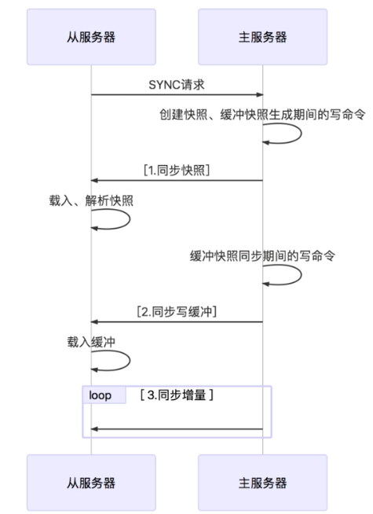

- 从数据库连接主数据库，发送SYNC命令； 
- 主数据库接收到SYNC命令后，开始执行BGSAVE命令生成RDB文件并使用缓冲区记录此后执行的所有写命令； 
- 主数据库BGSAVE执行完后，向所有从数据库发送快照文件，并在发送期间继续记录被执行的写命令； 
- 从数据库收到快照文件后**丢弃所有旧数据**，载入收到的快照； 
- 主数据库快照发送完毕后开始向从数据库发送缓冲区中的写命令； 
- 从数据库完成对快照的载入，开始接收命令请求，并执行来自主数据库缓冲区的写命令；（**从数据库初始化完成**）
- 主数据库每执行一个写命令就会向从数据库发送相同的写命令，从数据库接收并执行收到的写命令（**从数据库初始化完成后的操作**）
- 出现断开重连后，2.8之后的版本会将断线期间的命令传给从数据库，增量复制。
- 主从刚刚连接的时候，进行全量同步；全同步结束后，进行增量同步。当然，如果有需要，slave 在任何时候都可以发起全量同步。Redis 的策略是，无论如何，首先会尝试进行增量同步，如不成功，要求从机进行全量同步。

**优点：**

- 支持主从复制，主机会自动将数据同步到从机，可以进行读写分离；
- 为了分载Master的读操作压力，Slave服务器可以为客户端提供只读操作的服务，写服务仍然必须由Master来完成；
- Slave同样可以接受其它Slaves的连接和同步请求，这样可以有效的分载Master的同步压力；
- Master Server是以非阻塞的方式为Slaves提供服务。所以在Master-Slave同步期间，客户端仍然可以提交查询或修改请求；
- Slave Server同样是以非阻塞的方式完成数据同步。在同步期间，如果有客户端提交查询请求，Redis则返回同步之前的数据；

**缺点：**

- Redis不具备自动容错和恢复功能，主机从机的宕机都会导致前端部分读写请求失败，需要等待机器重启或者手动切换前端的IP才能恢复；
- 主机宕机，宕机前有部分数据未能及时同步到从机，切换IP后还会引入数据不一致的问题，降低了系统的可用性；
- 如果多个Slave断线了，需要重启的时候，尽量不要在同一时间段进行重启。因为只要Slave启动，就会发送sync请求和主机全量同步，当多个 Slave 重启的时候，可能会导致 Master IO剧增从而宕机。
- Redis较难支持在线扩容，在集群容量达到上限时在线扩容会变得很复杂；

## 4.2 哨兵模式 sentinel

​	第一种主从同步/复制的模式，当主服务器宕机后，需要手动把一台从服务器切换为主服务器，这就需要人工干预，费事费力，还会造成一段时间内服务不可用。这不是一种推荐的方式，更多时候，我们优先考虑哨兵模式。

　哨兵模式是一种特殊的模式，首先Redis提供了哨兵的命令，**哨兵是一个独立的进程，作为进程，它会独立运行。**其原理是哨兵通过发送命令，等待Redis服务器响应，从而监控运行的多个Redis实例。

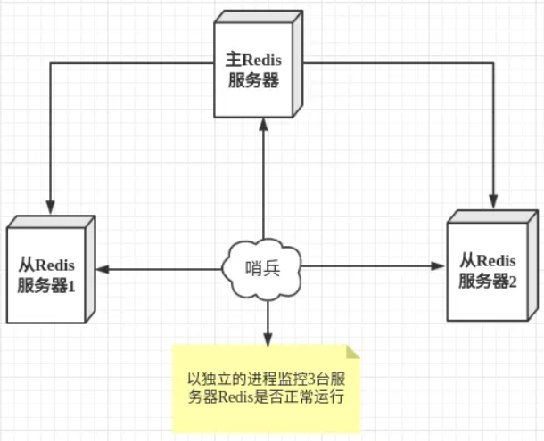

**哨兵模式的作用：**

- 通过发送命令，让Redis服务器返回监控其运行状态，包括主服务器和从服务器；
- 当哨兵监测到master宕机，会自动将slave切换成master，然后通过**发布订阅模式**通知其他的从服务器，修改配置文件，让它们切换主机。

然而一个哨兵进程对Redis服务器进行监控，也可能会出现问题，为此，我们可以使用多个哨兵进行监控。各个哨兵之间还会进行监控，这样就形成了**多哨兵模式**。

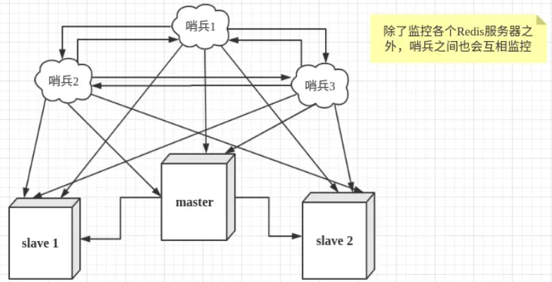

**故障切换的过程：**

　　假设主服务器宕机，哨兵1先检测到这个结果，系统并不会马上进行 failover 过程，仅仅是哨兵1主观的认为主服务器不可用，这个现象成为**主观下线**。当后面的哨兵也检测到主服务器不可用，并且数量达到一定值时，那么哨兵之间就会进行一次投票，投票的结果由一个哨兵发起，进行 failover 操作。切换成功后，就会通过发布订阅模式，让各个哨兵把自己监控的从服务器实现切换主机，这个过程称为**客观下线**。这样对于客户端而言，一切都是透明的。

**哨兵模式的配置：**

配置一主二从和三个哨兵的 Redis 服务器来演示这个过程

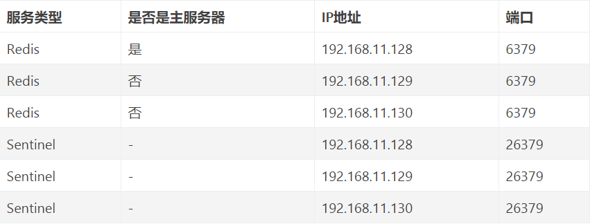

**主从服务器配置**

```properties
# 使得Redis服务器可以跨网络访问
bind 0.0.0.0
# 设置密码
requirepass "123456"
# 以下有关slaveof的配置只是配置从服务器，主服务器不需要配置
# 指定主服务器
slaveof 192.168.11.128 6379
# 主服务器密码
masterauth 123456
```

**哨兵配置**

```properties
# 禁止保护模式
protected-mode no
# 配置监听的主服务器，这里sentinel monitor代表监控，mymaster代表服务器的名称，可以自定义，192.168.11.128代表监控的主服务器，6379代表端口，2代表只有两个或两个以上的哨兵认为主服务器不可用的时候，才会进行failover操作。
sentinel monitor mymaster 192.168.11.128 6379 2
# sentinel author-pass定义服务的密码，mymaster是服务名称，123456是Redis服务器密码
# sentinel auth-pass <master-name> <password>
sentinel auth-pass mymaster 123456
```

配置3个哨兵，每个哨兵的配置都是一样的。在Redis安装目录下有一个sentinel.conf文件，copy一份进行修改。

**启动**

注意启动的顺序。首先是主机（192.168.11.128）的 Redis 服务进程，然后启动从机的 Redis 服务进程，最后启动3个哨兵的服务进程。

**哨兵模式的工作方式：**

- 每个Sentinel（哨兵）进程以每秒钟一次的频率向整个集群中的Master主服务器，Slave从服务器以及其他Sentinel（哨兵）进程发送一个 PING 命令。
- 如果一个实例（instance）距离最后一次有效回复 PING 命令的时间超过 down-after-milliseconds 选项所指定的值， 则这个实例会被 Sentinel（哨兵）进程标记为主观下线（SDOWN）
- 如果一个Master主服务器被标记为主观下线（SDOWN），则正在监视这个Master主服务器的所有 Sentinel（哨兵）进程要以每秒一次的频率确认Master主服务器的确进入了主观下线状态
- 当有足够数量的 Sentinel（哨兵）进程（大于等于配置文件指定的值）在指定的时间范围内确认Master主服务器进入了主观下线状态（SDOWN）， 则Master主服务器会被标记为客观下线（ODOWN）
- 在一般情况下， 每个 Sentinel（哨兵）进程会以每 10 秒一次的频率向集群中的所有Master主服务器、Slave从服务器发送 INFO 命令。
- 当Master主服务器被 Sentinel（哨兵）进程标记为客观下线（ODOWN）时，Sentinel（哨兵）进程向下线的 Master主服务器的所有 Slave从服务器发送 INFO 命令的频率会从 10 秒一次改为每秒一次。
- 若没有足够数量的 Sentinel（哨兵）进程同意 Master主服务器下线， Master主服务器的客观下线状态就会被移除。若 Master主服务器重新向 Sentinel（哨兵）进程发送 PING 命令返回有效回复，Master主服务器的主观下线状态就会被移除。

**优点：**

- 哨兵模式是基于主从模式的，所有主从的优点，哨兵模式都具有。
- 主从可以自动切换，系统更健壮，可用性更高。

**缺点：**

- Redis较难支持在线扩容，在集群容量达到上限时在线扩容会变得很复杂。

## 4.3 Cluster集群

Redis 的哨兵模式基本已经可以实现高可用，读写分离 ，但是在这种模式下每台 Redis 服务器都存储相同的数据，很浪费内存，所以在redis3.0上加入了 Cluster 集群模式，实现了 **Redis 的分布式存储**，也就是说每台 Redis 节点上存储不同的内容。

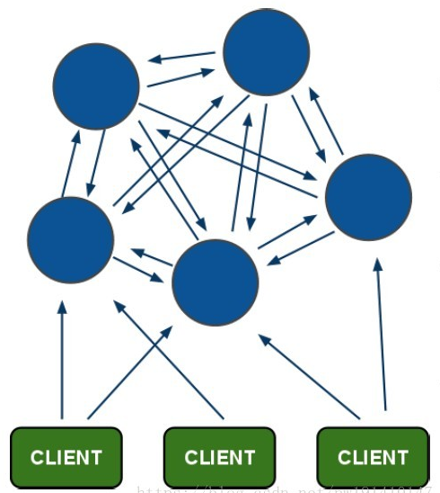

**集群的配置**

根据官方推荐，集群部署至少要 3 台以上的master节点。

**集群的特点**

- **所有的redis节点彼此互联**(PING-PONG机制),内部使用二进制协议优化传输速度和带宽。
- 节点的fail是通过集群中**超过半数**的节点检测失效时才生效。
- 客户端与 Redis 节点直连,不需要中间代理层.客户端不需要连接集群所有节点,连接集群中任何一个可用节点即可。

### 4.3.1 Redis Cluster 数据分片

Redis Cluster不使用一致的哈希，而是一种不同形式的分片，其中每个键都是我们称为哈希槽（hash slot）的概念的一部分。

在Redis Cluster中有16384个哈希槽，为了计算给定key的哈希槽，我们只需将key的CRC16取16384模。

Redis集群中的每个节点都负责一个哈希槽的子集，例如，你可能有一个有3个节点的集群，其中:

- Node A contains hash slots from 0 to 5500.
- Node B contains hash slots from 5501 to 11000.
- Node C contains hash slots from 11001 to 16383.

这允许在集群中轻松添加和删除节点。例如，如果我想添加一个新节点 D，我需要将一些哈希槽从节点 A、B、C 移动到 D。同样，如果我想从集群中删除节点 A，我可以移动 A 提供的哈希槽到 B 和 C。当节点 A 为空时，我可以将其从集群中完全删除。

由于将哈希槽从一个节点移动到另一个节点不需要停止操作，因此添加和删除节点或更改节点持有的哈希槽百分比不需要任何停机时间。

只要一个命令执行(或者整个事务，或者Lua脚本执行)中涉及的所有键都属于同一个散列槽，Redis集群就支持多个键操作。用户可以使用一个称为散列标签（hash tag）的概念来强制多个键成为同一个散列槽的一部分。

Redis Cluster 规范中记录了散列标签，但要点是如果键中的 {} 括号之间有一个子字符串，则只有字符串内的内容会被哈希，因此例如`this{foo}key`和`another{foo}key` 保证在同一个哈希槽中, 并且可以在具有多个键作为参数的命令中一起使用。

### 4.3.2 Redis Cluster 主从模式

为了在主节点子集出现故障或无法与大多数节点通信时保持可用，Redis 集群使用主从模型，其中每个哈希槽具有从 1（主节点本身）到 N 个副本（N -1 个额外的从节点）。

在我们包含节点 A、B、C 的示例集群中，如果节点 B 发生故障，集群将无法继续，因为我们不再有办法为 5501-11000 范围内的哈希槽提供服务。

然而，当集群创建时（或稍后），我们为每个主节点添加一个从节点，这样最终的集群由主节点 A、B、C 和从节点 A1、B1、C1 组成. 这样，如果节点 B 出现故障，系统就能够继续运行。

节点 B1 复制 B，并且 B 失败，集群会将节点 B1 提升为新的 master 并继续正常运行。

但是需要注意的是，如果节点 B 和 B1 同时发生故障，Redis Cluster 将无法继续运行。

### 4.3.3 Redis 集群一致性保证

Redis Cluster **无法保证强一致性**。实际上，这意味着在某些情况下，Redis Cluster 可能会丢失系统已向客户端确认的写入。

Redis Cluster 会丢失写入的第一个原因是因为它使用**异步复制**。这意味着在写入期间会发生以下情况：

- 您的客户端写入主 B。
- 主 B 向您的客户端回复 OK。
- 主设备 B 将写入传播到其从设备 B1、B2 和 B3。

如您所见，B 在回复客户端之前不会等待来自 B1、B2、B3 的确认，因为这对 Redis 来说是一个令人望而却步的延迟惩罚，因此如果您的客户端写入某些内容，B 会确认写入，但若在将写入发送到其从站之前崩溃，其中一个从站（未收到写入）提升为主站，将永远失去该写入。

这与大多数配置为每秒将数据刷新到磁盘的数据库**发生的情况非常相似**，因此您已经能够推理出这种情况，因为过去使用不涉及分布式系统的传统数据库系统的经验。同样，您可以通过强制数据库在回复客户端之前将数据刷新到磁盘来提高一致性，但这通常会导致性能低得令人望而却步。在 Redis Cluster 的情况下，这相当于同步复制。

基本上，需要在性能和一致性之间进行权衡。

Redis 集群**在绝对需要时支持同步写入**，通过[WAIT](https://redis.io/commands/wait)命令实现。这使得丢失写入的可能性大大降低。但是，请注意，**即使使用同步复制，Redis Cluster 也没有实现强一致性：在更复杂的故障场景下，始终有可能将无法接收写入的从站选为主站。**

还有一个值得注意的场景是 Redis 集群将丢失写入，这种情况发生在网络分区期间，客户端与少数实例（至少包括一个主实例）隔离。

以我们的6个节点集群为例，由A、B、C、A1、B1、C1组成，有3个master和3个slave。还有一个客户端，我们将其称为 Z1。

分区发生后，可能在分区的一侧有 A、C、A1、B1、C1，而在另一侧有 B 和 Z1。

Z1 仍然能够写入 B，B 将接受其写入。如果分区在很短的时间内恢复，集群将继续正常运行。但是，如果分区持续足够的时间让 B1 在分区的多数侧提升为主节点，则 Z1 同时发送给 B 的写入将丢失。

请注意，Z1 能够发送到 B 的写入量有一个**最大窗口**：如果分区的多数侧已经有足够的时间来选举一个从属作为主，那么少数侧的每个主节点都将停止接受写入。

这个时间量是 Redis Cluster 的一个非常重要的配置指令，称为**节点超时**。

节点超时后，主节点被视为发生故障，并且可以由其副本之一替换。类似地，在节点超时后，主节点无法感知大多数其他主节点，它会进入错误状态并停止接受写入。

# 5. 分区

Redis 中的分区有两个主要**目标**：

- 它允许使用多台计算机内存的总和来创建更大的数据库。如果不进行分区，您将受到单个计算机可以支持的内存量的限制。
- 它允许将计算能力扩展到多核和多台计算机，并将网络带宽扩展到多台计算机和网络适配器。

## 5.1 分区基础

有不同的划分标准。想象一下，我们有四个 Redis 实例**R0**、**R1**、**R2**、**R3**和许多代表用户的键，如`user:1`、`user:2`、 ... 等等，我们可以找到不同的方法来选择在哪个实例中存储给定的键。换句话说，有*不同的系统可以*将给定的键*映射*到给定的 Redis 服务器。

- **range partitioning**：它是通过将对象范围映射到特定 Redis 实例来实现的。
  - 该系统有效并在实际中使用，但是，它的缺点是需要一个将范围映射到实例的表。这个表需要管理，每种对象都需要一个表，因此Redis中的范围分区通常是不可取的，因为它比其他替代分区方法效率低得多。
- **hash partitioning**：该方案适用于任何键，不需要所有键都以这样的格式`object_name:<id>`，并且非常简单。
  - 获取键名并使用散列函数（例如，`crc32`散列函数）将其转换为数字。例如，如果键是`foobar`，`crc32(foobar)`将输出类似`93024922`.
  - 对这个数字使用模运算，将它转换成一个 0 到 3 之间的数字，这样这个数字就可以映射到我的四个 Redis 实例之一。`93024922 modulo 4`equals `2`，所以我知道我的key`foobar`应该存储到**R2**实例中。*注意：模运算返回除法运算的余数，在许多编程语言中使用`%`运算符实现。*

还有许多其他方法可以执行分区，但通过这两个示例，您应该了解了要点。哈希分区的一种高级形式被称为一致哈希，有少量Redis客户端和代理实现。

## 5.2 分区的不同实现

分区可以由软件栈的不同部分（环节）负责。

- **客户端分区**意味着客户端直接选择正确的节点来写入或读取给定的键。许多 Redis 客户端实现了客户端分区。
- **代理辅助分区**意味着我们的客户端将请求发送到能够使用 Redis 协议的代理，而不是直接将请求发送到正确的 Redis 实例。代理将确保根据配置的分区模式将我们的请求**转发**到正确的 Redis 实例，并将回复发送回客户端。Redis 和 Memcached 代理[Twemproxy](https://github.com/twitter/twemproxy)实现了代理辅助分区。
- **查询路由**意味着您可以将查询发送到随机实例，该实例将确保将您的查询转发到正确的节点。Redis Cluster 在客户端的帮助下实现了一种混合形式的查询路由（请求不是直接从 Redis 实例转发到另一个实例，而是客户端被***重定向***到正确的节点）。

## 5.3 分区的缺点

Redis 的一些特性在分区时不能很好地发挥作用：

- 通常不支持涉及多个键的操作。例如，如果两个集合存储在映射到不同 Redis 实例的键中，则不能执行它们之间的交集（实际上有方法可以做到这一点，但不是直接的）。
- 不能使用涉及多个键的Redis事务。
- 分区粒度是关键，因此不可能像非常大的排序集那样使用单个巨大的键对数据集进行分片。
- 使用分区时，数据处理更加复杂，例如您必须处理多个 RDB / AOF 文件，并且要备份您的数据，您需要聚合来自多个实例和主机的持久性文件。
- 添加和删除容量可能很复杂。例如，Redis Cluster 支持大部分透明的数据重新平衡，能够在运行时添加和删除节点，但其他系统（如客户端分区和代理）不支持此功能。然而，一种称为*预分片*的技术在这方面*有所*帮助。

## 5.4 数据存储还是缓存？

尽管 Redis 中的分区在概念上是相同的，无论是将 Redis 用作数据存储还是缓存，但将其用作数据存储时存在重大限制。当 Redis 用作数据存储时，给定的键必须始终映射到同一个 Redis 实例。当Redis用作缓存时，如果给定节点不可用，使用不同的节点也不是大问题，改变key-instance映射，因为我们希望提高系统的*可用性*（即系统回复我们的查询）。

如果给定键的首选节点不可用，则一致的散列实现通常能够切换到其他节点。同样，如果添加新节点，部分新key将开始存储在新节点上。

这里的主要概念如下：

- 如果将 Redis 用作缓存**，则**使用一致散列**扩展和缩减**是很容易的。
- 如果Redis用作存储，则使用**固定的key-to-nodes映射，因此节点数必须固定且不能变化**。否则，需要一个能够在添加或删除节点时在节点之间重新平衡键的系统，目前只有 Redis Cluster 能够做到这一点 - Redis Cluster[已于 2015 年 4 月 1 日全面](https://groups.google.com/d/msg/redis-db/dO0bFyD_THQ/Uoo2GjIx6qgJ)可用且可用于生产。

> Y：目前Redis的主要用途依旧是缓存而不是存储。

## 5.5 预分片

由于 Redis 占用空间极小且轻量级（一个备用实例使用 1 MB 内存），因此解决此问题的一个简单方法是从一开始就从大量实例开始。即使您只从一台服务器开始，您也可以决定从一开始就生活在分布式世界中，并使用分区在您的单个服务器上运行多个 Redis 实例。

# 6. Redis 持久化策略

**持久化概念**

Redis支持 将内存中的数据持久化到磁盘中,在下次启动redis时可以将磁盘中的数据加载到内存中。

**持久化通用的两种方式**

- 快照(某一时刻对数据的备份)
  例如：mmysql dump、redis RDB
- 记录日志()
  例如：Mysql binlog、Hbase Hlog、redis AOF

## 6.1 Redis持久化之 RDB(Redis database)

**RDB概念：**

Redis data  => data dump to disk => dump file （rdb文件）

**触发机制-主要三种方式：**

- save：同步，阻塞
- bgsave：异步，非阻塞（阻塞仅仅会发生在fork出子进程）
- 自动(符合配置文件中 save满足条件)

## 6.2 Redis持久化之AOF(Append-only file)

client每次请求redis，都会将写请求的命令保存到文件中。

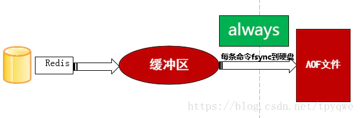

**AOF三种策略**

- always：只要缓冲区有数据 立马写入文件中
  - 不丢失数据，磁盘开销较大,一般sata磁盘一秒只有几百TPS。
- **everysec**：每隔一秒将数据从缓冲区写入文件中
  - 每秒一次fsync只丢失1秒数据。
- no：写文件的操作交由操作系统控制
  - 交由操作系统fsync,不用管，也不可控。

### AOF重写

**引入原因：**

随着数据的不断写入,会造成AOF文件不断增大,重复的命令会额外占用磁盘空间,而且增加redis重启速度。

**AOF重写定义：**

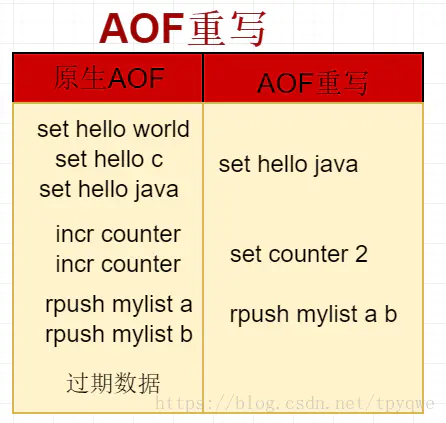

AOF文件重写不是对原有AOF文件进行读取分析,而是读取最新的数据进行分析实现的。

**AOF重写作用：**

1. 减少磁盘占用量
2. 加速启动速度

**AOF重写触发机制**

1. bgrewriteaof命令
2. AOF重写配置（同时满足配置文件中auto-aof-rewrite-percentage、auto-aof-rewrite-min-size两个配置）

**AOF重写流程：**

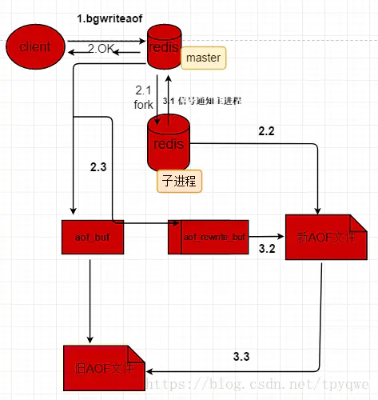


> 问题：
> 	aof_rewrite是在子进程执行，子进程带有主进程数据副本,不会阻塞客户端请求，子进程在AOF重写期间,主进程依然需要会记录数据变化日志，就会出现当前数据与AOF重写之后的数据不一致。
> 解决方案：
> 	redis增加了一个aof_rewrite_buf(aof重写缓冲区),当主进程fork出子进程后开始启用,此时主进程需要将日志同时记录到aof_buf(aof缓冲区)与aof_ewrite_aof(aof重写缓冲区),当子进程重写完数据后给主进程发送信号,此时 主进程通过信号处理函数将aof_rewrite_buf数据追加到新aof文件后，替换旧aof文件。

## 6.3 混合持久化

重启 Redis 时，我们很少使用 rdb 来恢复内存状态，因为会丢失大量数据。我们通常使用 AOF 日志重放，但是重放 AOF 日志性能相对 rdb 来说要慢很多，这样在 Redis 实例很大的情况下，启动需要花费很长的时间。 Redis 4.0 为了解决这个问题，带来了一个新的持久化选项——混合持久化。AOF在重写(aof文件里可能有太多没用指令，所以aof会定期根据内存的最新数据生成aof文件)时将重写这一刻之前的内存rdb快照文件的内容和增量的 AOF修改内存数据的命令日志文件存在一起，都写入新的aof文件，新的文件一开始不叫appendonly.aof，等到重写完新的AOF文件才会进行改名，原子的覆盖原有的AOF文件，完成新旧两个AOF文件的替换；
 AOF根据配置规则在后台自动重写，也可以人为执行命令bgrewriteaof重写AOF。 于是在 Redis 重启的时候，可以先加载 rdb 的内容，然后再重放增量 AOF 日志就可以完全替代之前的 AOF 全量文件重放，重启效率因此大幅得到提升。

# 7. Redis 的应用

## 7.1 缓存的雪崩、击穿、穿透

- 缓存雪崩：当某一个时刻出现大规模的缓存失效的情况，那么就会导致大量的请求直接打在数据库上面，导致数据库压力巨大，如果在高并发的情况下，可能瞬间就会导致数据库宕机。这时候如果运维马上又重启数据库，马上又会有新的流量把数据库打死。这就是缓存雪崩。

  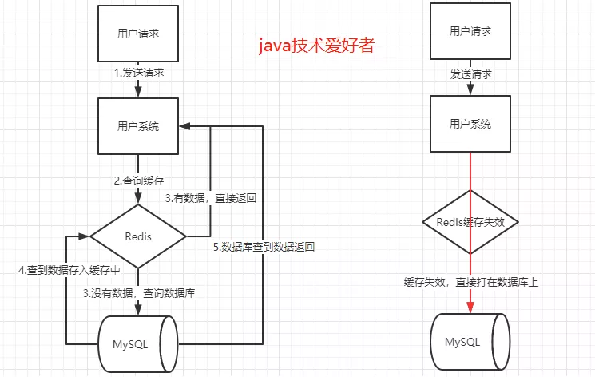

  - 解决方法

    1. 不同的key,可以设置不同的过期时间，让缓存失效的时间点不一致，尽量达到平均分布。

       > Y：随机值可在【最小失效时间，原缓存时长定值】之间生成，如此将其缓存时间分散开。

    2. 使用熔断机制。当流量到达一定的阈值时，就直接返回“系统拥挤”之类的提示，防止过多的请求打在数据库上。至少能保证一部分用户是可以正常使用，其他用户多刷新几次也能得到结果。

    3. 使用互斥锁

       在缓存失效后，通过加锁或者队列来控制读和写数据库的线程数量。比如：对某个key只允许一个线程查询数据和写缓存，其他线程等待。单机的话，可以使用synchronized或者lock来解决，如果是分布式环境，可以是用redis的setnx命令来解决。

    4. 提高数据库的容灾能力，可以使用分库分表，读写分离的策略。

    5. 为了防止Redis宕机导致缓存雪崩的问题，可以搭建Redis集群，提高Redis的容灾性。

    6. 永远不过期。

- 缓存击穿：存在热点key，当热点key失效瞬间，大量原本对应该热点的请求因缓存失效而去查数据库，给数据库带来巨大压力。

  - 解决方法：
    1. 使用互斥锁。同雪崩情况。
    2. 如果业务允许的话，对于热点的key可以设置永不过期的key。

- 缓存穿透：大量未命中key的请求。

  - 原因：1.业务自身代码或数据出现问题；2.一些恶意攻击、爬虫造成大量空的命中，此时会对数据库造成很大压力。
  - 解决方法
    1. 基于布隆过滤器过滤请求。见7.2
    2. 如果一个查询返回的数据为空，不管是数据不存在还是系统故障，我们仍然把这个结果进行缓存，但是它的过期时间会很短
       最长不超过5分钟。假如传进来的这个不存在的Key值每次都是随机的，那存进Redis也没有意义。

- 上述两种方法都存在

## 7.2 布隆过滤器

布隆过滤器(BloomFilter)是由一个叫“布隆”的前辈在1970年提出的，它是一个很长的二进制向量，主要**用于判断一个元素是否在一个集合中**。

### 原理

在介绍原理之前，要先讲一下**Hash函数**的概念。

我们在Java中的HashMap，HashSet其实也接触过hashcode()这个函数，哈希函数是可以将任意大小的输入数据转换成特定大小的输出数据的函数，转换后的数据称为**哈希值**。

哈希函数有以下特点：

- 如果根据同一个哈希函数得到的哈希值不同，那么这两个哈希值的原始输入值肯定不同。
- 如果根据同一个哈希函数得到的两个哈希值相等，两个哈希值的原始输入值有可能相等，有可能不相等。

布隆过滤器是由一个很长的二进制向量和一系列的哈希函数组成。那么布隆过滤器是怎么判断一个元素是否在一个集合中的呢？

假设布隆过滤器的底层存储结构是一个长度为16的位数组，初始状态时，它的所有位置都设置为0。

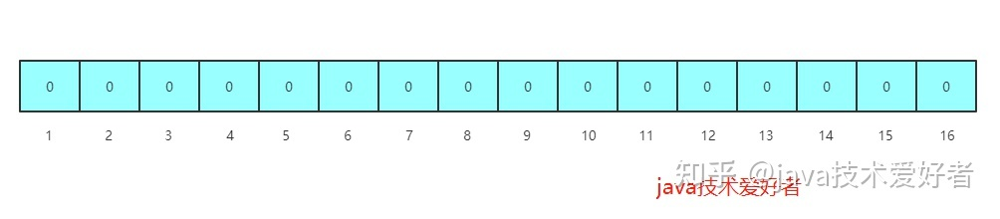

当有变量添加到布隆过滤器中，通过K个映射函数将变量映射到位数组的K个点，并把这K个点的值设置为1(假设有三个映射函数)。

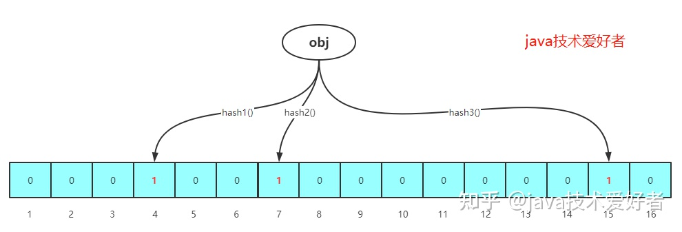

查询某个变量是否存在的时候，我们只需要通过同样的K个映射函数，找到对应的K个点，判断K个点上的值是否全都是1，**如果全都是1则表示很可能存在**，如果**K个点上有任何一个是0则表示一定不存在**。

### 特性

第一个问题，为什么说全都是1的情况是很可能存在，而不是一定存在呢？

还记得前面说的哈希函数的特点，根据同一个哈希函数得到相同的哈希值，输入值不一定相等。类似于Java中两个对象的hashcode相等，但是不一定相等的道理。说白了，映射函数得到位数组上映射点全都是1，不一定是要查询的这个变量之前存进来时设置的，也有可能是其他变量映射的点。

所以这里引出了布隆过滤器的其中一个特点，**存在一定的误判**。

第二个问题，布隆过滤器能不能删除元素呢？

答案是不能的。因为在位数组上的同一个点有可能有多个输入值映射，如果删除了会影响布隆过滤器里其他元素的判断结果。

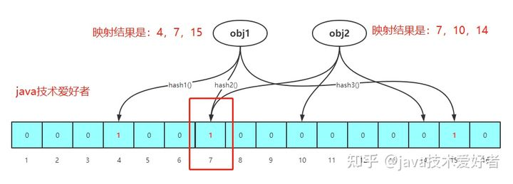

如上图，如果删除obj1，把4,7,15置为0，那么判断obj2是否存在时就会导致因为映射点7是0，结果判断obj2是不存在的，结果出错。

这是第二个特点，**不能删除布隆过滤器里的元素。**

### 优缺点

**优点：**

- 在空间和时间方面，都有着巨大的优势。因为不是存完整的数据，是一个二进制向量，能节省大量的内存空间，时间复杂度方面，是根据映射函数查询，假设有K个映射函数，那么时间复杂度就是O(K)。
- 因为存的不是元素本身，而是二进制向量，所以在一些对**保密性**要求严格的场景有一定优势。

**缺点：**

- **存在一定的误判。**存进布隆过滤器里的元素越多，误判率越高。
- **不能删除布隆过滤器里的元素。**随着使用的时间越来越长，因为不能删除，存进里面的元素越来越多，占用内存越来越多，误判率越来越高，最后不得不重置。

### 应用于缓存穿透

**用于缓解缓存穿透。**

​	缓存穿透的问题主要是因为传进来的key在Redis中是不存在的，那么就会直接打在DB上，造成DB压力增大。

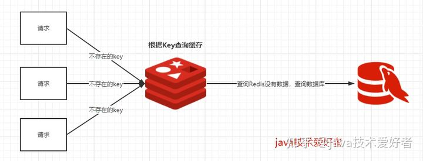

针对这种情况，可以在Redis前加上布隆过滤器，预先把数据库中的数据加入到布隆过滤器中，因为布隆过滤器的底层数据结构是一个二进制向量，所以占用的空间并不是很大。**在查询Redis之前先通过布隆过滤器判断是否存在，如果不存在就直接返回，如果存在的话，按照原来的流程还是查询Redis，Redis不存在则查询DB**。

> Y：预存到布隆过滤器的数据可以基于数据库中数据如id，也可以基于Redis的key，视具体需求而定。一定要注意布隆过滤器不可删除元素。

这里主要利用的是**布隆过滤器判断结果是不存在的话就一定不存在**这一个特点，但是由于布隆过滤器有一定的误判，所以并不能说完全解决缓存穿透，但是能很大程度缓解缓存穿透的问题。

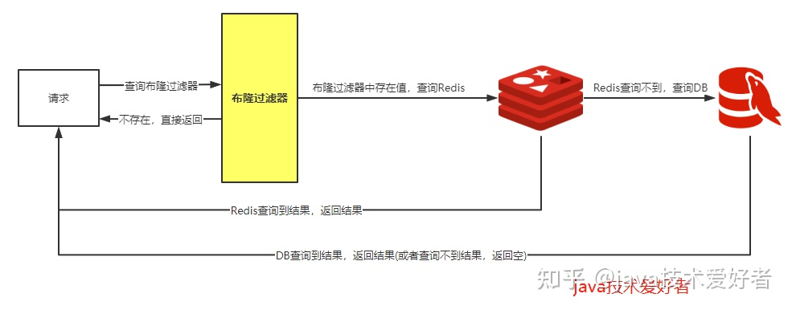

### 布隆过滤器插件

在Redis4.0后，官方提供了布隆过滤器的插件功能，布隆过滤器可以作为一个插件加载到Redis服务器直接使用。

代码示例：

```xml
<dependency>
    <groupId>org.redisson</groupId>
    <artifactId>redisson-spring-boot-starter</artifactId>
    <version>3.15.0</version>
</dependency>
```

```java
public static void main(String[] args) throws Exception {
    Config config = new Config();
    config.useSingleServer().setAddress("redis://192.168.0.109:6379");
    RedissonClient client = Redisson.create(config);

    RBloomFilter<String> bloomFilter = client.getBloomFilter("user");
    //尝试初始化，预计元素55000000，期望误判率0.03
    bloomFilter.tryInit(55000000L, 0.03);
    //添加元素到布隆过滤器中
    bloomFilter.add("tom");
    bloomFilter.add("mike");
    bloomFilter.add("rose");
    bloomFilter.add("blue");
    System.out.println("布隆过滤器元素总数为：" + bloomFilter.count());//布隆过滤器元素总数为：4
    System.out.println("是否包含tom：" + bloomFilter.contains("tom"));//是否包含tom：true
    System.out.println("是否包含lei：" + bloomFilter.contains("lei"));//是否包含lei：false
    client.shutdown();
}
```

## 7.3 Redis 分布式锁

[官网描述](https://redis.io/topics/distlock)

### 7.3.1 安全（Safety）和活力（Liveness）保证

我们将用三个属性对我们的设计进行建模，在我们看来，这三个属性是有效使用分布式锁所需的最小保证。

1. Safety 属性:互斥。在任何给定时刻，只有一个客户端可以持有锁。
2. Liveness 属性A:无死锁。最终总是可以获得锁，即使锁定资源的客户端崩溃或被分区。
3. Liveness 特性B:容错性。只要大多数Redis节点都在运行，客户端就可以获取和释放锁。

### 7.3.2 初步实现思路

Redis实现分布式锁主要利用Redis的`setnx`命令。`setnx`是`SET if not exists`(如果不存在，则 SET)的简写。

```shell
127.0.0.1:6379> setnx lock value1 #在键lock不存在的情况下，将键key的值设置为value1
(integer) 1
127.0.0.1:6379> setnx lock value2 #试图覆盖lock的值，返回0表示失败
(integer) 0
127.0.0.1:6379> get lock #获取lock的值，验证没有被覆盖
"value1"
127.0.0.1:6379> del lock #删除lock的值，删除成功
(integer) 1
127.0.0.1:6379> setnx lock value2 #再使用setnx命令设置，返回0表示成功
(integer) 1
127.0.0.1:6379> get lock #获取lock的值，验证设置成功
"value2"
```

上面这几个命令就是最基本的用来完成分布式锁的命令。

加锁：使用`setnx key value`命令，如果key不存在，设置value(加锁成功)。如果已经存在lock(也就是有客户端持有锁了)，则设置失败(加锁失败)。

解锁：使用`del`命令，通过删除键值释放锁。释放锁之后，其他客户端可以通过`setnx`命令进行加锁。

key的值可以根据业务设置，比如是用户中心使用的，可以命令为`USER_REDIS_LOCK`，value可以使用uuid保证唯一，用于标识加锁的客户端。保证加锁和解锁都是同一个客户端。

那么接下来就可以写一段很简单的加锁代码：

```java
private static Jedis jedis = new Jedis("127.0.0.1");

private static final Long SUCCESS = 1L;

/**
  * 加锁
  */
public boolean tryLock(String key, String requestId) {
    //使用setnx命令。
    //不存在则保存返回1，加锁成功。如果已经存在则返回0，加锁失败。
    return SUCCESS.equals(jedis.setnx(key, requestId));
}

//删除key的lua脚本，先比较requestId是否相等，相等则删除
private static final String DEL_SCRIPT = "if redis.call('get', KEYS[1]) == ARGV[1] then return redis.call('del', KEYS[1]) else return 0 end";

/**
  * 解锁
  */
public boolean unLock(String key, String requestId) {
    //删除成功表示解锁成功
    Long result = (Long) jedis.eval(DEL_SCRIPT, Collections.singletonList(key), Collections.singletonList(requestId));
    return SUCCESS.equals(result);
}
```

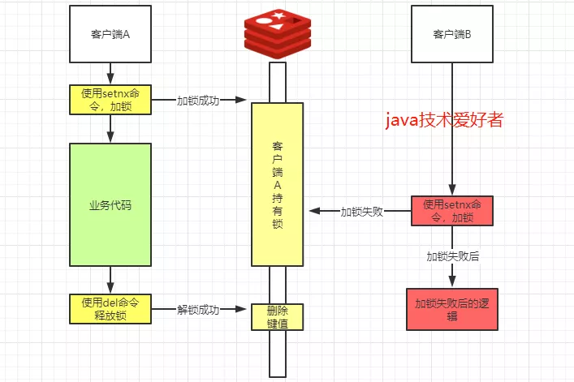

这仅仅满足上述的第一个条件和第三个条件，保证上锁和解锁都是同一个客户端，也保证只有一个客户端持有锁。

但是第二点没法保证，因为如果一个客户端持有锁的期间突然崩溃了，就会导致无法解锁，最后导致出现死锁的现象。

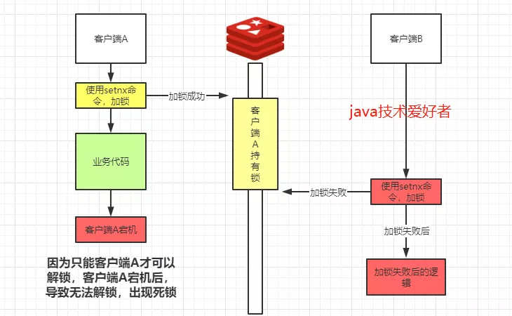

所以要有个超时的机制，在设置key的值时，需要加上有效时间，如果有效时间过期了，就会自动失效，就不会出现死锁。然后加锁的代码就会变成这样。

```java
public boolean tryLock(String key, String requestId, int expireTime) {
    //使用jedis的api，保证原子性
    //NX 不存在则操作 EX 设置有效期，单位是秒
    String result = jedis.set(key, requestId, "NX", "EX", expireTime);
    //返回OK则表示加锁成功
    return "OK".equals(result);
}
```

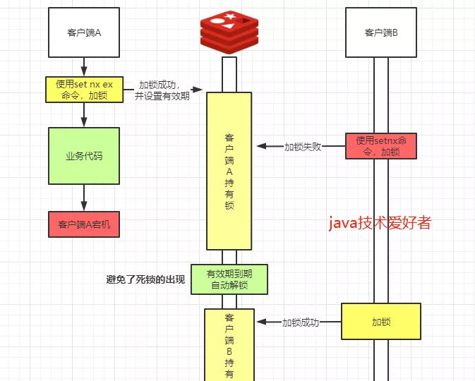


### 7.3.3 问题1：有效时间设置多长

1. **根据经验预测**

2. **锁续期**

   在Redisson框架实现分布式锁的思路，就使用watchDog机制实现锁的续期。当加锁成功后，同时开启守护线程，默认有效期是30秒，每隔10秒就会给锁续期到30秒，只要持有锁的客户端没有宕机，就能保证一直持有锁，直到业务代码执行完毕由客户端自己解锁，如果宕机了自然就在有效期失效后自动解锁。

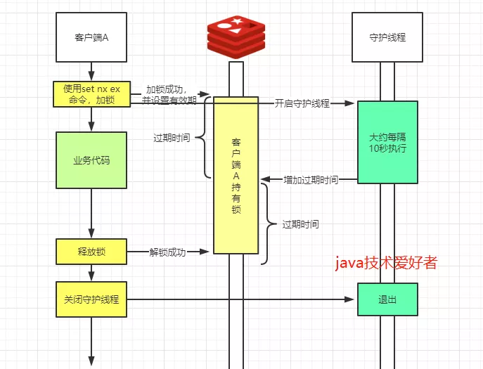

### 7.3.4 问题2：可重入锁的实现思路

在Redisson实现可重入锁的思路，**使用Redis的hash存储可重入次数**，当加锁成功后，使用`hset`命令，value(重入次数)则是1。

```java
"if (redis.call('exists', KEYS[1]) == 0) then " +
"redis.call('hset', KEYS[1], ARGV[2], 1); " +
"redis.call('pexpire', KEYS[1], ARGV[1]); " +
"return nil; " +
"end; "
```

如果同一个客户端再次加锁成功，则使用`hincrby`自增加一。

```java
"if (redis.call('hexists', KEYS[1], ARGV[2]) == 1) then " +
"redis.call('hincrby', KEYS[1], ARGV[2], 1); " +
"redis.call('pexpire', KEYS[1], ARGV[1]); " +
"return nil; " +
"end; " +
"return redis.call('pttl', KEYS[1]);"
```

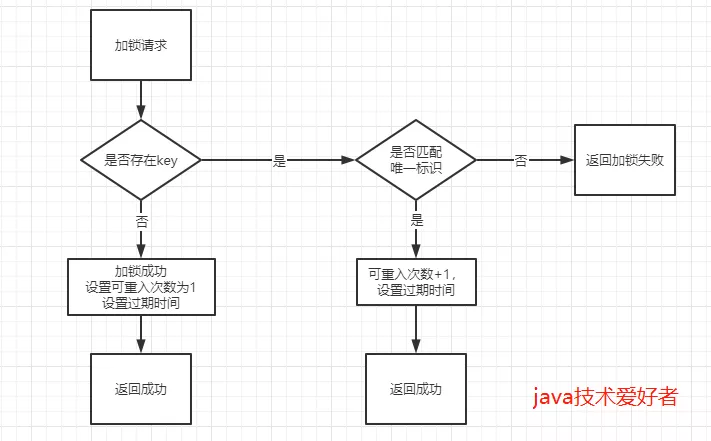

解锁时，先判断可重复次数是否大于0，大于0则减一，否则删除键值，释放锁资源。

```java
protected RFuture<Boolean> unlockInnerAsync(long threadId) {
    return commandExecutor.evalWriteAsync(getName(), LongCodec.INSTANCE, RedisCommands.EVAL_BOOLEAN,
"if (redis.call('hexists', KEYS[1], ARGV[3]) == 0) then " +
"return nil;" +
"end; " +
"local counter = redis.call('hincrby', KEYS[1], ARGV[3], -1); " +
"if (counter > 0) then " +
"redis.call('pexpire', KEYS[1], ARGV[2]); " +
"return 0; " +
"else " +
"redis.call('del', KEYS[1]); " +
"redis.call('publish', KEYS[2], ARGV[1]); " +
"return 1; "+
"end; " +
"return nil;",
Arrays.<Object>asList(getName(), getChannelName()), LockPubSub.UNLOCK_MESSAGE, internalLockLeaseTime, getLockName(threadId));
}
```

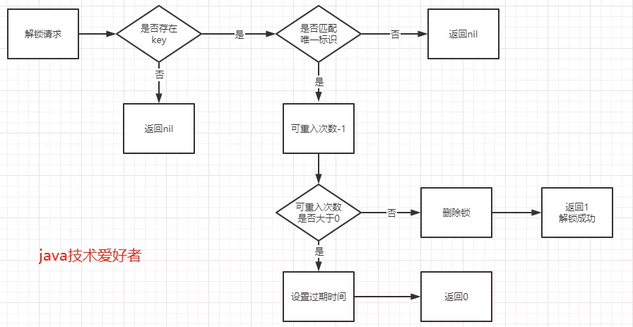

为了保证操作原子性，加锁和解锁操作都是使用lua脚本执行。

### 7.3.5 问题3：加锁失败情况处理

上面的加锁方法是加锁后立即返回加锁结果，如果加锁失败的情况下，总不可能一直轮询尝试加锁，直到加锁成功为止，这样太过耗费性能。所以需要**利用发布订阅的机制进行优化**。

**步骤如下：**

1. 当加锁失败后，订阅锁释放的消息，自身进入阻塞状态；
2. 当持有锁的客户端释放锁的时候，发布锁释放的消息；
3. 当进入阻塞等待的其他客户端收到锁释放的消息后，解除阻塞等待状态，再次尝试加锁。

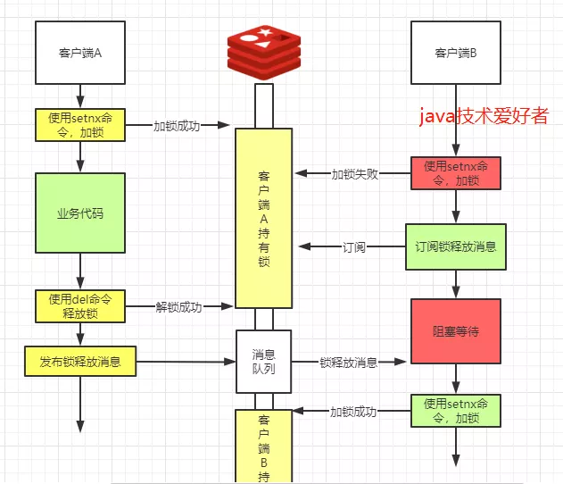

### 7.3.7 Redis分布式锁Java实现-Redisson

> [Redisson](https://github.com/redisson/redisson/)是架设在Redis基础上的一个Java驻内存数据网格（In-Memory Data Grid）。充分的利用了Redis键值数据库提供的一系列优势，基于Java实用工具包中常用接口，为使用者提供了一系列具有分布式特性的常用工具类。使得原本作为协调单机多线程并发程序的工具包获得了协调分布式多机多线程并发系统的能力，大大降低了设计和研发大规模分布式系统的难度。同时结合各富特色的分布式服务，更进一步简化了分布式环境中程序相互之间的协作。

它里面也实现了分布式锁，而且包含多种类型的锁，更多请参阅[分布式锁和同步器](https://github.com/redisson/redisson/wiki/8.-分布式锁和同步器)。

**使用Redisson中的可重入锁示例：**

```xml
<dependency>
    <groupId>org.redisson</groupId>
    <artifactId>redisson</artifactId>
    <version>3.10.1</version>
</dependency>
或
<dependency>
    <groupId>org.redisson</groupId>
    <artifactId>redisson-spring-boot-starter</artifactId>
    <version>3.15.0</version>
</dependency>
```

```java
import org.redisson.Redisson;
import org.redisson.api.RLock;
import org.redisson.api.RedissonClient;
import org.redisson.config.Config;

public static void main(String[] args) {

    Config config = new Config();
    config.useSingleServer().setAddress("redis://127.0.0.1:6379");
    config.useSingleServer().setPassword("redis1234");
    
    final RedissonClient client = Redisson.create(config);  
    /*
      返回一个RedissonLock实例。
      RedissonLock 是 java.util.concurrent.locks.Lock 的分布式实现，实现可重入锁。 如果客户端断开连接，锁定将自动解除。
      实现非公平锁定，因此不保证获取顺序。
      */
    RLock lock = client.getLock("lock1");
    try{
      	// 获得锁。如果锁不可用，则当前线程将被禁用以用于线程调度目的并处于休眠状态，直到获得锁。
        lock.lock();
    }finally{
      	// 释放锁。
        lock.unlock();
    }
}
```


------

> 内容来源：
>
> 1. [An introduction to Redis data types and abstractions](https://redis.io/topics/data-types-intro)
> 2. [Redis(一)、Redis五种数据结构](https://www.cnblogs.com/haoprogrammer/p/11065461.html)
> 3. [Redis五大类型及底层实现原理](https://www.cnblogs.com/xuxh120/archive/2021/02/14/14400980.html)
> 4. [跳跃表的原理及实现](https://blog.csdn.net/u013709270/article/details/53470428)
> 5. [Redis数据结构——跳跃表](https://www.cnblogs.com/hunternet/p/11248192.html)
> 6. [Redis 的底层数据结构（整数集合）](https://www.cnblogs.com/yangming1996/p/11709051.html)
> 7. [Redis中压缩列表的实现](https://www.jianshu.com/p/60c9b231f62a)
> 8. [Redis的过期策略和内存淘汰策略最全总结与分析](https://zhuanlan.zhihu.com/p/152284892)
> 9. [LRU和LFU的区别](https://blog.csdn.net/a3192048/article/details/82291222)
> 10. [Redis ==> 集群的三种模式](https://www.cnblogs.com/L-Test/p/11626124.html)
> 11. [Redis cluster tutorial](https://redis.io/topics/cluster-tutorial)
> 12. [ Partitioning: how to split data among multiple Redis instances.](https://redis.io/topics/partitioning)
> 13. [3.redis持久化策略](https://www.jianshu.com/p/ae47d69f92eb)
> 14. [什么是布隆过滤器？](https://zhuanlan.zhihu.com/p/348332384)
> 15. [Redis-缓存雪崩、缓存击穿、缓存穿透](https://mp.weixin.qq.com/s/vjof5CdJaRuoPMf6J5sMdA)
> 16. [【redis】redis的雪崩和穿透](https://blog.csdn.net/lzj3462144/article/details/78323589)
> 17. [Redis如何实现分布式锁？](https://mp.weixin.qq.com/s/FPt5rJIpHAe0psFo6inxUg)
> 18. [分布式锁之Redis实现](https://www.jianshu.com/p/47fd7f86c848)
> 19. [Distributed locks with Redis](https://redis.io/topics/distlock)

