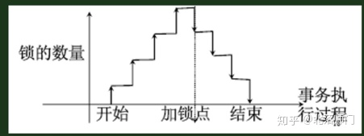
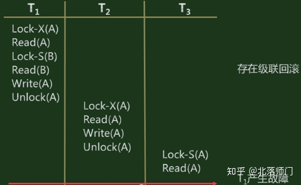
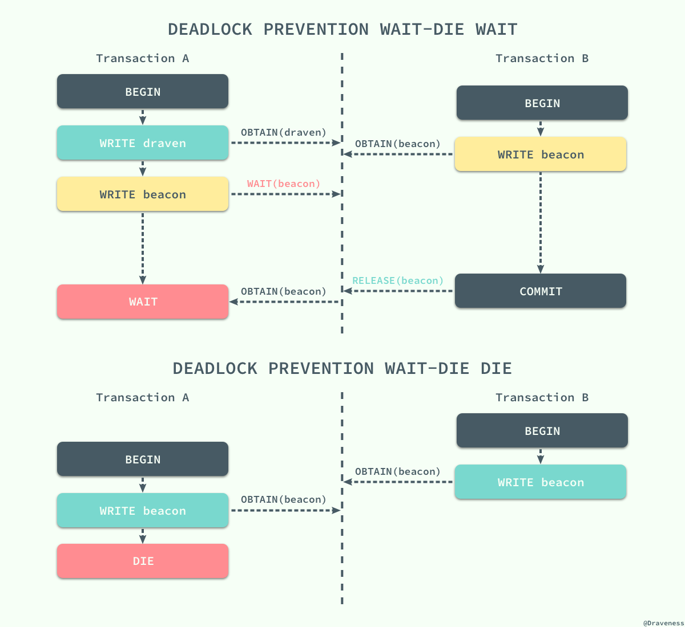
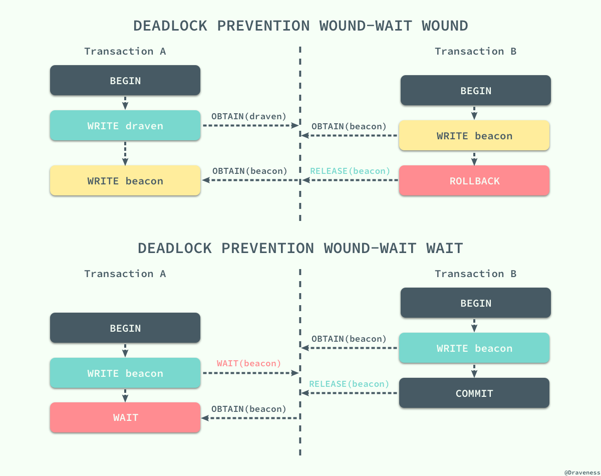
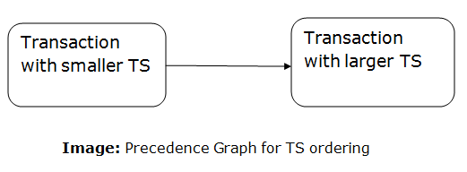
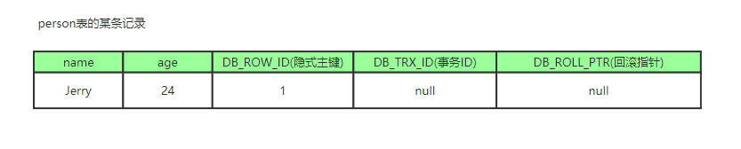

# 事务的特性

- A (atomicity) 原子性
  - 一个事务中的所有操作要么全部提交成功，要么全部失败回滚，不可能出现只执行其中一部分的情况，这就是原子性。
  - 针对该事务自身而言。
- C (consistency) 一致性
  - 数据库总是从一个一致性的状态到另外一个一致性的状态，不会出现事务开始和结束之间的状态被其他事务看到。
  - 针对该事务自身而言。保证其所产生的结果一定是符合规则（如**[constraints](https://link.zhihu.com/?target=https%3A//en.wikipedia.org/wiki/Integrity_constraints), [cascades](https://link.zhihu.com/?target=https%3A//en.wikipedia.org/wiki/Cascading_rollback),[triggers](https://link.zhihu.com/?target=https%3A//en.wikipedia.org/wiki/Database_trigger)**等）的。
- I (isolation) 隔离性
  - 一个事务所做的修改在最终提交以前，对其他事务是不可见的。
  - 针对事务间的互相影响而言。
- D (durability) 持久性
  - 一旦事务提交，则其所做的修改就会永久保存到数据库中。
  - 针对该事务自身而言。

> [Wikipedia中关于数据库事务一致性的定义](https://link.zhihu.com/?target=https%3A//en.wikipedia.org/wiki/ACID_(computer_science))：
>
> [Consistency](https://link.zhihu.com/?target=https%3A//en.wikipedia.org/wiki/Consistency_(database_systems)) ensures that a transaction can **only bring the database from one valid state to another**, maintaining database [invariants](https://link.zhihu.com/?target=https%3A//en.wikipedia.org/wiki/Invariant_(computer_science)): **any data written to the database must be valid according to all defined rules, including [constraints](https://link.zhihu.com/?target=https%3A//en.wikipedia.org/wiki/Integrity_constraints), [cascades](https://link.zhihu.com/?target=https%3A//en.wikipedia.org/wiki/Cascading_rollback),[triggers](https://link.zhihu.com/?target=https%3A//en.wikipedia.org/wiki/Database_trigger), and any combination thereof.** This prevents database corruption by an illegal transaction, but does **not guarantee that a transaction is *correct*.**
>
> This(Consistency）does not guarantee correctness of the transaction in all ways the application programmer might have wanted (that is the responsibility of application-level code) but merely that any programming errors cannot result in the violation of any defined database constraints.[1]

​	事务的实现：事务的(A)原子性、(C)一致性、(D)持久性是由我们的RedoLog(重做日志)、UndoLog(回滚日志)实现，而我们的(I)隔离性由锁实现。

# 并发事务

## 数据库的三种并发场景

- **读-读**：不存在任何问题，也不需要并发控制。
- **读-写**：有线程安全问题，可能会造成事务隔离性问题，可能遇到**脏读**、**不可重复读**、**幻读**。
- **写-写**：有线程安全问题，可能会存在**更新**丢失问题，比如**第一类更新丢失**，**第二类更新丢失**。

## 并发事务带来的问题

- **第一类更新丢失(脏写)：**

  A事务撤销时，把已提交的B事务的数据覆盖掉 。

- **第二类更新丢失(丢失更新)：**  

  A事务提交时，把已提交的B事务的数据覆盖掉。

-  **脏读：**

  A事务对一数据进行了修改，但尚未提交，B事务读取了A事物修改但未提交的数据。A事务发生异常，回滚了数据，那么此时B事务读取的数据就是脏数据。

- **不可重复读：**  

  A事务内，多次读写同一数据，在A事务并没有结束，B事务对这数据进行了修改，那么A事务两次读取的数据可能就不一样的，这样就发生了同一事务内两次相同的查询读到的数据不一样。 

- **幻读：**  

  事务A 按照一定条件进行数据读取， 期间事务B 插入了相同搜索条件的新数据，事务A再次按照原先条件进行读取时，发现了事务B 新插入的数据 称为幻读。


未提交数据的数据引起的问题，为“脏”。

不可重复读的是由update和delete引起，幻读是由insert引起。

幻读产生的原因：行锁只能锁住行，即使把所有行记录都上锁，也阻止不了新插入的记录。

为了解决这些问题，才有了事务的隔离。

## 事务的隔离级别

- 读未提交 Read Uncomitted
  - 当数据库系统使用READ UNCOMMITTED隔离级别时，一个事务在执行过程中可以看到其他事务没有提交的新插入的记录，而且还能看到其他事务没有提交的对已有记录的更新。
  - 以上问题都可能发生

- 读已提交 Read Committed
  - 当数据库系统使用READ COMMITTED隔离级别时，一个事务在执行过程中可以看到其他事务已经提交的新插入的记录，而且还能看到其他事务已经提交的对已有记录的更新。
  - 解决了**脏读**问题，可能有**不可重复读**、**幻读**问题

- 可重复读 Repeable Read（默认）

  - 当数据库系统使用REPEATABLE READ隔离级别时，一个事务在执行过程中可以看到其他事务已经提交的新插入的记录，但是不能看到其他事务对已有记录的更新。
  - 解决了**脏读**、**不可重复读问题**，但是可能有**幻读**问题

  - **Innodb 引擎**下采用**MVCC**解决了**幻读**问题

- 串行化 Serializable
  - 当数据库系统使用SERIALIZABLE隔离级别时，一个事务在执行过程中完全看不到其他事务对数据库所做的更新。当两个事务同时操作数据库中相同数据时，如果第一个事务已经在访问该数据，第二个事务只能停下来等待，必须等到第一个事务结束后才能恢复运行。因此这两个事务实际上是**串行化方式运行**。
  - 什么问题都不会发生

## 事务的并发控制

## 悲观并发控制

​	在悲观并发控制（Pessimistic Concurrency Control）中，数据库程序对于数据被修改持悲观的态度，在数据处理的过程中都会被锁定，以此来解决竞争的问题。

### 读写锁（共享锁、互斥锁）

​	为了最大化数据库事务的并发能力，数据库中的锁被设计为两种模式，分别是**共享锁（S）**和**互斥锁（X）**。当一个事务获得共享锁之后，它只可以进行读操作，所以共享锁也叫**读锁**；而当一个事务获得一行数据的互斥锁时，就可以对该行数据进行读和写操作，所以互斥锁也叫**写锁**。

​	多个事务可以同时获得某一**行**数据的共享锁。

### 多粒度锁

有些时候我们希望将多个节点看做一个数据单元，使用锁直接将这个数据单元、表甚至数据库锁定起来。这个目标的实现需要我们在数据库中定义不同粒度的锁。

- 显示加锁（explicit）:树上每个结点都可以单独加锁

- 隐式加锁（implicit）:对当前结点加锁会导致隐式地对全部后代结点加上同类型的锁

但这样的话，检查锁冲突时,必须检查祖先、后代结点，性能比较低，于是有了意向锁。

#### 意向锁

在原来的X/S锁基础上引入了IX/IS，**IX/IS都是表锁**，用来表示一个事务想要或者正在在表中的某个数据行上加X锁或S锁。有以下两个规定：

- 一个事务在获得某个数据行对象的 S 锁之前，必须先获得表的 IS 锁或者更强的锁；
- 一个事务在获得某个数据行对象的 X 锁之前，必须先获得表的 IX 锁。

**锁类型兼容关系矩阵**如下：

| -    | X    | IX   | S    | IS   |
| :--- | :--- | :--- | :--- | :--- |
| X    | ×    | ×    | ×    | ×    |
| IX   | ×    | √    | ×    | √    |
| S    | ×    | ×    | √    | √    |
| IS   | ×    | √    | √    | √    |

- **任意 IS/IX 锁之间都是兼容的，因为它们只是表示想要对表加锁，而不是真正加锁；**
- S 锁只与 S 锁和 IS 锁兼容，也就是说事务 T 想要对数据行加 S 锁，其它事务可能已经获得对表或者表中的行的 S 锁。

### 两阶段锁协议（2PL）

两阶段锁协议（2PL）是一种能够保证事务可串行化的协议，它将事务的获取锁和释放锁划分成了**增长（Growing）**和**缩减（Shrinking）**两个不同的阶段。

- 增长阶段：事务可以获得锁但是不能释放锁；
- 缩减阶段：事务只可以释放锁，并不能获得新的锁。





2PL存在级联回滚的可能，于是有了它的两个变种：

- **Strict 2PL**：事务持有的**互斥锁**必须在提交后再释放；
- **Rigorous 2PL**：事务持有的**所有锁**必须在提交后释放。

可能会引发死锁。

#### 死锁的处理

- 预防死锁

  - 抢占加事务回滚

    - wait-die机制

      当执行事务的时间戳小于另一事务时，即事务 A 先于 B 开始，那么它就会等待另一个事务释放对应资源的锁，否则就会保持当前的时间戳并回滚。

      非抢占。

      

    - wound-wait机制

      当前事务如果先于另一事务执行并请求了另一事务的资源，那么另一事务会立刻回滚，将资源让给先执行的事务，否则就会等待其他事务释放资源。抢占。

      

- 死锁的检测与恢复

  - 将事务环中的一个事务进行回滚。选择牺牲品（Victim）时的黄金原则就是**最小化代价**。
  - 回滚分为：全部回滚、部分回滚（回滚到上一个检查点，如果有的话，没有则全部回滚）。

## 乐观并发控制

乐观并发控制（Optimistic Concurrency Control）也叫乐观锁，但是它并不是真正的锁，很多人都会误以为乐观锁是一种真正的锁，然而**它只是一种并发控制的思想**。

### 基于时间戳的协议

**基于锁的协议**执行事务的顺序与获得锁的顺序有关。**基于时间戳的协议**能够在事务执行之前先决定事务的执行顺序。

每一个事务都会具有一个**全局唯一**的时间戳，它即可以使用系统的时钟时间，也可以使用计数器，只要能够保证所有的时间戳都是唯一并且是**随时间递增**的就可以。

Basic T/O协议主要特点：

- 每个事务都会被赋予一个Timestamp
- 每条数据都会记录最近读取该数据的事务id，以及最近写入的事务id
- 每个事务在读写数据时需要根据事务的timestamp和数据的读写timestamp进行冲突检测
- DBMS会把事务读取过的数据拷贝到一个private的空间，来实现可重复读

Basic T/O需要对每条记录额外存储以下几个信息：

1. **Read Timestamp**: 表示读过该数据中最大的事务Timestamp
2. **Write Timestamp**: 最近更新该数据的事务Timestamp


​	无论是读操作还是写操作都会从左到右依次比较读写时间戳的值，如果小于当前值就会直接被拒绝然后回滚，数据库系统会给回滚的事务添加一个新的时间戳并重新执行这个事务。

- read流程：

  If TS < W-ts(x) then reject read request and abort corresponding transaction else execute transaction Set R-ts(x) to max{R-ts(x), TS}

- write流程：

  If TS < R-ts(x) or TS < W-ts(x) then reject write request and abort corresponding transaction else execute transaction Set W-ts(x) to TS.

Y: 总结就是后来的事务B已经执行操作（对A当前操作有影响的操作）了该数据，那当前事务A就需要回滚。但是这样有一个问题，就是在此之前B已经读了A写入的数据，即“脏读”。

**Basic T/O协议的优点和缺点：**

- TO协议确保可串行化，因为优先级图如下：



- TS协议确保免于死锁，这意味着没有事务等待。

- 但是时间表可能无法恢复，甚至可能无法级联。基于时间戳的协议。


### 基于验证的协议

*乐观并发控制*其实本质上就是基于验证的协议，因为在多数的应用中只读的事务占了绝大多数，事务之间因为写操作造成冲突的可能非常小，也就是说大多数的事务在不需要并发控制机制也能运行的非常好，也可以保证数据库的一致性；而并发控制机制其实向整个数据库系统添加了很多的开销，我们其实可以通过别的策略降低这部分开销。

而验证协议就是找到的解决办法，它也叫乐观并发控制技术。在基于验证的协议中，根据事务的只读或者更新将所有事务的执行分为两到三个阶段：

1. **读阶段** ：在此阶段，读取并执行事务T。它用于读取各种数据项的值并将它们存储在临时局部变量中。 它可以对临时变量执行所有写操作，而无需更新实际数据库。
2. **验证阶段** ：在此阶段，将根据实际数据验证临时变量值，以查看它是否违反了可串行性，即是否有其他事务在读阶段期间更新了数据。
3. **写入阶段** ：如果通过了事务的验证，则将临时结果写入数据库或系统，否则将回滚事务。

## 多版本并发控制 MVCC

上述的并发控制机制其实都是通过延迟或者终止相应的事务来解决事务之间的竞争条件（Race condition）来保证事务的可串行化；虽然前面的两种并发控制机制确实能够从根本上解决并发事务的可串行化的问题，但是在实际环境中数据库的事务大都是只读的，读请求是写请求的很多倍，如果写请求和读请求之前没有并发控制机制，那么最坏的情况也是读请求读到了已经写入的数据，这对很多应用完全是可以接受的。

在这种大前提下，数据库系统引入了另一种并发控制机制 - *多版本并发控制*（Multiversion Concurrency Control），每一个写操作都会创建一个新版本的数据，读操作会从有限多个版本的数据中挑选一个最合适的结果直接返回；在这时，读写操作之间的冲突就不再需要被关注，而管理和快速挑选数据的版本就成了 MVCC 需要解决的主要问题。

即**MVCC就是为了以不加锁的方式解决读-写冲突问题**。

MVCC 并不是一个与乐观和悲观并发控制对立的东西，它能够与两者很好的结合以增加事务的并发量。

- **MVCC + 悲观锁**
  MVCC解决读写冲突，悲观锁解决写写冲突
- **MVCC + 乐观锁**
  MVCC解决读写冲突，乐观锁解决写写冲突

在目前最流行的 SQL 数据库 MySQL 和 PostgreSQL 中都对 MVCC 进行了实现：

- PostgreSQL中的MVCC与乐观锁结合，实现的多版本时间戳排序协议（Multiversion Timestamp Ordering）。

- Mysql将MVCC与2PL相结合，实现的多版本两段锁协议（Multiversion 2PL）。

### Mysql中的MVCC

#### 当前读&快照读

- **当前读**

  像select lock in share mode(共享锁), select for update ; update, insert ,delete(排他锁)这些操作都是一种当前读，为什么叫当前读？就是它读取的是记录的**最新版本**，读取时还要保证其他并发事务不能修改当前记录，会对读取的记录进行**加锁**。

- **快照读**

   像不加锁的select操作就是快照读，即不加锁的非阻塞读；快照读的前提是**隔离级别不是串行级别**，串行级别下的快照读会退化成当前读；之所以出现快照读的情况，是基于提高并发性能的考虑，快照读的实现是基于多版本并发控制，即MVCC,可以认为MVCC是行锁的一个变种，但它**在很多情况下，避免了加锁**操作，降低了开销；既然是基于多版本，即快照读可能读到的并**不一定是数据的最新版本**，而有可能是之前的历史版本

#### MVCC实现原理

##### 隐式字段

每行记录除了我们自定义的字段外，还有数据库隐式定义的字段：

- **DB_TRX_ID**
   6byte，最近修改(修改/插入)事务ID，记录创建这条记录/最后一次修改该记录的事务ID。
- **DB_ROLL_PTR**
   7byte，回滚指针，指向这条记录的上一个版本（存储于rollback segment里）。
- **DB_ROW_ID**
   6byte，隐含的自增ID（隐藏主键），如果数据表没有主键，InnoDB会自动以DB_ROW_ID产生一个聚簇索引。
- DELETE_BIT: 删除标志位, 即记录被更新或删除并不代表真的删除，而是删除标志位变了。



如上图，DB_ROW_ID是数据库默认为该行记录生成的唯一隐式主键，DB_TRX_ID是当前操作该记录的事务ID,而DB_ROLL_PTR是一个回滚指针，用于配合undo日志，指向上一个旧版本。

##### undo日志

undo log主要分为两种：

- **insert undo log**

  代表事务在insert新记录时产生的undo log, 只在**事务回滚**时需要，并且在事务提交后可以被立即丢弃代表事务在insert新记录时产生的undo log, 只在事务回滚时需要，并且在**事务提交后可以被立即丢弃**。

- **update undo log**

  事务在进行**update或delete**时产生的undo log; 不仅在**事务回滚**时需要，在**快照读**时也需要；所以不能随便删除，只有在快速读或事务回滚不涉及该日志时，对应的日志才会被purge线程统一清除。

> purge
>
> - 从前面的分析可以看出，InnoDB的MVCC机制，更新或者删除操作都只是设置一下老记录的deleted_bit，并不真正将过时的记录删除。
> - 为了节省磁盘空间，InnoDB有专门的purge线程来清理deleted_bit为true的记录。为了不影响MVCC的正常工作，purge线程自己也维护了一个read view（这个read view相当于系统中最老活跃事务的read view）;如果某个记录的deleted_bit为true，并且DB_TRX_ID相对于purge线程的read view可见，那么这条记录一定是可以被安全清除的。

不同事务或者相同事务的对同一记录的修改，会导致该记录的undo log成为一条记录版本线性表，即链表，undo log的链首就是最新的旧记录，链尾就是最早的旧记录（当然就像之前说的该undo log的节点可能是会purge线程清除掉）。

##### Read View 读视图

Read View就是事务进行快照读操作的时候生产的读视图(Read View)，在该事务执行快照读的那一刻，会生成数据库系统当前的一个快照，记录并维护系统当前活跃事务的ID(当每个事务开启时，都会被分配一个ID, 这个ID是递增的，所以最新的事务，ID值越大)。

Read View主要是用来做可见性判断的, 即当我们某个事务执行快照读的时候，对该记录创建一个Read View读视图，把它比作条件用来判断当前事务能够看到哪个版本的数据，既可能是当前最新的数据，也有可能是该行记录的undo log里面的某个版本的数据。

Read View遵循一个可见性算法，主要是将要被修改的数据的最新记录中的DB_TRX_ID（即当前事务ID）取出来，与系统当前其他活跃事务的ID去对比（由Read View维护），如果DB_TRX_ID跟Read View的属性做了某些比较，不符合可见性，那就通过DB_ROLL_PTR回滚指针去取出Undo Log中的DB_TRX_ID再比较，即遍历链表的DB_TRX_ID（从链首到链尾，即从最近的一次修改查起），直到找到满足特定条件的DB_TRX_ID, 那么这个DB_TRX_ID所在的旧记录就是当前事务能看见的最新老版本。

那么这个可见性的判断条件是什么呢？

说明：下面内容及源码所摘录的文章应该是基于mysql 5.7版本的。

我们可以把Read View简单的理解成有四个全局属性：

> - m_ids
>    快照创建时，处于活动即尚未提交的读写事务的ID集合。
>    
> -  m_up_limit_id
>    一个快照，有左右边界，左边界是最小值，右边界是最大值，此变量是左边界即m_ids列表中事务ID最小的ID。
>    
> -  m_low_limit_id
>    ReadView生成时刻系统尚未分配的下一个事务ID，也就是目前已出现过的事务ID的最大值+1。
>    
> - m_createor_trx_id 
>
>    创建该ReadView事务的事务ID，即当前事务ID。

左右边界字段中的up和low让我们有些怀疑其含义，如下源码中可以看到上述几个变量的初始化，可以更准确地理解其定义：

```c
void
ReadView::prepare(trx_id_t id)
{
	ut_ad(mutex_own(&trx_sys->mutex));

	m_creator_trx_id = id;

    // trx_sys->max_trx_id是当前最小未分配的事务id。
	m_low_limit_no = m_low_limit_id = trx_sys->max_trx_id;

    // 将当前只读事务的id拷贝到view中的m_ids。
	if (!trx_sys->rw_trx_ids.empty()) {
		copy_trx_ids(trx_sys->rw_trx_ids);
	} else {
		m_ids.clear();
	}

    // trx_sys->serialisation_list是事务提交时会加入的一个按照trx->no排序的列表。
    // 这里取列表中第一个（如果有的话）为m_low_limit_no供purge线程作为是否清理undo的依据。
	if (UT_LIST_GET_LEN(trx_sys->serialisation_list) > 0) {
		const trx_t*	trx;

		trx = UT_LIST_GET_FIRST(trx_sys->serialisation_list);

		if (trx->no < m_low_limit_no) {
			m_low_limit_no = trx->no;
		}
	}
}

void
ReadView::complete()
{
    // m_up_limit_id取活跃事务最小id。
	m_up_limit_id = !m_ids.empty() ? m_ids.front() : m_low_limit_id;

	ut_ad(m_up_limit_id <= m_low_limit_id);

	m_closed = false;
}
```

- 对于**Read Committed**的隔离级别，在一致性读语句结束后（即一次快照读完成），会关闭掉Read View，即每次快照读都创建新的快照，让其可以读到最新commit的事务的修改。
- 而对于**Repeatable Read**的隔离级别，Read View在创建后（在该事务第一次快照读时创建）会一直到事务结束时才被关闭，即其创建快照之后所有事务所做的修改对其都不可见。

##### Read View可见性判断

###### 走聚簇索引的情况

假设sql查询走的是聚簇索引，则通过下面的lock_clust_rec_cons_read_sees方法来判断记录rec是否对当前事务可见。

```c
bool
lock_clust_rec_cons_read_sees(
	const rec_t*	rec,	
	dict_index_t*	index,
	const ulint*	offsets,
	ReadView*	view)	
{
	ut_ad(dict_index_is_clust(index));
	ut_ad(page_rec_is_user_rec(rec));
	ut_ad(rec_offs_validate(rec, index, offsets));

        // 对于InnoDB处于只读模式或者表为临时表的情况永远都是可见的。
	if (srv_read_only_mode || dict_table_is_temporary(index->table)) {
		ut_ad(view == 0 || dict_table_is_temporary(index->table));
		return(true);
	}


    // 获取行记录上的事务id。
	trx_id_t	trx_id = row_get_rec_trx_id(rec, index, offsets);

    // 判断是否可见。
	return(view->changes_visible(trx_id, index->table->name));
}

```

下面再来看看ReadView::changes_visible方法的实现源码：

```c
bool changes_visible(
    trx_id_t		id,
    const table_name_t&	name) const
    MY_ATTRIBUTE((warn_unused_result))
{
    ut_ad(id > 0);

    // 如果行记录上的id<m_up_limit_id或者等于m_creator_trx_id则可见。
    if (id < m_up_limit_id || id == m_creator_trx_id) {

        return(true);
    }

    check_trx_id_sanity(id, name);

    // 如果行记录上的id>=m_low_limit_id，则不可见。
    if (id >= m_low_limit_id) {

        return(false);

    } else if (m_ids.empty()) {

        return(true);
    }

    const ids_t::value_type*	p = m_ids.data();

    // 二分判断是否在m_ids中，如果存在则不可见。
    return(!std::binary_search(p, p + m_ids.size(), id));
}
```

理一下这里判断的依据

- 记录的事务id为m_creator_trx_id即**当前事务**的修改，一定**可见**。
- 记录的事务id<m_up_limit_id，说明Read View在初始化的时候，修改此记录的事务已经提交了，因此可见。
- 记录的事务id>=m_low_limit_id，说明Read View在初始化的时候，修改此记录的事务还没开启（准确说是还没被分配到事务id），因此不可见。

如果这里不满足的话，会走到*row_sel_build_prev_vers_for_mysql->row_vers_build_for_consistent_read*的调用，根据回滚段中的信息不断**构建前一个版本信息**直至当前事务可见。

###### 走二级索引的情况

```c
bool
lock_sec_rec_cons_read_sees(
	const rec_t*		rec,	
	const dict_index_t*	index,
	const ReadView*	view)
{
	ut_ad(page_rec_is_user_rec(rec));

	if (recv_recovery_is_on()) {
		return(false);
	} else if (dict_table_is_temporary(index->table)) {
		return(true);
	}
    // 取索引页上的PAGE_MAX_TRX_ID字段。
	trx_id_t	max_trx_id = page_get_max_trx_id(page_align(rec));

	ut_ad(max_trx_id > 0);

	return(view->sees(max_trx_id));
}
```

下面是ReadView:sees的实现，可以看到其实就是判断是否PAGE_MAX_TRX_ID小于ReadView初始化时的最小事务id，也就是判断修改页上记录的最大事务id是否在快照生成的时候已经提交了，简单粗暴的很。

```c
bool sees(trx_id_t id) const
{
    return(id < m_up_limit_id);
}
```

因此这里`lock_sec_rec_cons_read_sees`方法如果返回true，那么是一定可见的，返回false的话未必不可见，但下一步就需要利用聚簇索引来获取可见版本的数据了。
在这之前InnoDB会先利用ICP(Index Push Down)根据索引信息来判断搜索条件是否满足，如果不满足那也没必要再去聚簇索引中取了；若ICP判断出符合条件，则会走到`row_sel_get_clust_rec_for_mysql`方法中去聚簇索引中取可见版本数据。


------

> 感谢参考的文章及其作者：
>
> - [8张图说清楚MySql 脏写、脏读、不可重复读、幻读到底是怎么回事儿 ](https://www.sohu.com/a/408963027_100016227)
> - [数据库隔离级别------串行化，可重复读，读提交，读未提交](https://blog.csdn.net/weixin_43081805/article/details/98493923)
> - [浅谈数据库并发控制 - 锁和 MVCC](https://draveness.me/database-concurrency-control/)
> - [基于封锁的并发控制机制](https://zhuanlan.zhihu.com/p/158499690)
> - [数据库事务调度的可恢复性和级联回滚](https://blog.csdn.net/u010486124/article/details/42426127)
> - [数据库系统原理: 封锁 (封锁粒度、封锁类型、封锁协议)](https://blog.csdn.net/amoscykl/article/details/88784028)
> - [意向锁](https://www.jianshu.com/p/38dd4f64ebd1)
> - [基于时间戳的并发控制协议](https://zhuanlan.zhihu.com/p/168746376)
> - [DBMS基于验证的协议](https://www.knowledgedict.com/tutorial/dbms-validation-based-protocol.html)
> - [DBMS时间戳顺序协议](https://www.knowledgedict.com/tutorial/dbms-timestamp-ordering-protocol.html)
> - [MVCC多版本并发控制](https://www.jianshu.com/p/8845ddca3b23)
> - [初探InnoDB MVCC源码实现](https://www.cnblogs.com/micrari/p/8144339.html)
> - [MVCC讲解](https://blog.51cto.com/itzhoujun/2357430)
>
> Mysql 官方手册：
>
> - [Mysql官方手册-5.7版本](https://dev.mysql.com/doc/refman/5.7/en/innodb-multi-versioning.html)
> - [Mysql官方手册-8.0版本](https://dev.mysql.com/doc/refman/8.0/en/innodb-multi-versioning.html)

